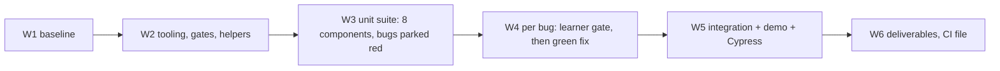
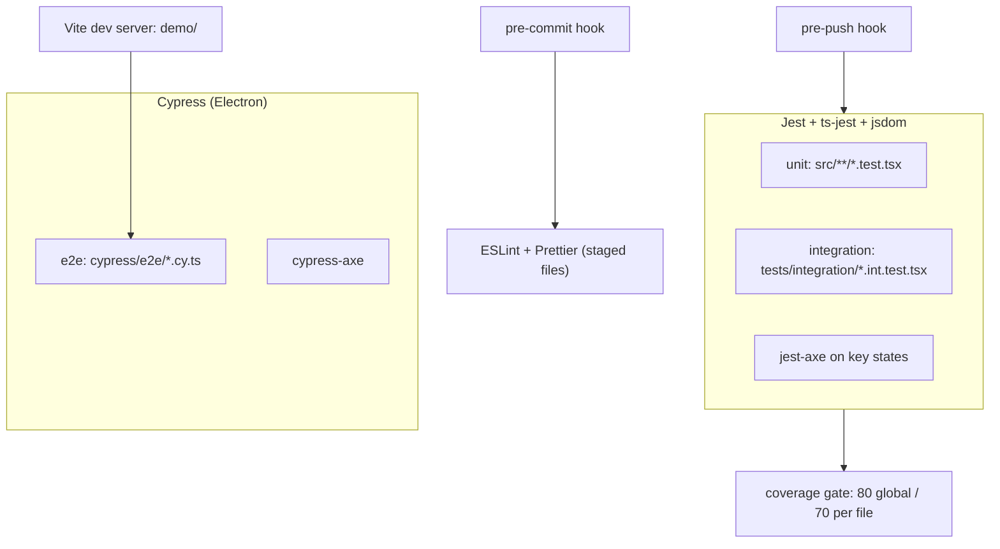

# Design: ENG-L1-M01 Code Quality & Testing — test an untested component library

**Change:** 001-m01-code-quality-testing
**Created:** 2026-09-30

## Technical Approach

Wrap the existing components in a three-level test suite without changing their behaviour,
except for the minimal fixes to the 5 defects. The work runs in waves that mirror the
challenge's Parts:



Teaching mode is on at `depth: full`. Every wave that introduces a technology rated (a) or (b)
opens with a short brief (see [Teaching gates per wave](#teaching-gates-per-wave)). Before
`verify`, the learner predicts the numbers.

## Architecture

```
m01-code-quality-testing/component-library/
├── package.json · tsconfig.json · jest.config.ts · jest.setup.ts
├── eslint.config.js · .prettierrc · .lintstagedrc.json · .husky/{pre-commit,pre-push}
├── vite.config.ts · cypress.config.ts
├── src/
│   ├── components/<Name>/<Name>.tsx         ← generated starter (fixes only in W4)
│   └── components/<Name>/<Name>.test.tsx    ← unit tests (W3)
├── tests/
│   ├── utils.tsx                            ← renderWithUser (W2)
│   └── integration/*.int.test.tsx           ← 3+ integration tests (W5)
├── demo/index.html · demo/main.tsx          ← Settings screen for E2E (W5)
├── cypress/e2e/settings-flow.cy.ts · cypress/support/e2e.ts   (W5)
└── scripts/deliverables.mjs                 ← builds docs/deliverables/* (W6)
.github/workflows/m01-ci.yml (repo root)     ← dormant CI (W6)
```



## File Changes Map

| Wave | Files | Kind |
|---|---|---|
| W1 | `component-library/src/**`, `component-library/README.md` (as generated) | config |
| W2 | `package.json`, lockfile, `tsconfig.json`, `jest.config.ts`, `jest.setup.ts`, `eslint.config.js`, `.prettierrc`, `.lintstagedrc.json`, `.husky/*`, `vite.config.ts`, `cypress.config.ts`, `tests/utils.tsx`, `.gitignore` additions | config |
| W3 | `src/components/{Button,Input,Modal,Card,Dropdown,Toggle,Alert,Tabs}/*.test.tsx`, `docs/deliverables/jayath-de-silva-month1-bug-fixes.md` (found entries) | test |
| W4 | Up to 5 `src/components/*/*.tsx` (minimal fixes), bug-fixes doc sections | impl |
| W5 | `tests/integration/*.int.test.tsx` (3+), `demo/*`, `cypress/**` | test |
| W6 | `scripts/deliverables.mjs`, `docs/deliverables/*`, `.github/workflows/m01-ci.yml`, module README update | docs |

## Data Model Changes

None. Component props are unchanged. Fixes change internal behaviour only.

## API Changes

None to the public exports in `src/index.ts`. Any fix that would need a prop change is a scope
question for the learner, not a silent change.

## Key Decisions

Design-session decisions D1–D10 are recorded in full in
[`docs/decisions-made.md`](../../../docs/decisions-made.md) and are **settled**. Summary:

| # | Decision | Choice |
|---|---|---|
| D1 | Starter library | Hybrid: generated sealed-bug library now; facilitator repo if it arrives before Part 2 |
| D2 | TypeScript in Jest | `ts-jest` (type errors fail tests) |
| D3 | Layout | Unit colocated · `tests/integration/*.int.test.tsx` · `cypress/e2e/*.cy.ts` |
| D4 | Helpers | Per-file `setup()` + shared `renderWithUser()` |
| D5 | Mocking | Only at the boundary (callbacks, time); `Harness` for controlled components |
| D6 | Coverage gate | 80% global + 70% per file, all four metrics |
| D7 | TDD commits | Red commit (failing test only) → green commit (fix only) → optional refactor |
| D8 | Accessibility | Layered: behaviour tests + `jest-axe` + `cypress-axe` |
| D9 | E2E target | Vite `demo/` page + `start-server-and-test` |
| D10 | Gates | pre-commit lint-staged · pre-push typecheck + coverage · CI file ready |

Plan-phase decisions, made by the learner on 2026-09-30:

### P1 · Autonomous loop and test guard

- **Options:** (A) loop off; (B) loop on only after Part 3, with the guard; (C) loop always on;
  (D) loop without the guard.
- **Chose:** B. `loop.enabled: true`, `guard_action: revert-tests`, and `test_paths` set to
  `component-library/src/**/*.test.tsx`, `component-library/tests/**` and
  `component-library/cypress/**`. **Rule:** don't run `/specclaw:loop` until all 5 green commits
  exist.
- **Reason (learner):** accepted the recommendation. It protects the Part 2–3 learning and the
  red→green history, but still automates the end-of-module clean-up.

### P2 · Test-suite zip deliverable

- **Chose:** A. `npm run deliverables` generates it; the zip is gitignored and attached to the
  PR, and the `.md` and `.html` deliverables are committed.
- **Reason:** always matches the final code, and keeps binaries out of history.

### P3 · Cypress browser

- **Chose:** A, bundled Electron. `cypress run` is headless in scripts and CI; `cypress open`
  runs with a visible window while writing the flow.
- **Reason:** zero setup, and the same browser locally and in CI.

### P4 · Roles for found bugs

- **Chose:** B. In W3, agents stop at a failing test, commit it alone as red, and record a
  "found" entry. In W4, **the learner** triages each one (test wrong, or code wrong?), states the
  root cause (file, line, why) and picks the fix approach. The agent then writes the minimal
  green commit, and the learner confirms that the diagnosis and fix match.
- **Reason:** the learner's time goes on triage and diagnosis, the skills this module builds.
  Agents do the typing. The learner may ask for a hint or hand one bug to the agent; that is
  logged.

## Teaching gates per wave

| Wave | Brief before the wave (levels) | The learner's part |
|---|---|---|
| W2 | ts-jest (a), jest-dom (a), ESLint testing plugins (a), Husky + lint-staged (a); syllabus ch02 and ch03 | Predict: what should `npm test` print with zero tests? Why does pre-commit not run tests? |
| W3 | RTL + queries (a, ch05), user-event (a, ch06), mocking (a, ch07), jest-axe (a, ch11); link to AAA (ch09) | Review one component's tests before the other 7 are built; flag anything implementation-coupled |
| W4 | TDD (a, ch10); "scientific debugging" | For each bug: triage, root cause, and fix approach (P4) |
| W5 | Vite `index.html` entry (b), start-server-and-test (a), Cypress (a, ch12), cypress-axe (a) | Choose the flow's steps; predict what jsdom would have missed |
| W6 | GitHub Actions (b) | Annotate the TDD log; predict the final coverage numbers before verify |

## Risks & Mitigations

| Risk | Impact | Mitigation |
|---|---|---|
| Timebox (2 days) | Parts 4–5 squeezed | W1–W2 today; W3 in parallel batches; W6 content can slip to the weekend |
| The loop or an agent fixes a bug before its red commit | Lost TDD evidence | FR9 rule in every W3 task; P1 rule; the red commit is checked in AC6 |
| An agent reads the answer key | Discovery spoiled | Task notes forbid `academy/`; AC14; the key is only read after W4 |
| Cypress install or launch on Windows | Part 4 blocked | Install in W2 to find problems early; Chrome fallback (edge case) |
| A generated library bug is easier or harder than intended | Uneven learning | Accepted in D1; the off-by-one location is known to be partly spoiled |
| Per-file threshold blocked by an unreachable branch | Gate fails | Refactor out dead code; justify any exclusion in config |
| Billing lock persists | CI can't run | `npm run verify` locally is the gate; the CI file is ready |

## Grounding sources

- `docs/decisions-made.md`: D1–D10 (quoted in the Key Decisions table)
- `.claude/rules/module-stack.md`: "Coverage ≥ 80% for lines, branches and functions, enforced
  by `coverageThreshold` in Jest config (the build fails below it)"
- `.claude/rules/git-workflow.md`: "the failing test is its **own commit** before the fix
  commit. Split such work into two specclaw tasks (`red`, then `green`)"
- `docs/plan.md`: timeboxed Parts 0–5 and the rubric map
