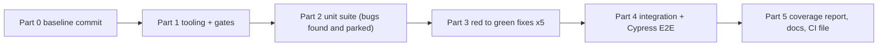

# Proposal: ENG-L1-M01 Code Quality & Testing — test an untested component library

**Created:** 2026-09-30
**Status:** 🟡 Draft

## Problem

`component-library/` holds 8 React 18 + TypeScript components (Button, Input, Modal, Card,
Dropdown, Toggle, Alert, Tabs) with **no tests, no tooling and 5 hidden defects**. Nobody can
change it safely: there's no evidence that any component works, no gate that stops a regression,
and the defects reach users.

The module's goal is to make this library trustworthy with a behaviour-focused test suite, and
to fix every defect **test-first**, so the history proves each bug was caught before it was
fixed. It also has to be done in a way I can explain in review, because learning the practice is
the point.

## Proposed Solution

Build the test infrastructure and suite around the existing components, following the ten
decisions already settled in [`docs/decisions-made.md`](../../../docs/decisions-made.md)
(treat D1–D10 as fixed; raise only questions they don't answer):

1. **Baseline.** Commit the generated starter library as-is (D1) so every later change is
   visible against it.
2. **Tooling (Part 1).** `package.json`, TypeScript strict, Vite (demo page and build), Jest with
   `ts-jest` + jsdom + jest-dom (D2), coverage gate at 80% global plus a 70% per-file floor on
   all four metrics, with `collectCoverageFrom` over `src/components` (D6), ESLint with the
   testing-library and jest-dom plugins, Prettier, and Husky + lint-staged hooks split by speed
   (D10), plus Cypress with `start-server-and-test` (D9).
3. **Test helpers.** `tests/utils.tsx` with `renderWithUser()`; per-file `setup()` factories;
   `Harness` components for the controlled components (D4, D5).
4. **Unit suite (Part 2).** One colocated `<Component>.test.tsx` per component (D3), grouped as
   rendering / interactions / edge cases in AAA style, with keyboard and ARIA behaviour per the
   WAI-ARIA pattern and `jest-axe` on key states (D8). A correct test that fails is **parked as
   a found bug and committed alone as the red commit** (D7).
5. **Bug fixes (Part 3).** For each of the 5 defects: a red commit (failing test) then a green
   commit (minimal fix), with an optional refactor. Documented per bug (location, symptom, root
   cause, test, fix).
6. **Integration and E2E (Part 4).** At least 3 multi-component tests in
   `tests/integration/*.int.test.tsx` with real children. A `demo/` Settings page, and one
   Cypress flow across components with a `cypress-axe` check (D9, D8).
7. **Evidence (Part 5).** HTML coverage report, bug-fix document, annotated TDD commit log, test
   suite archive, and a CI workflow file ready for when GitHub Actions is unlocked.

## Scope

### In Scope
- Tooling and config for Jest, TypeScript, Vite, ESLint, Prettier, Husky, lint-staged and Cypress
  inside `component-library/`
- Unit tests for all 8 components; at least 3 integration tests; at least 1 Cypress E2E flow
  with an accessibility check
- Fixes for the 5 defects, each as a red commit then a green commit
- The coverage gate (D6) enforced by `jest --coverage` and the pre-push hook
- `demo/` Settings page used by Cypress and for manual exploration
- The 4 challenge deliverables in `docs/deliverables/`, named
  `jayath-de-silva-month1-{test-suite.zip, coverage-report.html, bug-fixes.md, tdd-commits.md}`
- A CI workflow file (`.github/workflows/m01-ci.yml` at the repo root), committed but not
  expected to run until the billing lock is lifted

### Out of Scope
- New components, redesigns, or behaviour changes beyond the 5 defect fixes
- Visual regression or snapshot testing (snapshots are deliberately avoided, per ch09)
- Storybook (deferred to ENG-L1-M04), and publishing the library to npm
- Running CI on GitHub (blocked by the account billing lock; the file is prepared only)
- Offline milestones (tracked separately in `docs/offline-milestones.md`), except where they
  fall out of this work (hooks: milestone 6)
- Opening `academy/bug-key.md` before Part 3 is complete

## Impact

- **Size:** architectural. This is a new test subsystem other
  modules build on: tooling, gates, helpers, test layers and an E2E harness. The ten design
  decisions need a `design.md` record.
- **Files affected:** ~35 (estimated): ~10 config/tooling, 8 unit test files, 3+ integration, 1–2
  E2E, 3 helpers, `demo/`, up to 5 component files touched by fixes, 4 deliverables
- **Complexity:** medium
- **Risk:** medium. Main risks: the timebox (the module is scheduled for Wed 30 Sep – Thu 1 Oct);
  the specclaw loop guard reverting deliberately red tests (configure before Part 3); Cypress
  install and browser availability on Windows; flaky timing in async tests (use fake timers, no
  fixed waits)

## Open Questions

1. The facilitator's official starter repo: if it arrives before Part 2, switch to it per D1.
   Who confirms the switch and the prop differences?
2. specclaw `loop.guard_action` / `loop.test_paths`: which setting lets red-commit tasks keep a
   failing test without the reward-hack guard reverting it? Settle during `/specclaw:plan`.
3. Deliverable 1 is a `.zip` of the test files. Keep it out of git (generated in Part 5) or
   commit it? Default: generate it and gitignore it.
4. Cypress on this Windows machine: use its bundled Electron or an installed Chrome? Check in
   Part 1.

## Dependency Bypass

_Not applicable. This isn't a brownfield backlog item._

## Item Split

_Not applicable._

## Resumes Split

_Not applicable._

---

**To proceed:** Review this proposal and approve to begin planning.
