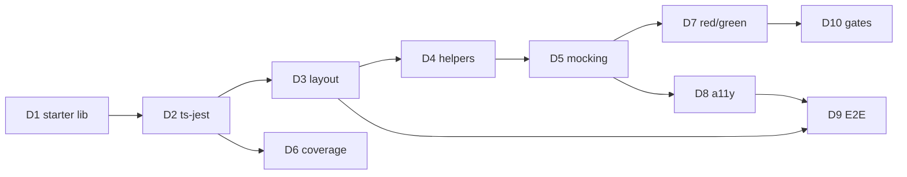
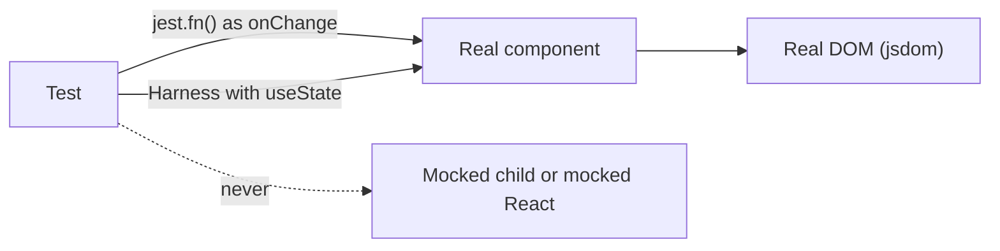

# Decisions made — ENG-L1-M01 Code Quality & Testing

Every design decision for this module, made in `/design-session` before planning. Each entry
keeps the **full context** so I can come back to it, re-learn the reasoning, and check it
still holds: the background concept, why it mattered here, the options, what I chose and why,
what it means for the code, the cost of changing it, the pattern behind it, and a
**Clarifications** log of questions I asked later.

How to use this file:

- Before building a part, reread the decisions that part depends on (see "Affects").
- If something isn't clear, ask (`/study D6`, for example). The answer is appended under
  that decision's **Clarifications**.
- If a decision turns out wrong, don't edit it silently. Add a **Revised** entry with the date,
  what changed and why.

## Summary

| # | Decision | Choice | Affects | Reversible? |
|---|---|---|---|---|
| [D1](#d1-where-the-starter-library-comes-from) | Starter library source | Hybrid: sealed-bug generated library now, facilitator repo if it arrives | everything | medium |
| [D2](#d2-project-tooling) | How Jest compiles TypeScript | Vite + Jest with `ts-jest` | Part 1 | easy |
| [D3](#d3-test-file-layout-and-naming) | Test layout | Unit colocated · `tests/integration/*.int.test.tsx` · `cypress/e2e/*.cy.ts` | Parts 2, 4 | medium |
| [D4](#d4-shared-test-helpers) | Shared setup | Per-file `setup()` factory + shared `renderWithUser()` | Part 2 | easy |
| [D5](#d5-mocking-policy) | What may be mocked | Only at the boundary: `jest.fn()` callbacks, fake timers; `Harness` for controlled components | Parts 2, 4 | medium |
| [D6](#d6-coverage-gate) | Coverage gate | Global 80% + per-file 70% on all four metrics | Parts 1, 5 | easy |
| [D7](#d7-tdd-bug-workflow-and-commit-strategy) | Bug workflow | Red commit → green commit → optional refactor | Part 3 | **hard** |
| [D8](#d8-accessibility-testing) | Accessibility testing | Layered: behaviour tests + `jest-axe` + `cypress-axe` | Parts 2, 4 | easy |
| [D9](#d9-e2e-target) | E2E target | Vite demo page + `start-server-and-test`; preview build once CI exists | Part 4 | easy |
| [D10](#d10-quality-gates) | Quality gates | pre-commit lint · pre-push typecheck + coverage · CI ready | Part 5 | easy |
| [P1](#p1-autonomous-loop-and-test-guard) | specclaw loop and test guard | Loop on only after Part 3; guard reverts test edits | Parts 3–5 | easy |
| [P2](#p2-test-suite-zip-deliverable) | Test-suite zip | Generated by `npm run deliverables`, gitignored, attached to the PR | Part 5 | easy |
| [P3](#p3-cypress-browser) | Cypress browser | Bundled Electron, headless; `cypress open` while writing | Part 4 | trivial |
| [P4](#p4-roles-for-found-bugs) | Who triages and fixes bugs | Agents park failing tests; **I** triage and diagnose; agent writes the green fix | Parts 2–3 | easy per bug |
| [B1](#b1-git-hook-scope) | Git hook scope in a multi-module repo | Path-guarded hooks: run only when M01 files are involved | every commit/push | easy |
| [B2](#b2-review-cadence-for-unit-tests) | Review cadence for the 8 test files | Button first, then two reviewed batches (simple, then complex) | Part 2 | easy |



---

## D1 · Where the starter library comes from

**Decided** 2026-09-29 · **Affects** everything · **Reversible** medium

**Background.** The challenge assumes a facilitator hands out a starter repo: 8 untested React
components with 5 planted bugs. The whole exercise depends on finding bugs *you didn't write*.
Testing is how you find them. The academy pages don't include that repo.

**Why it mattered here.** Without a starter library, Parts 1–4 can't begin. The two-day timebox
(Wed–Thu) leaves no room to wait. If we write the bugs ourselves, the discovery skill (15 bug
points and much of the learning) disappears.

**Options.**

| Option | How | Pros | Cons |
|---|---|---|---|
| A. Wait for the facilitator | Start when the repo arrives | Official starter | Blocks everything |
| B. Sealed-bug generated library | A separate agent writes the 8 components and plants 5 bugs, one per published category; the key goes to `academy/bug-key.md` (gitignored) | Unblocked; bugs are still found by testing | Not the official code; the reviewer needs a note |
| C. Build and plant bugs ourselves | We write everything | Full understanding | You'd know the bugs |
| **D. Hybrid** ✔ | B now; switch to A if it arrives before Part 2 | Never blocked; official code when possible | Some rework if props differ |

**Chose D.** It protects the timebox without faking the part that teaches.

**What it means for the code.** `component-library/src/components/*` is generated. Don't open
`academy/bug-key.md` until Part 3 is complete. The PR description states that the library was
generated, and why. *Known leak:* the off-by-one bug's location was partly hinted during the
design session, so treat that one as less of a discovery.

**Pattern.** Substitute a stand-in for an unavailable dependency behind a clean swap point, and
record the substitution (the same idea as a fake in [ch07](syllabus/07-mocking.md)).

**Clarifications.** *(none yet)*

---

## D2 · Project tooling

**Decided** 2026-09-29 · **Affects** Part 1 · **Reversible** easy

**Background.** Jest runs JavaScript. Your components are TypeScript + JSX (`.tsx`), so a
**transformer** must compile each file before Jest can run it. The main choices are `ts-jest`
(uses the real TypeScript compiler, so it also *type-checks*), `babel-jest` (strips types without
checking them) and `@swc/jest` (a very fast Rust compiler, also no type check). Vite is separate:
it serves the demo page and builds the library. The challenge requires Jest, which rules out
Vitest. See [ch02](syllabus/02-jest-basics.md) and [ch04](syllabus/04-typescript-props.md).

**Options.**

| Option | Type errors fail tests? | Speed | Notes |
|---|---|---|---|
| **A. `ts-jest`** ✔ | yes | ~2–4 s start | matches the syllabus |
| B. `babel-jest` | no (needs a separate `tsc --noEmit`) | fast | two tools to understand |
| C. `@swc/jest` | no | fastest | fewer beginner resources |

**Chose A.** Seeing `Property 'onChange' is missing` inside a test run is a free lesson in
strict TypeScript, and speed doesn't matter for 8 components.

**What it means for the code.** `jest.config.ts` uses `preset: 'ts-jest'` and
`testEnvironment: 'jsdom'`, with `setupFilesAfterEnv` loading jest-dom. Vite config sits
alongside it for `demo/`.

**Pattern.** Fail fast: catch a class of errors at the earliest, cheapest step.

**Clarifications.** *(none yet)*

---

## D3 · Test file layout and naming

**Decided** 2026-09-29 · **Affects** Parts 2, 4 · **Reversible** medium (moving files later is noisy in git)

**Background.** Where tests live decides how easy it is to find a component's tests, spot a
missing one, and see the pyramid levels (unit, integration, E2E; [ch01](syllabus/01-testing-pyramid.md)).
The reviewer scores "all 8 components have test files".

**Options.** A: everything colocated. B: `__tests__/` folders. C: top-level folders by level.
**D: hybrid** ✔.

```
component-library/
├── src/components/Button/Button.tsx
├── src/components/Button/Button.test.tsx        ← unit (one per component)
├── tests/integration/settings-form.int.test.tsx  ← multi-component (3+)
├── tests/utils.tsx                              ← shared helper (D4)
└── cypress/e2e/settings-flow.cy.ts              ← real browser (1+)
```

**Chose D.** Each level has an obvious home, and the suffix says the level at a glance. You can
run one level alone: `jest --testPathPattern int`.

**Pattern.** Screaming architecture: the folder tree shows what each file is.

**Clarifications.** *(none yet)*

---

## D4 · Shared test helpers

**Decided** 2026-09-29 · **Affects** Part 2 · **Reversible** easy

**Background.** Every test renders a component, creates a `userEvent` instance
(`userEvent.setup()`, [ch06](syllabus/06-user-event.md)), and often a `jest.fn()` handler.
Repeating that everywhere is noise. Hiding it in `beforeEach` with shared `let` variables makes
tests hard to read and to vary ([ch09](syllabus/09-aaa-and-behaviour.md)). Test quality is
25 rubric points.

**Options.** A: everything inline. B: `beforeEach` + `let`. C: a `setup()` factory per file.
**D: C plus a shared `renderWithUser()`** ✔.

```tsx
// tests/utils.tsx
export function renderWithUser(ui: ReactElement) {
  return { user: userEvent.setup(), ...render(ui) };
}
// Button.test.tsx
function setup(props: Partial<ButtonProps> = {}) {
  const onClick = jest.fn();
  return { onClick, ...renderWithUser(<Button onClick={onClick} {...props}>Save</Button>) };
}
```

**Chose D.** Arrange stays one explicit line per test (defaults plus overrides), with no hidden
shared state and no repeated `userEvent.setup()`.

**Pattern.** Test data builder / factory.

**Clarifications.** *(none yet)*

---

## D5 · Mocking policy

**Decided** 2026-09-29 · **Affects** Parts 2, 4 · **Reversible** medium

**Background.** A **mock** replaces something real with a fake that records how it was used
([ch07](syllabus/07-mocking.md)). Mocks make tests precise but can hide bugs: if `Input` is
mocked inside a form test, a broken `Input` still passes ([ch01](syllabus/01-testing-pyramid.md), Q3).
Several components are **controlled** (the parent owns the state and passes `value`/`checked`
plus an `onChange`), so tests need something to play the parent.

**Options.** **A: mock only at the boundary** ✔. B: mock child components. C: mock nothing.

**Chose A.** `jest.fn()` for callback props, and fake timers for time. React, the DOM and
child components are never mocked. Two kinds of check:

- **Interaction check** ("was it called, with what?"): pass a `jest.fn()` and assert on it.
- **State check** ("does the UI update?"): render inside a tiny `Harness` that holds the state
  with `useState`, then read the screen.



**Pattern.** Mock at architectural boundaries.

**Clarifications.** *(none yet)*

---

## D6 · Coverage gate

**Decided** 2026-09-29 · **Affects** Parts 1, 5 · **Reversible** easy (except forgetting `collectCoverageFrom`)

**Background.** Coverage is Jest's measurement of which code ran during tests: statements,
lines, functions and branches ([ch03](syllabus/03-code-coverage.md), including the
"How the numbers are calculated" section). A **threshold** turns it into a gate that fails the run
below a limit. `collectCoverageFrom` makes untested files count as 0% instead of disappearing.
Coverage proves code *ran*, not that assertions are good.

**Why it mattered here.** It's worth 25 rubric points (80% or more on lines, branches and
functions; 90% or more is the top band). The trap: the global number sums raw counts, so one
big, well-tested file can hide a small, untested one.

**Options.**

| | A Global 80 | **B Global 80 + file 70** ✔ | C Global 90 | D File 80 |
|---|---|---|---|---|
| Meets rubric | yes | yes | yes | yes |
| Weak component can't hide | no | **yes** | partly | yes |
| Pressure toward low-value tests | low | low | high | medium |

**Chose B.**

```ts
coverageThreshold: {
  global: { lines: 80, branches: 80, functions: 80, statements: 80 },
  './src/components/**/*.tsx': { lines: 70, branches: 70, functions: 70, statements: 70 },
},
collectCoverageFrom: ['src/components/**/*.{ts,tsx}', '!src/**/index.ts', '!src/**/*.stories.tsx'],
```

**Pattern.** A quality gate with a per-unit floor. "Coverage finds untested code; it doesn't
prove tests are good" (Martin Fowler, *TestCoverage*).

**Clarifications.**

- **2026-09-29 · "How are the numbers added up?"** Each column is *items that ran ÷ items that
  exist*. For a 5-statement, 4-line, 2-function, 4-branch component, one happy-path test gave
  60% / 75% / 50% / 50%, and each further test raised a different column. The global number sums
  covered items across all files before dividing: 90/100 + 2/10 = 92/110 = 83.6%, not the
  55% average. That's why the per-file floor exists. The full worked example is in
  [ch03 → How the numbers are calculated](syllabus/03-code-coverage.md#how-the-numbers-are-calculated).

---

## D7 · TDD bug workflow and commit strategy

**Decided** 2026-09-29 · **Affects** Part 3 (and how Part 2 handles surprises) · **Reversible** **hard**, because history is written once

**Background.** TDD is **red** (write a test that fails), **green** (smallest fix that passes),
then **refactor** (clean up safely) ([ch10](syllabus/10-tdd.md)). For bugs, the red test is a
**regression test** that stays forever. A reviewer can't watch you work; they read `git log`. So
the failing test must be committed *before* its fix. Conventional Commit messages
(`test(…)`, `fix(…)`) label each step.

**Why it mattered here.** It's worth 20 points for TDD process and 15 for bug fixes. Bugs will
first appear in Part 2 as ordinary tests that fail even though the test is right, so the
workflow must say what to do at that moment.

**Options.** A: test and fix in one commit. **B: a red commit, then a green commit** ✔.
C: `it.failing`, then flip it. D: a branch per bug.

**Chose B.**

```
test(<component>): reproduce <symptom> (red)     ← failing test only
fix(<component>): <what was corrected> (green)   ← code change only
refactor(<component>): <cleanup>                 ← optional, tests stay green
```

Rule: when a correct test fails in Part 2, **don't fix it**. Record it as "found" in
`docs/deliverables/jayath-de-silva-month1-bug-fixes.md`, and commit the failing test as the red
commit. Fix it in Part 3.

**Constraints on other decisions.** Pre-commit hooks must not run the full suite (D10). Each bug
is two specclaw tasks, red then green, with the loop guard configured not to revert red tests.
`main` only receives the green merge.

**Pattern.** Red-green-refactor with regression tests, and atomic Conventional Commits.

**Clarifications.** *(none yet)*

---

## D8 · Accessibility testing

**Decided** 2026-09-29 · **Affects** Parts 2, 4 · **Reversible** easy to add, costly to skip

**Background.** Assistive technology reads the **accessibility tree** (role, name and state of
each element), not the pixels ([ch11](syllabus/11-accessibility.md)). WAI-ARIA Authoring Practices
define expected keyboard and focus behaviour per widget: a modal traps focus and closes on
Escape, tabs move with the arrow keys, a switch toggles with Space. **Scanners** (axe-core via
`jest-axe` or `cypress-axe`) check the markup against rules. **Behaviour tests** check what
happens when you use the component. Neither replaces the other.

**Why it mattered here.** One seeded bug is an accessibility bug, and the E2E test must check
accessibility. Modal, Tabs, Dropdown and Toggle all have strict keyboard rules.

**Options.** A: behaviour only. B: + `jest-axe`. C: + `cypress-axe`. **D: layered** ✔.

**Chose D.** Behaviour tests per WAI-ARIA pattern for interaction, `jest-axe` on the important
states (open, error, disabled) for markup, and `cypress-axe` in the E2E flow for the real page
(contrast, visibility). No axe rule is disabled without a written reason.

**Pattern.** Defence in depth, and testing against a specification.

**Clarifications.** *(none yet)*

---

## D9 · E2E target

**Decided** 2026-09-29 · **Affects** Part 4 · **Reversible** easy

**Background.** E2E tests drive a real browser against a **running page** ([ch12](syllabus/12-cypress-e2e.md)).
A library has no page, so something must render the components, and a helper must start the
server before Cypress and stop it after (`start-server-and-test`). A **dev server** (`vite`) is
fast for iterating. A **preview build** (`vite build && vite preview`) is closer to production.

**Options.** **A: Vite demo page** ✔ (D once CI exists). B: Storybook. C: Cypress component
testing (not a real user flow). D: preview build.

**Chose A.** A `demo/` Settings screen composes the components. `npm run e2e` starts Vite, waits
for `http://localhost:5173`, runs Cypress, then stops. The flow: open the Modal, fill the Input,
pick a Dropdown option, flip the Toggle, switch Tabs, save, see the Alert, then run the axe
check. Use role- or label-based selectors, and no `cy.wait(<ms>)`.

**Pattern.** Test the critical user journey in a self-contained, scripted environment.

**Clarifications.** *(none yet)*

---

## D10 · Quality gates

**Decided** 2026-09-29 · **Affects** Part 5 and every commit · **Reversible** easy

**Background.** **Git hooks** run on your machine at pre-commit, commit-msg or pre-push. **Husky**
installs them from `package.json`, and **lint-staged** runs checks only on the files you staged.
**ESLint** with `eslint-plugin-testing-library` and `eslint-plugin-jest-dom` flags test
anti-patterns as you commit. **CI** repeats the checks on a server. Right now GitHub Actions is
billing-locked, so CI is prepared but won't run.

**Why it mattered here.** D7's red commits deliberately fail tests, so a pre-commit hook that
runs the whole suite would block them (and teach `--no-verify`). The gates also cover the
10 code-quality points.

**Options.** A: npm scripts only. **B: hooks split by speed, CI ready** ✔. C: full tests in
pre-commit (conflicts with D7). D: B + `commitlint`.

**Chose B.**

```
pre-commit : lint-staged → ESLint (testing-library + jest-dom rules) + Prettier   ~2 s
pre-push   : tsc --noEmit + jest --coverage                                        ~20 s
CI         : .github/workflows/m01-ci.yml → lint, typecheck, test, e2e (dormant until billing is fixed)
one command: npm run verify (the same checks, run by hand)
```

**Pattern.** Shift-left testing with tiered gates by cost.

**Revised 2026-09-30.** The pre-push coverage gate (`test:cov`) **blocks pushes to `main`**
and is **advisory on feature branches**: it warns but doesn't block. Typecheck and lint block
every push. Reason: the feature branch is deliberately red during Parts 2–3 (D7), and a hard gate
would stop backups to GitHub or train the `--no-verify` habit. Approved by me.

**Relation to the offline milestone** "set up pre-commit hooks for test running": tests run in
the **pre-push** hook, not pre-commit, because of D7. The milestone evidence explains that
trade-off (see [offline-milestones.md](offline-milestones.md)).

**Clarifications.** *(none yet)*

---

## P1 · Autonomous loop and test guard

**Decided** 2026-09-30 (plan phase) · **Affects** Parts 3–5 · **Reversible** easy, except that a bug fixed before its red commit can't be undone

**Background.** `/specclaw:loop` runs after a build. It re-runs every check and sends a fix agent
to make the smallest change that turns red checks green, repeating until done or a limit stops
it. Its **test guard** rejects and reverts any fix that edits a test file (`guard_action:
revert-tests`), because changing a test to make it pass is the standard way automated fixes
cheat.

**Why it mattered here.** The red tests in Part 2 are deliberate. A loop running then would fix
the bugs itself, before I diagnose them, and break the red→green history.

**Options.** A: loop off. **B: loop only after Part 3, with the guard** ✔. C: loop always on.
D: loop without the guard.

**Chose B.** Config: `loop.enabled: true`, `guard_action: "revert-tests"`, and `test_paths`
covering `src/**/*.test.tsx`, `tests/**` and `cypress/**`. **Rule: never run `/specclaw:loop`
until all 5 green commits exist.**

**Pattern.** Human-in-the-loop automation; tests define correctness (TDD invariant).

**Clarifications.** *(none yet)*

---

## P2 · Test-suite zip deliverable

**Decided** 2026-09-30 · **Affects** Part 5 · **Reversible** easy

**Background.** A zip is a generated copy of files already in git. Committed copies go stale and
bloat history, so generated artefacts are normally rebuilt on demand or attached to a release.

**Options.** **A: generate it, don't commit it** ✔. B: commit it in Part 5. C: skip it.

**Chose A.** `npm run deliverables` builds the zip (gitignored, attached to the PR) and writes the
coverage HTML and TDD log into `docs/deliverables/`, which are committed.

**Pattern.** Build artefacts are reproducible outputs, not source.

**Clarifications.** *(none yet)*

---

## P3 · Cypress browser

**Decided** 2026-09-30 · **Affects** Part 4 · **Reversible** trivial (a CLI flag)

**Background.** Cypress ships with Electron (Chromium). It can also drive an installed
Chrome or Edge. Headless means no window, as CI uses.

**Options.** **A: Electron** ✔. B: Chrome. C: Edge.

**Chose A.** `cypress run` is headless in scripts and CI; `cypress open` runs with a window while
writing the flow.

**Pattern.** Keep local and CI environments the same.

**Clarifications.** *(none yet)*

---

## P4 · Roles for found bugs

**Decided** 2026-09-30 · **Affects** Parts 2–3 · **Reversible** easy, per bug

**Background.** A failing test needs three steps: **triage** (is the test wrong, or the code?),
**diagnosis** (which line, and why?) and a **fix** (minimal, green). The learning is in triage and
diagnosis.

**Options.** A: agents do everything. **B: agents find, I triage and diagnose, agents fix** ✔.
C: I do all of Part 3. D: B plus writing some tests myself.

**Chose B.**
- *Part 2:* agents keep a failing test, label that component's test commit
  `(red: <behaviour>)`, and log a "Found" row.
- *Part 3, per bug:* I see the red test and its output, then decide whether the test or the code
  is wrong, the root cause (file, line, why) and the fix approach. The agent writes the minimal
  `fix(…) (green)` commit, and I confirm it matches my diagnosis. Hints only when I ask.
- *Upgrade path:* if there's slack on Thursday, switch 2–3 components to D.

**Implementation note.** specclaw commits once per task, and bugs are found while a
component's tests are being written. So the failing test shares its commit with that
component's passing tests rather than having a commit of its own. The D7 evidence holds: the
failing test is committed before its fix, and the fix commit touches no test.

**Pattern.** Scientific debugging (observe, hypothesise, test, fix) and deliberate practice.

**Clarifications.** *(none yet)*

---

## B1 · Git hook scope

**Decided** 2026-09-30 (build, wave 2) · **Affects** every commit and push in `rbt-eng-l1` · **Reversible** easy

**Background.** Git has one hooks folder per repository (`core.hooksPath`), and `rbt-eng-l1` holds
all six modules. Hooks that Husky installs from this module therefore run on every commit and push in
the track repo, including docs, other modules and the template.

**Options.** **A: path-guarded hooks** ✔. B: no Husky, manual `npm run verify`. C: a track-level
`package.json` managing hooks (breaks module isolation).

**Chose A.** Each hook first checks whether the staged files (pre-commit) or the pushed commits
(pre-push) touch `m01-code-quality-testing/component-library/`, and exits 0 if they don't. Later
modules add their own guarded block.

**Pattern.** Scope side effects to their owner: a shared resource used without affecting other
users.

**Clarifications.** *(none yet)*

---

## B2 · Review cadence for unit tests

**Decided** 2026-09-30 (build, wave 3) · **Affects** Part 2 · **Reversible** easy

**Background.** The first test file (Button) sets the pattern for the other seven, which agents
can write in parallel. One review at the end is long and easy to skim. Reviewing every file
makes me the bottleneck.

**Options.** **A: two batches** ✔. B: all seven, then one review. C: one at a time.

**Chose A.** Button is reviewed closely first. Then batch 1 (Input, Card, Toggle; simple) gets a
short review. Then batch 2 (Modal, Dropdown, Alert, Tabs; complex, where bugs and keyboard rules
concentrate) gets a short review. Found bugs are listed at each review.

**Pattern.** Review early to set the standard, then at batch boundaries.

**Clarifications.** *(none yet)*
