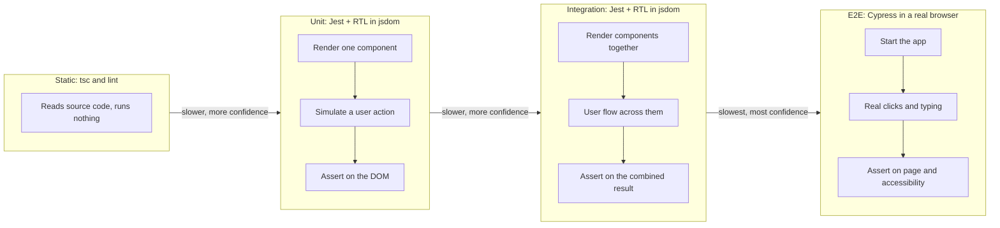
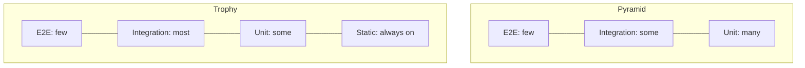

# 01 · Testing Pyramid and Testing Trophy

*Level (a) never used · about 10 minutes reading, plus 10 minutes for the questions*

## Why this matters here

The component library has 8 components and no tests at all. Before you write a single test you need to decide *what kind* of test each check should be. That decision shapes Part 2 (unit tests for all 8 components), Part 3 (the 5 bug fixes, each starting with a test at the right level) and Part 4 (3 integration tests and 1 Cypress end-to-end test). Pick the wrong level and your tests end up slow, fragile or unable to catch the bug.

## Mental model

A **test** is a small program that runs your code and checks that it did what you expected. In this module, unit and integration tests run in **Jest** (the test runner, chapter 02) with **React Testing Library (RTL)**, a library that renders components and finds elements the way a user would. End-to-end tests run in **Cypress**, a tool that drives a real browser. Tests come in levels, and each level trades **speed** against **confidence**:

- A **unit test** checks one small piece in isolation. Here, that means one component, such as `Button`, rendered on its own. It is fast (milliseconds) and tells you exactly what broke, but it cannot tell you whether the pieces work together.
- An **integration test** checks several pieces working together. For example, a `Modal` that contains an `Input` and a `Button`, where typing and submitting should close the modal. It is still fast, and closer to how people use the code.
- An **end-to-end (E2E) test** drives the real app in a real browser, the way a user would, with clicks, typing and page loads. It gives the most confidence and costs the most: it is slow, and it can fail for reasons that have nothing to do with your code (network, timing).

The **testing pyramid** (Mike Cohn's idea, popularised by Martin Fowler) says: write many unit tests, fewer integration tests and very few E2E tests. The picture is a pyramid, wide at the bottom.

The **testing trophy** (Kent C. Dodds) is the front-end counterpoint. It adds a base layer of **static analysis**: tools that read your code without running it. Here that means TypeScript (catching type errors) and a **linter** (a tool that flags suspicious patterns and typos, such as ESLint). It also makes the integration layer the widest, because in UI code most bugs happen where components meet, and tools like RTL make integration tests nearly as cheap as unit tests.

Think of it like checking a car. Unit tests check each part on a bench. Integration tests check the engine connected to the gearbox. E2E is a test drive on the road.

**Where the analogy breaks:** in a car the parts are physically separate. In a React library the line between "unit" and "integration" is blurry. A `Tabs` test that renders tab buttons and panels already exercises several pieces at once. Do not argue over labels. Ask "what does this test give me confidence in, and what does it cost?"

## Diagram

How each level reaches your code, and what it costs:



And the two shapes, as the share of tests at each level:



## Core primitives

**1. A unit test.** One component, one behaviour. **jsdom** is a fake browser document that runs inside Node, so Jest can render components without opening a browser.

```tsx
// src/components/Button/Button.test.tsx
import { render, screen } from '@testing-library/react';
import userEvent from '@testing-library/user-event';
import { Button } from './Button';

it('calls onClick when clicked', async () => {
  const user = userEvent.setup();
  const handleClick = jest.fn();
  render(<Button onClick={handleClick}>Save</Button>);

  await user.click(screen.getByRole('button', { name: 'Save' }));

  expect(handleClick).toHaveBeenCalledTimes(1);
});
```

**2. An integration test.** Several components, one user flow. The only difference is scope.

```tsx
// src/__tests__/modal-form.integration.test.tsx
import { useState } from 'react';
import { render, screen } from '@testing-library/react';
import userEvent from '@testing-library/user-event';
import { Modal } from '../components/Modal/Modal';
import { Input } from '../components/Input/Input';
import { Button } from '../components/Button/Button';

function RenameDialog() {
  const [open, setOpen] = useState(true);
  const [name, setName] = useState('');
  return (
    <Modal isOpen={open} onClose={() => setOpen(false)} title="Rename">
      <Input label="Name" value={name} onChange={(e) => setName(e.target.value)} />
      <Button onClick={() => setOpen(false)} disabled={name === ''}>Save</Button>
    </Modal>
  );
}

it('enables Save after typing and closes the modal on save', async () => {
  const user = userEvent.setup();
  render(<RenameDialog />);

  expect(screen.getByRole('button', { name: 'Save' })).toBeDisabled();
  await user.type(screen.getByLabelText('Name'), 'Report');
  await user.click(screen.getByRole('button', { name: 'Save' }));

  expect(screen.queryByRole('dialog')).not.toBeInTheDocument();
});
```

This assumes `Input`'s `onChange` receives the change event. Check the real signature in the starter code (chapter 04 covers event types).

**3. An E2E test.** Cypress opens the running app in a real browser.

```ts
// cypress/e2e/tabs.cy.ts
describe('Tabs page', () => {
  it('shows the second panel when its tab is clicked', () => {
    cy.visit('/');
    cy.findByRole('tab', { name: 'Settings' }).click();
    cy.findByRole('tabpanel').should('contain.text', 'Settings');
  });
});
```

`cy.findByRole` comes from `@testing-library/cypress`. Without it, use `cy.contains('[role=tab]', 'Settings')`.

**4. Static analysis.** No test file at all: `tsc --noEmit` (the TypeScript compiler, told to check types without writing any output) reads every file and fails if, for example, someone passes `variant="danger"` to `Button` when only `'primary' | 'secondary'` is allowed.

```ts
// This line fails type-checking before any test runs:
// <Button variant="danger">Delete</Button>
// Type '"danger"' is not assignable to type '"primary" | "secondary" | undefined'.
```

**5. Choosing a level.** A rule of thumb for this project:

| The check is about... | Level |
|---|---|
| One component's output or callbacks | Unit |
| Two or more components cooperating | Integration |
| Real browser behaviour: layout, real focus, full-page accessibility scan | E2E |
| Wrong prop names or types | Static |

## Worked example

Take `Alert` (`variant`, `dismissible?`, `onDismiss?`, `autoDismissMs?`). List what could go wrong, then give each item a level.

1. **"It renders its message with the right role."** Only `Alert` is involved, so this is a **unit** test: render it and check `getByRole('alert')` contains the text.
2. **"Clicking the dismiss button calls `onDismiss`."** Still one component, so **unit**. Use `jest.fn()` as `onDismiss` and click the button with `user.click`.
3. **"It dismisses itself after `autoDismissMs`."** Still **unit**, but time-based, so you will use Jest fake timers (a later chapter) instead of really waiting.
4. **"A form shows an error `Alert` when `Input` is empty and `Button` is pressed, and the alert goes away when dismissed."** Three components cooperating, so this is an **integration** test. It is a good candidate for one of your 3 Part 4 integration tests.
5. **"The alert has no accessibility violations on the real page."** A full-page accessibility scan in a real browser is **E2E** (Cypress with `cypress-axe`, a plugin that runs the axe accessibility checker on the page). It fits the single Part 4 E2E test.
6. **"Passing `variant="warn"` by mistake."** TypeScript catches it, so it is **static**. No test needed.

The result: four fast jsdom tests, one browser test, and one check you get for free. That is the trophy shape in miniature.

## Common mistakes

- **Testing everything E2E.** *Symptom:* the suite takes minutes and fails randomly on timing. *Fix:* move single-component checks down to Jest + RTL. Keep Cypress for the one flow that needs a real browser.
- **Mocking so much that a "unit" test proves nothing.** *Symptom:* tests pass while the app is broken, because every child component was replaced with a fake. *Fix:* render real child components. In this library they are cheap. A **mock** is a fake stand-in for real code that records how it was called. Mock only at module boundaries such as network calls.
- **Treating the pyramid as a quota.** *Symptom:* adding trivial unit tests ("renders without crashing") just to make the base wider. *Fix:* each test should protect a behaviour a user or caller relies on. Count confidence, not tests.
- **Arguing about labels.** *Symptom:* long debates over whether a `Tabs` test is "really" a unit test. *Fix:* use the rule-of-thumb table and move on. What matters is scope and cost.
- **Skipping static checks.** *Symptom:* tests written to check prop types by hand. *Fix:* let `tsc` do it. Spend your tests on behaviour.

## Check yourself

??? question "Q1. Suppose selecting an option in Dropdown does not call `onChange`. Which level of test should you write first, and why?"
    A unit test. The bug lives inside one component, so a Jest + RTL test that renders `Dropdown` with a `jest.fn()` as `onChange`, selects an option and asserts the mock was called will fail fast and point straight at the cause. An E2E test would also catch it, but it is slower and tells you less about where the fault is.

??? question "Q2. What does the testing trophy add that the pyramid does not have, and why does it make integration the widest layer?"
    It adds static analysis (TypeScript, linting) as the base. It makes integration widest because in front-end code many bugs come from components interacting, and React Testing Library makes integration tests almost as cheap as unit tests, so you get more confidence for about the same cost.

??? question "Q3. Predict: you replace `Input` with a mock inside a Modal form test, and the real `Input` has a bug where it never calls `onChange`. Does the test catch it?"
    No. The mock stands in for the real `Input`, so the bug is never run. This is why integration tests should use real child components.

??? question "Q4. Why does the Part 4 accessibility check belong in Cypress rather than only in Jest?"
    jsdom does not do real layout, styling or browser focus behaviour. A scan in a real browser, with the whole page assembled, sees what a real user and assistive technology would see. Jest tests can still check roles and labels. The E2E scan is the final check on the assembled page.

## Go deeper

**Official docs**

- [Martin Fowler — Test Pyramid](https://martinfowler.com/bliki/TestPyramid.html)

**Articles**

- [The Testing Trophy and Testing Classifications](https://kentcdodds.com/blog/the-testing-trophy-and-testing-classifications) — Kent C. Dodds
- [The Practical Test Pyramid](https://martinfowler.com/articles/practical-test-pyramid.html) — Ham Vocke (martinfowler.com)
- [Static vs Unit vs Integration vs E2E Testing for Frontend Apps](https://kentcdodds.com/blog/static-vs-unit-vs-integration-vs-e2e-tests) — Kent C. Dodds

**Videos**

- [Does the testing trophy need updating for 2025?](https://www.youtube.com/watch?v=ooBcCSpt0hs) — Kent C. Dodds · 10:17
- [React Testing Tutorial - 3 - Types of Tests](https://www.youtube.com/watch?v=Z_U6M1hMC6s) — Codevolution · 4:46

## Used in

- **Part 2:** every one of the 8 component test files is a set of unit tests. Use the table above to keep cross-component checks out of them.
- **Part 3:** for each seeded bug, decide the lowest level that reproduces it, and write that failing test first.
- **Part 4:** choose 3 flows where components cooperate for the integration tests, and 1 real-browser flow with an accessibility check for Cypress.

*Resources verified 2026-09-29.*
