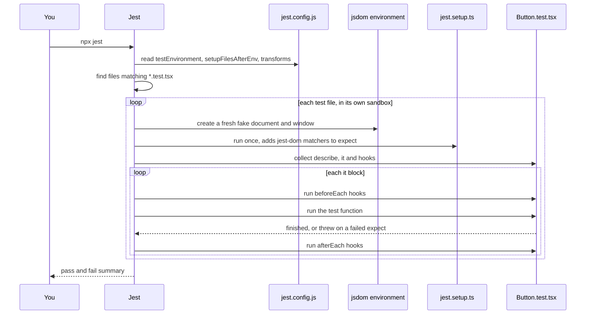

# 02 · Jest Basics

*Level (a) never used · about 11 minutes reading, plus 15 minutes trying it*

## Why this matters here

Jest is the **test runner** for this module: the program that finds your test files, runs them and reports what passed and failed. Part 1 is mostly Jest configuration (`jest.config.js`, the jsdom environment, the setup file, coverage thresholds). Every test in Part 2, Part 3 and the integration tests in Part 4 is written with Jest's `describe`, `it` and `expect`. If the config is wrong, nothing else in the module runs.

## Mental model

A Jest test file is a list of claims about your code. Each claim is a small function. Jest runs them one by one and tells you which ones turned out false.

- `it('does X', fn)` (alias `test`) registers one claim. Jest calls `fn` later.
- Inside `fn`, `expect(actual).toBe(expected)` checks something. If the check fails, it **throws** an error, and Jest marks that test as failed.
- A test **passes** if its function finishes without throwing (and, for async tests, the returned promise resolves).
- `describe('Button', fn)` groups related claims under one heading.

So a failed assertion is just an exception that Jest catches and reports nicely. Kent C. Dodds' article in Go deeper builds a tiny version of this by hand, and it is worth ten minutes.

**Where the model breaks:** Jest does not run test functions the moment it reads them. It first *collects* every `describe`, `it` and hook in the file, then runs them. Code written directly inside a `describe` body (not inside an `it` or hook) runs during collection, before any test. Put setup in `beforeEach`, not loose in a `describe`.

## Diagram

What happens when you type `npx jest`:



## Core primitives

**1. `describe`, `it`, `expect`.** The three words you will type most.

```tsx
import { render, screen } from '@testing-library/react';
import { Button } from './Button';

describe('Button', () => {
  it('shows its label', () => {
    render(<Button>Save</Button>);
    expect(screen.getByRole('button', { name: 'Save' })).toBeInTheDocument();
  });
});
```

`describe`, `it` and `expect` are globals, so you do not import them.

**2. Matchers.** A **matcher** is the method after `expect(...)` that states what you expect. Core Jest matchers work on plain values. `jest-dom` adds matchers for DOM elements.

```ts
expect(1 + 1).toBe(2);                        // same value (===)
expect({ id: 'a' }).toEqual({ id: 'a' });     // same shape, deep compare
expect([1, 2, 3]).toHaveLength(3);
expect(() => { throw new Error('boom'); }).toThrow('boom');
expect(null).toBeNull();
expect('Save').not.toBe('Cancel');            // .not flips any matcher

// jest-dom matchers (need the setup file below)
// expect(button).toBeDisabled();
// expect(dialog).toHaveAccessibleName('Rename');
```

Use `toBe` for numbers, strings and booleans, and `toEqual` for objects and arrays. `toBe` on two objects with the same contents fails, because they are different objects.

**3. Mock functions.** `jest.fn()` creates a fake function that records every call. It is how you check that a component called its callback prop.

```tsx
import { render, screen } from '@testing-library/react';
import userEvent from '@testing-library/user-event';
import { Toggle } from './Toggle';

it('calls onChange with the new value', async () => {
  const user = userEvent.setup();
  const handleChange = jest.fn();
  render(<Toggle label="Dark mode" checked={false} onChange={handleChange} />);

  await user.click(screen.getByRole('switch', { name: 'Dark mode' }));

  expect(handleChange).toHaveBeenCalledWith(true);
});
```

The expected argument depends on `Toggle`'s actual `onChange` signature, and the role depends on its markup (`switch` for `role="switch"`, `checkbox` for a plain checkbox input). Check the starter code. `userEvent.setup()` creates a simulated user; every `user.*` call returns a promise, so you `await` it.

**4. Hooks: `beforeEach` and `afterEach`.** A **hook** is a function Jest runs around each test. Use it for setup every test in a group needs, so each test starts clean.

```tsx
import { act, render } from '@testing-library/react';
import { Alert } from './Alert';

describe('Alert auto-dismiss', () => {
  beforeEach(() => {
    jest.useFakeTimers();
  });

  afterEach(() => {
    jest.useRealTimers();
  });

  it('calls onDismiss after autoDismissMs', () => {
    const onDismiss = jest.fn();
    render(<Alert variant="info" autoDismissMs={3000} onDismiss={onDismiss}>Saved</Alert>);

    act(() => {
      jest.advanceTimersByTime(3000);
    });

    expect(onDismiss).toHaveBeenCalledTimes(1);
  });
});
```

This assumes `Alert` renders its message as `children` and accepts `variant="info"`. Adjust both to the starter code. **Fake timers** replace `setTimeout` and friends with a clock you move by hand (`jest.advanceTimersByTime`), so the test does not really wait 3 seconds. `act` (from RTL) makes React finish any state updates the timer triggered before you assert. There are also `beforeAll` and `afterAll`, which run once per file. Prefer `beforeEach`, so tests cannot leak state into each other.

**5. `jest.config.js`.** The configuration file. Two settings matter most for React:

- `testEnvironment: 'jsdom'` gives each test file a fake browser `document` and `window`. Without it, the default environment is `node`, which has no `document`, and `render` fails with `document is not defined`. Since Jest 28 you must install `jest-environment-jsdom` separately.
- `setupFilesAfterEnv` lists files that run before each test file, after Jest is installed. That is where you load the `jest-dom` matchers.

```js
// jest.config.js
/** @type {import('jest').Config} */
module.exports = {
  testEnvironment: 'jsdom',
  setupFilesAfterEnv: ['<rootDir>/jest.setup.ts'],
  transform: {
    '^.+\\.(ts|tsx)$': 'ts-jest',
  },
  moduleNameMapper: {
    '\\.(css|scss)$': 'identity-obj-proxy',
  },
};
```

```ts
// jest.setup.ts
import '@testing-library/jest-dom';
```

`transform` tells Jest how to turn TypeScript into JavaScript it can run (here `ts-jest`; `babel-jest` with a TypeScript preset also works). `moduleNameMapper` stops Jest from choking when a component imports a CSS file. Use whatever the starter project already uses and add only what is missing.

**6. Running tests and watch mode.**

```bash
npx jest                      # run every test once
npx jest Button               # only files whose path matches "Button"
npx jest -t "calls onClick"   # only tests whose name matches
npx jest --watch              # re-run tests related to files you change
npx jest --coverage           # run and measure coverage (chapter 03)
```

In **watch mode**, Jest keeps running and re-runs the affected tests each time you save. Press `p` to filter by file name, `t` to filter by test name, `a` to run all, `q` to quit. `--watch` relies on git to know what changed. In a folder that is not a git repository, use `--watchAll`.

## Worked example

Set up Jest for the library and write the first `Button` test from nothing.

1. **Install** the pieces (versions compatible with Jest 29):

    ```bash
    npm install -D jest@29 jest-environment-jsdom@29 ts-jest@29 @types/jest \
      @testing-library/react @testing-library/dom @testing-library/user-event \
      @testing-library/jest-dom identity-obj-proxy
    ```

    `@testing-library/dom` is listed explicitly because RTL 16 and later declare it as a peer dependency (a package you must install yourself) instead of bundling it.

2. **Write `jest.config.js` and `jest.setup.ts`** as in primitive 5.
3. **Add scripts** to `package.json`: `"test": "jest"`, `"test:watch": "jest --watch"`.
4. **Write the test file** next to the component, `src/components/Button/Button.test.tsx`:

    ```tsx
    import { render, screen } from '@testing-library/react';
    import userEvent from '@testing-library/user-event';
    import { Button } from './Button';

    describe('Button', () => {
      describe('rendering', () => {
        it('shows its label', () => {
          render(<Button>Save</Button>);
          expect(screen.getByRole('button', { name: 'Save' })).toBeInTheDocument();
        });
      });

      describe('interaction', () => {
        it('calls onClick once per click', async () => {
          const user = userEvent.setup();
          const onClick = jest.fn();
          render(<Button onClick={onClick}>Save</Button>);

          await user.click(screen.getByRole('button', { name: 'Save' }));

          expect(onClick).toHaveBeenCalledTimes(1);
        });
      });

      describe('edge cases', () => {
        it('does not call onClick when disabled', async () => {
          const user = userEvent.setup();
          const onClick = jest.fn();
          render(<Button onClick={onClick} disabled>Save</Button>);

          await user.click(screen.getByRole('button', { name: 'Save' }));

          expect(onClick).not.toHaveBeenCalled();
        });
      });
    });
    ```

    The three inner `describe` blocks match the module rule: every component has rendering, interaction and edge-case groups.

5. **Run it** with `npm test`. You should see three passing tests.
6. **Prove the test can fail.** Temporarily change `toHaveBeenCalledTimes(1)` to `toHaveBeenCalledTimes(2)` and run again. Read the failure message: it shows expected and received values. Change it back. A test you have never seen fail might not be testing anything.

## Common mistakes

- **`ReferenceError: document is not defined`.** *Cause:* the test environment is `node`. *Fix:* set `testEnvironment: 'jsdom'` and install `jest-environment-jsdom`.
- **`TypeError: expect(...).toBeInTheDocument is not a function`.** *Cause:* `jest-dom` is not loaded. *Fix:* add `import '@testing-library/jest-dom'` to the file listed in `setupFilesAfterEnv`, and check the path is right.
- **Forgetting `await` on `user.click`.** *Symptom:* the assertion runs before the click finishes, so the test fails, or passes by luck, sometimes with an "act" warning (React telling you a state update happened outside `act`, that is, after the test stopped waiting). *Fix:* make the test `async` and `await` every `user.*` call.
- **Using `toBe` on objects or arrays.** *Symptom:* `expect(received).toBe(expected)` fails, with a note that the values serialize the same. *Fix:* use `toEqual`.
- **State leaking between tests.** *Symptom:* a test passes alone (`-t`) but fails in the full run. *Fix:* create mocks inside each test or in `beforeEach`, and restore fake timers in `afterEach`. RTL unmounts rendered components after each test automatically.

## Check yourself

??? question "Q1. A test contains no `expect` calls and its function finishes normally. Does Jest report it as passed or failed?"
    Passed. A test fails only when something throws (or a returned promise rejects). That is why a test with no assertion is dangerous: it always passes.

??? question "Q2. Predict the output: `expect({ a: 1 }).toBe({ a: 1 })`."
    It fails. `toBe` checks identity (`Object.is`), and the two literals are different objects. `toEqual` would pass.

??? question "Q3. Why does the jest-dom import go in `setupFilesAfterEnv` rather than `setupFiles`?"
    `setupFiles` runs before the test framework is installed, so `expect` does not exist yet and there is nothing to extend. `setupFilesAfterEnv` runs after Jest's `expect` is available, so jest-dom can add its matchers to it.

??? question "Q4. You write `const onClick = jest.fn();` directly inside a `describe` body and use it in two tests. The second test asserts `toHaveBeenCalledTimes(1)` and fails with 2. Why, and how do you fix it?"
    The same mock is shared, so it still holds the call from the first test. Create the mock inside each test, or reset it in `beforeEach`. Setting `clearMocks: true` in `jest.config.js` also clears mock calls before every test.

## Go deeper

**Official docs**

- [Getting started](https://jestjs.io/docs/getting-started)
- [Mock functions](https://jestjs.io/docs/mock-functions)
- [Timer mocks](https://jestjs.io/docs/timer-mocks)

**Articles**

- [But really, what is a JavaScript test?](https://kentcdodds.com/blog/but-really-what-is-a-javascript-test) — Kent C. Dodds
- [Setup Jest and React Testing Library in a React project | a step-by-step guide - DEV Community](https://dev.to/ivadyhabimana/setup-jest-and-react-testing-library-in-a-react-project-a-step-by-step-guide-1mf0) — Iva Dyhabimana (dev.to)
- [A Crash Course on Jest TestEnvironments with TypeScript - Ken Muse](https://www.kenmuse.com/blog/crash-course-jest-test-environments-with-typescript/) — Ken Muse

**Videos**

- [Introduction To Testing In JavaScript With Jest](https://www.youtube.com/watch?v=FgnxcUQ5vho) — Web Dev Simplified · 13:57
- [JavaScript Testing with Jest – Crash Course](https://www.youtube.com/watch?v=IPiUDhwnZxA) — freeCodeCamp.org · 1:00:34

## Used in

- **Part 1:** write `jest.config.js` (jsdom, setup file, transform) and `jest.setup.ts`, add the `test` and `test:watch` scripts, and prove one test runs.
- **Part 2:** every component test file uses `describe` groups for rendering, interaction and edge cases, with `jest.fn()` for callback props.
- **Part 3:** keep `npm run test:watch` open while you do each red-then-green bug fix.

*Resources verified 2026-09-29.*
