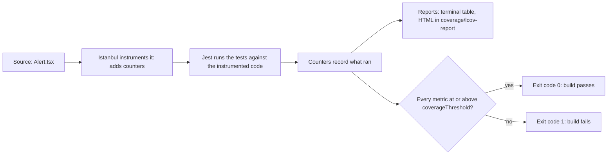
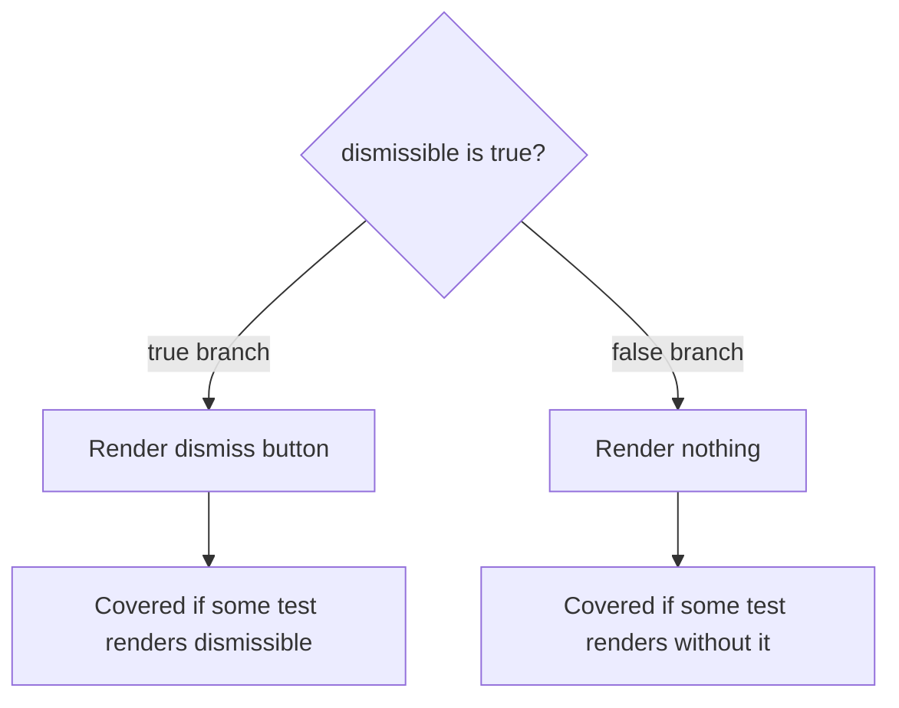

# 03 · Code Coverage

*Level (a) never used · about 16 minutes reading, plus 10 minutes with a real report*

## Why this matters here

This module has a hard target: at least 80% line, branch and function coverage, enforced by `coverageThreshold` so the build fails below it. You set that up in Part 1, you use the report to find untested paths in each component in Part 2, and you publish the final coverage report in Part 5. Coverage is also easy to misread, so it is worth knowing what the numbers do and do not prove before you start chasing them.

## Mental model

**Code coverage** is a record of which parts of your source code ran while the tests ran. Jest uses a tool called **Istanbul** to do this. Before running your tests, Istanbul **instruments** each source file: it rewrites the code to add a counter at every statement, function and branch. The tests run, the counters tick, and at the end Istanbul reports what fraction of each counter was hit at least once.

Think of it as a highlighter. Every line that runs during the tests gets highlighted. The report shows you the parts that never got highlighted.

**Where the analogy breaks:** a highlighted line only means it *ran*. It does not mean anything *checked* the result. A test with no `expect` at all can highlight a whole component. Coverage tells you what is definitely untested (the unhighlighted parts). It cannot tell you that the highlighted parts are tested well. Martin Fowler's short article in Go deeper makes exactly this point.

The four numbers:

- **Statements:** the share of executable statements that ran. `const a = 1; doThing();` is two statements, even on one line.
- **Lines:** the share of source lines containing code that ran. Usually close to statements.
- **Functions:** the share of functions (including arrow functions and event handlers) that were called at least once.
- **Branches:** the share of decision paths that were taken. Every `if` has two branches (true and false), and so do `? :` (the ternary operator), `&&`, `||`, `??` and default parameter values. Optional chaining (`a?.b()`, "call it only if it exists") may also be counted, depending on how your TypeScript is compiled. Each `case` in a `switch` is a branch. This is the number that finds missing edge cases.

## Diagram

How a coverage number is produced:



What branch coverage looks for, in one line of `Alert`:



## Core primitives

**1. Running with coverage.**

```bash
npx jest --coverage
```

Jest prints a table like this, one row per file:

```text
-------------|---------|----------|---------|---------|-------------------
File         | % Stmts | % Branch | % Funcs | % Lines | Uncovered Line #s
-------------|---------|----------|---------|---------|-------------------
 Alert.tsx   |   84.61 |       50 |      75 |   83.33 | 18,27
 Button.tsx  |     100 |      100 |     100 |     100 |
-------------|---------|----------|---------|---------|-------------------
```

`Uncovered Line #s` is your to-do list. Here, `Alert` has only half its branches covered.

**2. `collectCoverageFrom`.** By default Jest only measures files that some test imports, so a component with no test file at all is silently left out and the total looks better than it is. `collectCoverageFrom` lists which files *should* count, tested or not.

```js
// jest.config.js
module.exports = {
  // ...testEnvironment, setupFilesAfterEnv from chapter 02
  collectCoverageFrom: [
    'src/components/**/*.{ts,tsx}',
    '!src/**/*.test.{ts,tsx}',
    '!src/**/*.stories.{ts,tsx}',
    '!src/**/index.ts',
  ],
};
```

A `!` pattern excludes files. Exclude things that are not your logic (tests, stories, re-export barrels). Do not exclude a component just because it is hard to test.

**3. `coverageThreshold`.** Turns the numbers into a gate. If any global metric is below its value, Jest exits with a failure (a non-zero **exit code**, the number a program returns to say whether it succeeded; CI treats anything other than 0 as a failure), even when every test passed.

```js
// jest.config.js
module.exports = {
  // ...
  coverageThreshold: {
    global: {
      lines: 80,
      branches: 80,
      functions: 80,
      statements: 80,
    },
  },
};
```

Thresholds are only checked when coverage is collected, so the **CI** script (continuous integration: the server that runs your checks on every push) must run `jest --coverage` (or set `collectCoverage: true`). The failure looks like: `Jest: "global" coverage threshold for branches (80%) not met: 72.5%`.

**4. The Istanbul HTML report.** After `--coverage`, open `coverage/lcov-report/index.html` in a browser. Click into a file and you see the source with markings:

- Red background: a statement or function that never ran.
- Yellow background: a branch that was never taken.
- `I` or `E` markers: the `if` path or the `else` path was never taken.
- A number like `3x` in the margin: how many times that line ran.

Set which reports to produce with `coverageReporters`, for example `['text', 'html', 'lcov']`. The `lcov` reporter writes a machine-readable `lcov.info` file (for CI tools) plus the HTML in `coverage/lcov-report/`. The `html` reporter writes the same HTML straight into `coverage/`.

**5. Covering a branch.** The fix for a yellow branch is a test that takes the other path, and asserts what the user sees on it.

```tsx
import { render, screen } from '@testing-library/react';
import { Alert } from './Alert';

it('shows no dismiss button when not dismissible', () => {
  render(<Alert variant="info">Saved</Alert>);
  expect(screen.queryByRole('button', { name: /dismiss/i })).not.toBeInTheDocument();
});
```

`queryBy*` returns `null` instead of throwing when nothing matches, so it is the right query for "is not there".

## How the numbers are calculated

Every coverage number is the same fraction:

> **percentage = items that ran ÷ items that exist × 100**

What changes between the four columns is what counts as an "item". Before the tests run,
Istanbul reads each file and makes a list of every statement, line, function and branch in it,
each with a counter set to 0. While the tests run, the counters go up. Afterwards, any item
still at 0 is "uncovered".

### Step 1: count the items in a file

A small made-up component, with line numbers:

```tsx
1  export function Badge({ count, onClear }: BadgeProps) {
2    if (count === 0) return null;
3    const label = count > 99 ? '99+' : String(count);
4    function handleClick() {
5      onClear?.();
6    }
7    return <button onClick={handleClick}>{label}</button>;
8  }
```

| Item type | What counts as one | The items in `Badge` | Total |
|---|---|---|---|
| **Statements** | each executable instruction | the `if` (line 2), `return null` (line 2), `const label = …` (3), `onClear?.()` (5), `return <button>` (7) | **5** |
| **Lines** | each line that holds at least one statement | lines 2, 3, 5, 7 (line 2 holds two statements but is one line) | **4** |
| **Functions** | each function, including small inner ones | `Badge`, `handleClick` | **2** |
| **Branches** | each *path* out of a decision; an `if` or a `? :` has 2 paths | line 2: if-true, if-false; line 3: `> 99`, `≤ 99` | **4** |

Lines 1, 4, 6 and 8 are declarations and braces, not executable instructions, so they don't count.

### Step 2: add tests one at a time and recount

✔ = ran at least once, ✘ = never ran.

**Test 1:** `render(<Badge count={5} />)` and expect "5" on screen.

| | Items that ran | Result |
|---|---|---|
| Statements | `if` ✔, `return null` ✘, `const label` ✔, `onClear?.()` ✘, `return <button>` ✔ | 3 / 5 = **60%** |
| Lines | 2 ✔, 3 ✔, 5 ✘, 7 ✔ | 3 / 4 = **75%** |
| Functions | `Badge` ✔, `handleClick` ✘ | 1 / 2 = **50%** |
| Branches | if-true ✘, if-false ✔, `> 99` ✘, `≤ 99` ✔ | 2 / 4 = **50%** |

Line 2 counts as covered because *something* on it ran, even though `return null` didn't. That
is why line coverage can look better than statement or branch coverage.

**Test 2:** `render(<Badge count={0} />)` and expect nothing rendered.
Adds `return null` and the if-true path. Statements **80%** (4/5), lines **75%** (unchanged: line 2
was already counted), functions **50%**, branches **75%** (3/4).

**Test 3:** `render(<Badge count={150} />)` and expect "99+".
Adds the `> 99` path. Branches **100%** (4/4). The other numbers are unchanged.

**Test 4:** click the button and expect `onClear` to have been called.
Adds `handleClick` and `onClear?.()`. Statements **100%**, lines **100%**, functions **100%**.

The same four tests, as one table:

| After test | Stmts | Lines | Funcs | Branches |
|---|---|---|---|---|
| 1 (count 5) | 60% | 75% | 50% | 50% |
| 2 (+ count 0) | 80% | 75% | 50% | 75% |
| 3 (+ count 150) | 80% | 75% | 50% | 100% |
| 4 (+ click) | 100% | 100% | 100% | 100% |

Each test raised a *different* column. That is the point of looking at all four: each one
catches a different kind of untested behaviour.

### What else counts as a branch

- `if` / `else`, `? :` and each `case` in a `switch`: one branch per path.
- `a && b` and `a || b`: each side is a branch, so a test where `a` is always true never
  covers the short-circuit path.
- `a ?? b` and default parameters (`variant = 'primary'`): the "value given" and "fallback used"
  cases are separate branches.
- `?.` (optional chaining, as in `onClear?.()`) may or may not show up as a branch, depending
  on how TypeScript compiles it. With `ts-jest`, check the report rather than assuming.

### Step 3: how the "All files" (global) number combines files

The global number is **not the average of the file percentages**. Istanbul adds up the raw
counts across all files first, then divides:

> **global % = (sum of covered items in all files) ÷ (sum of all items in all files) × 100**

So bigger files weigh more. For example, for branches:

| File | Covered branches | Total branches | File % |
|---|---|---|---|
| `Tabs.tsx` (large) | 90 | 100 | 90% |
| `Card.tsx` (small) | 2 | 10 | 20% |
| **All files** | 92 | 110 | **83.6%** |

The simple average of 90% and 20% would be 55%, but the global figure is 83.6%, because
`Tabs` has ten times as many branches. With a global-only threshold of 80%, this passes even
though `Card` is barely tested.

That is what the **per-file floor** in this module's gate is for (design decision D6): with
`'./src/components/**/*.tsx': { branches: 70 }`, `Card.tsx` at 20% fails the run and names the
file, even while the global number is green.

### Reading it in the terminal

```text
File         | % Stmts | % Branch | % Funcs | % Lines | Uncovered Line #s
-------------|---------|----------|---------|---------|------------------
All files    |   83.6  |   83.6   |   ...   |   ...   |
 Card.tsx    |   40    |   20     |   50    |   40    | 12-18,24
 Tabs.tsx    |   91    |   90     |   100   |   92    | 57
```

"Uncovered Line #s" lists the lines with statements that never ran. Open
`coverage/lcov-report/index.html` and click a file to see them highlighted: red for code that
never ran, and yellow markers (such as `I` or `E` next to an `if`) for branches never taken.

## Worked example

Take `Alert`, with props `variant`, `dismissible?`, `onDismiss?` and `autoDismissMs?`. Suppose it looks roughly like this (a simplified sketch, not the real starter code; it assumes `AlertProps` also includes `children` for the message):

```tsx
export function Alert({ variant, dismissible = false, onDismiss, autoDismissMs, children }: AlertProps) {
  const [visible, setVisible] = useState(true);

  useEffect(() => {
    if (!autoDismissMs) return;
    const id = setTimeout(() => { setVisible(false); onDismiss?.(); }, autoDismissMs);
    return () => clearTimeout(id);
  }, [autoDismissMs, onDismiss]);

  if (!visible) return null;
  return (
    <div role="alert" className={`alert alert-${variant}`}>
      {children}
      {dismissible && (
        <button aria-label="Dismiss" onClick={() => { setVisible(false); onDismiss?.(); }}>×</button>
      )}
    </div>
  );
}
```

1. **Count the branches.** `dismissible = false` (default used or not), `if (!autoDismissMs)` (true/false), `onDismiss?.()` twice (defined or not), `if (!visible)` (true/false), `dismissible &&` (true/false). That is about 8 to 12 branch paths, depending on whether the two `?.` calls are counted.
2. **Start with one test** that renders `<Alert variant="info">Saved</Alert>` and checks the text. Run `npx jest --coverage Alert`. Because of `collectCoverageFrom`, the other components show 0% and the global threshold fails on this single-file run; ignore that and read the `Alert` row. Branches will be low. Three functions (the timeout callback, the effect's cleanup and the click handler) never ran, so functions will be low too.
3. **Open the HTML report.** The dismiss button line is yellow, the click handler is red, and the timeout body is red.
4. **Add tests for behaviours, not for lines.** Each new test should describe something a user would notice:
    - "dismissible alert hides when Dismiss is clicked and calls onDismiss" (covers the button, the click handler, `onDismiss` defined)
    - "dismissible alert without onDismiss still hides" (covers `onDismiss` undefined, and shows it does not crash)
    - "calls onDismiss after autoDismissMs" with fake timers (covers the timeout path)
5. **Re-run and re-read.** Branches should now be near 100% for this file. Any remaining yellow is either a real untested behaviour or a path that cannot happen. For the second kind, ask whether the code needs that branch at all.

Notice that step 4's second test is exactly the kind of check that finds a *missing null check crash*. The coverage report pointed you at the path, and your assertion is what catches the bug.

## Why 100% is not the goal

- **Coverage measures execution, not checking.** You can reach 100% with tests that assert nothing.
- **The last few percent cost the most.** They are usually defensive code, error paths that cannot really happen, or glue. Tests written only to colour them green tend to test implementation details and break on every refactor.
- **A number that becomes a target stops being useful.** Once people chase it, they write tests for the number. 80% is a floor that says "nothing big is untested". It is not a quality score.
- **Missing code has no coverage.** If a component *should* handle an empty `options` list and the code simply does not, there is no line to be red. Only thinking about behaviour finds that.

Use coverage as a flashlight for finding untested behaviour, then judge each test by one question: *would this test fail if the behaviour broke?*

## Common mistakes

- **Total looks fine, but a component has no tests.** *Cause:* no `collectCoverageFrom`, so untested files are not counted. *Fix:* add it, and check every component appears in the table.
- **Threshold never fails the build.** *Cause:* CI runs `jest` without `--coverage`, so thresholds are never checked. *Fix:* use a `test:coverage` script with `jest --coverage` and run that in CI.
- **Branches stuck at 50-70% while lines are at 95%.** *Cause:* tests only take the "happy" (expected, everything-goes-right) path of each `if`, `&&` and `? :`. *Fix:* in the HTML report, find the yellow markers and add a test for each *other* path.
- **Adding tests with no assertions to raise the number.** *Symptom:* coverage goes up, and bugs still ship. *Fix:* every test ends with an `expect` about something the user sees or a callback receives.
- **Excluding hard files.** *Symptom:* `!src/components/Modal/**` quietly appears in the config. *Fix:* exclude only non-logic files. Hard-to-test code is where bugs hide.

## Check yourself

<details markdown="1">
<summary><strong>Q1. A file shows 100% lines and 50% branches. What does that tell you, and where do you look?</strong></summary>

Every line ran, but only half of the decision paths were taken. Usually the tests exercise one side of each `if`, `&&`, `? :` or default value. Open the file in the HTML report and look for yellow highlights and `I`/`E` markers.

</details>

<details markdown="1">
<summary><strong>Q2. Predict: a test renders <code>&lt;Button onClick={fn}&gt;Save&lt;/Button&gt;</code>, clicks it, and has no <code>expect</code>. Which metrics go up, and is the click handler tested?</strong></summary>

Statements, lines and functions go up, because the handler ran. It is not tested: nothing checks that `fn` was called, so the test would still pass if the handler did nothing.

</details>

<details markdown="1">
<summary><strong>Q3. All tests pass, but <code>npm run test:coverage</code> exits with code 1. What happened?</strong></summary>

A metric fell below `coverageThreshold`. Jest prints which one, for example `coverage threshold for branches (80%) not met`. The build fails on purpose, even though no test failed.

</details>

<details markdown="1">
<summary><strong>Q4. Why is <code>collectCoverageFrom</code> needed to make the 80% target honest?</strong></summary>

Without it, Jest only measures files that some test imports. A component with no test file does not appear at all, so it cannot drag the total down. `collectCoverageFrom` makes every component count, tested or not.

</details>

<details markdown="1">
<summary><strong>Q5. A <code>Pagination</code> helper has 100% coverage. Can it still have an off-by-one bug?</strong></summary>

Yes. Every line can run with the wrong index and still produce output. Coverage does not know what the correct output is. Only an assertion that checks the right page is shown, including the first and last one, catches it.

</details>

## Go deeper

**Official docs**

- [`coverageThreshold`](https://jestjs.io/docs/configuration#coveragethreshold-object)
- [Istanbul](https://istanbul.js.org/)

**Articles**

- [Test Coverage](https://martinfowler.com/bliki/TestCoverage.html) — Martin Fowler
- [100% Code Coverage is a Lie 🎯 - DEV Community](https://dev.to/this-is-learning/100-code-coverage-is-a-lie-1i1a) — This is Learning (dev.to)

**Videos**

- [React Testing Tutorial - 14 - Code Coverage](https://www.youtube.com/watch?v=W-dc5fpxUVs) — Codevolution · 11:39
- [Jest Code Coverage: Branches, Lines, Functions and Thresholds](https://www.youtube.com/watch?v=Kf0OCNmoIeA) — TestMu AI (Formerly LambdaTest) · 20:09

## Used in

- **Part 1:** add `collectCoverageFrom`, `coverageThreshold` (80 for lines, branches, functions) and a `test:coverage` script, then confirm the build fails while coverage is still low.
- **Part 2:** after each component's tests, open the HTML report and add behaviour tests for the red and yellow paths.
- **Part 5:** produce the final coverage report for the deliverables, and be ready to explain why the number alone does not prove the tests are good.

*Resources verified 2026-09-29.*
