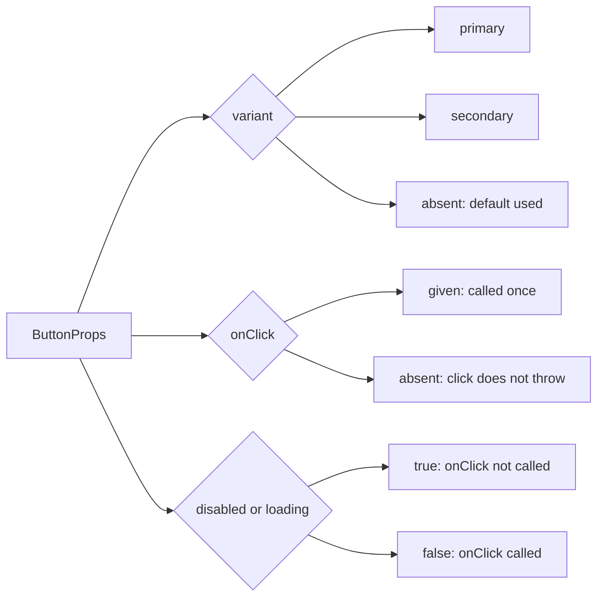

# 04 · Typing React Props Under Strict Mode

*Level (b) theory only · about 6 minutes reading · short chapter: production concerns only*

## Why this matters here

You can read typed React, and you have seen that untyped destructured props fail under `strict` (`Binding element 'label' implicitly has an 'any' type`). This chapter covers what tutorials skip: how the prop types in this library tell you which tests to write. In Part 2 every optional prop, union and callback is a test case. In Part 3 a seeded bug that crashes on a missing value is exactly the case `strict` asks you to handle.

## Mental model

A props type is a **contract**, and every alternative in it is a path your tests must take. `variant?: 'primary' | 'secondary'` is not one input. It is three: `'primary'`, `'secondary'` and absent. `onDismiss?: () => void` is two: given and not given.

**Where the model breaks:** types only exist at compile time. They protect callers written in TypeScript, but the test runner may not check them (`ts-jest` type-checks by default unless `isolatedModules` is on; `babel-jest` just strips types). Data from outside (an API, `JSON.parse`, a JavaScript caller) can still send `null` where the type says `string`. Types reduce the cases you have to test. They do not remove the need to test.

## Diagram

From one props type to test cases:



## Core primitives

**1. A props type with optional props and defaults.** Put defaults in the destructuring. Then inside the component the type is `boolean`, not `boolean | undefined`.

```tsx
import type { ReactNode } from 'react';

export type ButtonProps = {
  children: ReactNode;
  onClick?: () => void;
  disabled?: boolean;
  variant?: 'primary' | 'secondary';
  loading?: boolean;
};

export function Button({ children, onClick, disabled = false, variant = 'primary', loading = false }: ButtonProps) {
  return (
    <button type="button" className={`btn btn-${variant}`} disabled={disabled || loading} aria-busy={loading} onClick={onClick}>
      {children}
    </button>
  );
}
```

Avoid `React.FC` for new code. Type the props parameter directly, as above. `ReactNode` accepts anything React can render, including strings, elements, `null` and arrays.

**2. Union variants.** A **union type** lists every allowed value. Under `strict`, a `switch` over the union can be made **exhaustive** (handling every member), so adding a new variant without handling it is a compile error. The trick is the `default` branch: `never` is the type with no possible values, so assigning `variant` to it only compiles when every case above has already been handled.

```ts
type AlertVariant = 'info' | 'success' | 'warning' | 'error';

function iconFor(variant: AlertVariant): string {
  switch (variant) {
    case 'info': return 'i';
    case 'success': return '✓';
    case 'warning': return '!';
    case 'error': return '×';
    default: {
      const unreachable: never = variant;
      return unreachable;
    }
  }
}
```

Check the real `Alert` variants in the starter code; these four are an example.

**3. Event handler types.** Type the callback by what the component passes out. For a native event, use React's event types. For a component-level value, pass the value.

```tsx
import type { ChangeEvent } from 'react';

type InputProps = {
  label: string;
  value: string;
  onChange: (event: ChangeEvent<HTMLInputElement>) => void;
  error?: string;
  required?: boolean;
  type?: 'text' | 'email' | 'password' | 'number';
};

type ToggleProps = {
  label: string;
  checked: boolean;
  onChange: (checked: boolean) => void;
};
```

The type decides the test: for `Input` you assert on `event.target.value`, for `Toggle` you assert `toHaveBeenCalledWith(true)`.

**4. Arrays of objects and optional control.** `Tabs` can be **controlled** (the parent passes `activeTabId` and handles `onChange`) or **uncontrolled** (it keeps its own state, starting from `defaultTabId`).

```tsx
import type { ReactNode } from 'react';

type Tab = { id: string; label: string; content: ReactNode };

type TabsProps = {
  tabs: Tab[];
  defaultTabId?: string;
  activeTabId?: string;
  onChange?: (id: string) => void;
};
```

Nothing in this type stops `tabs` from being empty, or `defaultTabId` from naming an id that is not in `tabs`. Those are runtime edge cases, so they need tests.

**5. `noUncheckedIndexedAccess`.** This flag is not part of `strict`, but it is worth turning on. With it, `tabs[0]` has type `Tab | undefined`, so the compiler forces you to handle an empty list. Below, `?.` (optional chaining) gives `undefined` instead of crashing when `first` is missing, and `??` (nullish coalescing) falls back to the right side only when the left is `null` or `undefined`.

```ts
const first = tabs[0];
const initialId = defaultTabId ?? first?.id; // string | undefined, and the code must cope
```

## Worked example

Read `DropdownProps` as a list of tests:

```tsx
type Option = { value: string; label: string };

type DropdownProps = {
  label: string;
  options: Option[];
  value: string;
  onChange: (value: string) => void;
};
```

1. `label: string` is required: test that the control's **accessible name** (the name a screen reader announces, which RTL's `name` option matches) is the label (`getByRole('combobox', { name: 'Country' })`, or whatever role the starter uses).
2. `options: Option[]`: test several options, **one option**, and **an empty array**. The type allows `[]`, so the component must not crash on it.
3. `value: string`: test a value that matches an option (it shows as selected) and **one that matches none**. The type cannot prevent that. What should display?
4. `onChange: (value: string) => void`: test that it is called with the option's `value`, not its `label`, and only once.

Four props, eight or more tests, and at least two of them are edge cases you would not have thought of without reading the type.

## Common mistakes

- **Silencing errors with `any` or `as`.** *Symptom:* `props: any` or `value as string` makes the red line go away. *Fix:* type the prop honestly, then handle the case the compiler found.
- **Non-null assertions (`!`).** *Symptom:* `options.find(...)!.label` compiles, then crashes when nothing matches. *Fix:* handle `undefined` with `?.` and a fallback, and write the test for "no match".
- **Typing `onChange` too loosely.** *Symptom:* `onChange: Function` or `(e: any) => void`, so tests cannot tell what should be passed. *Fix:* give the exact argument type.
- **Assuming types replace edge-case tests.** *Symptom:* no test for an empty `tabs` list "because it is typed". *Fix:* an empty array is a valid `Tab[]`. Test it.

## Check yourself

??? question "Q1. How many test cases does `variant?: 'primary' | 'secondary'` imply, and why?"
    Three: `'primary'`, `'secondary'` and absent. The absent case checks that the default is applied.

??? question "Q2. `onDismiss?: () => void`. The component calls `onDismiss()` directly. What happens when a caller leaves it out, and what test catches it?"
    Under `strict`, `tsc` rejects the direct call (`Cannot invoke an object which is possibly 'undefined'`), so this bug only survives if types are skipped (`babel-jest`) or silenced with `!`. At runtime it throws `TypeError: onDismiss is not a function` at the moment of dismissal. A test that renders a dismissible `Alert` without `onDismiss` and clicks Dismiss catches it. The fix is `onDismiss?.()`.

??? question "Q3. Does TypeScript stop a test from rendering `<Tabs tabs={[]} />`? Should it?"
    No. `[]` is a valid `Tab[]`. The component must decide what to do with it, and a test should pin that behaviour down.

## Go deeper

**Official docs**

- [Typing Component Props | React TypeScript Cheatsheet](https://react-typescript-cheatsheet.netlify.app/docs/basic/getting-started/basic_type_example)

**Articles**

- [Strongly Typing React Props with TypeScript | Total TypeScript](https://www.totaltypescript.com/react-props-typescript) — Matt Pocock (Total TypeScript)
- [The TSConfig Cheat Sheet | Total TypeScript](https://www.totaltypescript.com/tsconfig-cheat-sheet) — Matt Pocock

**Videos**

- [React TypeScript Tutorial - 3 - Typing Props](https://www.youtube.com/watch?v=KpA6oEaCHtk) — Codevolution · 5:49
- [React & TypeScript - Course for Beginners](https://www.youtube.com/watch?v=FJDVKeh7RJI) — freeCodeCamp.org · 1:32:59

## Used in

- **Part 2:** before writing each component's test file, read its props type and list one test per union member, optional prop (given and absent) and callback.
- **Part 3:** for the missing null check bug, write the failing test that passes the missing value first, then fix it with `?.` or a default, not with `!`.

*Resources verified 2026-09-29.*
