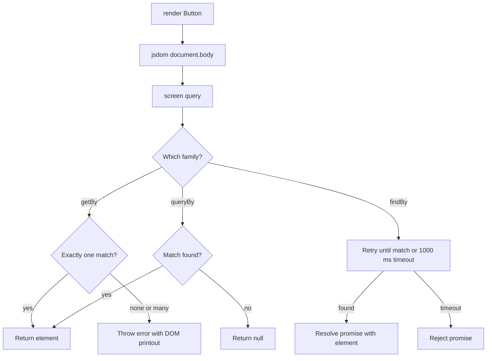
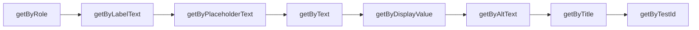

# 05 · React Testing Library

*Level (a) never used · about 10 min reading + 20 min practice*

## Why this matters here

Every unit test in **Part 2** (tests for all 8 components) starts by rendering a component and finding things on the screen. React Testing Library (RTL) does both. The same queries come back in **Part 3**, where each seeded bug gets a failing test first, and in **Part 4**'s integration tests. If you pick the wrong query here, your tests will break every time someone renames a CSS class. The accessibility bug may also slip through unnoticed.

## Mental model

**Test the component the way a person uses it: by what they can see, read and hear.**

A sighted user finds the "Save" button by reading its text. A screen-reader user finds it because the browser announces "Save, button". RTL gives you queries that work the same way. You ask for "the button named Save", not for "the third `<div>` with class `btn-primary`".

A useful picture is **a screen reader with an assertion library attached**. RTL renders your component into a fake DOM called **jsdom** (a JavaScript copy of the browser's document, with no real screen). Then it lets you look things up by **role** (what kind of thing it is: button, textbox, dialog) and **accessible name** (what a screen reader would call it).

**Where the analogy breaks:** jsdom has no layout and no CSS engine. RTL cannot tell you that a button is off-screen, hidden behind a modal backdrop, or 2px wide. A real screen reader also does things jsdom does not, such as reading live-region updates aloud. Checks that need layout belong in the Cypress test in Part 4.

## Diagram

How a query finds an element, and what each query family does when the element is missing:



And the order in which to reach for queries (use the first one that works):



## Core primitives

### 1. `render` and `screen`

`render` mounts a component into jsdom. `screen` is an object holding every query, bound to `document.body`. Always query through `screen`: you don't have to destructure `render`'s result, and every test reads the same way. Because it searches the whole `document.body`, it also finds content that a **portal** (React's way of rendering a child into a different DOM node, such as a modal attached straight to `<body>`) puts outside your component's `container` (the `<div>` that `render` mounts into).

```tsx
import { render, screen } from '@testing-library/react';
import { Button } from './Button';

it('shows its label', () => {
  render(<Button>Save</Button>);

  expect(screen.getByRole('button', { name: 'Save' })).toBeInTheDocument();
});
```

### 2. Query families: `getBy`, `queryBy`, `findBy`

Each query comes in three variants. There is also an `All` form of each (`getAllBy…`) that returns an array.

| Variant | No match | More than one match | Returns | Use it when |
|---|---|---|---|---|
| `getBy…` | throws | throws | element | the element should be there now |
| `queryBy…` | returns `null` | throws | element or `null` | you are checking something is **absent** |
| `findBy…` | rejects | rejects | `Promise<element>` | the element appears **later** (see chapter 08) |

```tsx
it('has no error message until one is passed', () => {
  render(<Input label="Email" value="" onChange={() => {}} />);

  // getByText would throw here; queryByText returns null
  expect(screen.queryByText(/invalid email/i)).not.toBeInTheDocument();
});
```

### 3. `getByRole` and the accessible name

A **role** is the part a screen reader announces: `button`, `textbox`, `checkbox`, `switch`, `dialog`, `tab`, `alert`. Native HTML elements already have roles (`<button>` is `button`, `<input type="text">` is `textbox`). **ARIA** (Accessible Rich Internet Applications, a W3C standard of extra HTML attributes such as `role`, `aria-label` and `aria-checked`) attributes can set a role or state on other elements. The **accessible name** is the label the browser works out from the element's text, its `<label>`, `aria-label` or `aria-labelledby`.

The `name` option accepts a string (exact match) or a regular expression.

```tsx
import { Modal } from './Modal';

it('is a dialog named by its title', () => {
  render(
    <Modal isOpen onClose={() => {}} title="Delete item">
      <p>This cannot be undone.</p>
    </Modal>,
  );

  expect(screen.getByRole('dialog', { name: 'Delete item' })).toBeInTheDocument();
});
```

This test does two jobs. It finds the modal, and it proves the modal is announced correctly. If the title is not wired to the dialog with `aria-labelledby`, the query fails. **A failed `getByRole` is often a real accessibility bug, not a test problem.**

### 4. `getByLabelText` for form fields

This finds an input through its `<label>`. If the label is not connected (`htmlFor` must match the input's `id`, or the input must sit inside the `<label>`), the query fails. That is the same failure a screen-reader user would run into.

```tsx
it('connects the label to the input', () => {
  render(<Input label="Email" value="" onChange={() => {}} />);

  expect(screen.getByLabelText('Email')).toHaveValue('');
});
```

`getByRole('textbox', { name: 'Email' })` does the same job and also checks the role. Prefer it. Use `getByLabelText` when the role is awkward, for example `type="password"`, which has no role.

### 5. `getByTestId`, the last resort

`data-testid="..."` is an attribute that only tests read. Users can't see it, so a test that uses it proves nothing about what they experience. The module rule is: **`data-testid` only when nothing accessible exists**. A decorative image wrapper in `Card` might be one of those cases.

```tsx
import { Card } from './Card';

// Only if the image has alt="" (decorative) and no role to find it by
render(<Card title="Plan" imageUrl="/plan.png" />);
expect(screen.getByTestId('card-image')).toBeInTheDocument();
```

If the image means something, give it real `alt` text and use `getByRole('img', { name: … })` instead.

### 6. jest-dom matchers

`@testing-library/jest-dom` adds DOM-aware **matchers** (the checking methods after `expect(...)`, like `toBe`) to `expect`. Load it once in a setup file listed in `setupFilesAfterEnv` (for example `jest.setup.ts` containing `import '@testing-library/jest-dom';`).

```tsx
const button = screen.getByRole('button', { name: 'Save' });

expect(button).toBeInTheDocument();
expect(button).toBeDisabled();            // native disabled attribute
expect(button).toHaveAccessibleName('Save');
expect(screen.getByRole('switch')).toBeChecked();   // aria-checked="true"
expect(screen.getByRole('tab', { name: 'Billing' }))
  .toHaveAttribute('aria-selected', 'true');
expect(screen.getByRole('textbox', { name: 'Email' }))
  .toHaveAccessibleDescription('Enter a valid email');
```

These give far better failure messages than `expect(el.disabled).toBe(true)`.

## Worked example: `Input` with an error

The goal is three tests for `Input {label, value, onChange, error?, required?, type?}`: one for rendering, one for the edge case, one for accessibility.

**Step 1. Decide what a user can observe.** A user sees a label, a field, and sometimes an error message. A screen-reader user also hears whether the field is required and invalid. You don't test the CSS class that turns the border red.

**Step 2. The render test.**

```tsx
import { render, screen } from '@testing-library/react';
import { Input } from './Input';

describe('Input', () => {
  it('renders a textbox named by its label', () => {
    render(<Input label="Email" value="jay@example.com" onChange={() => {}} />);

    const field = screen.getByRole('textbox', { name: /email/i });
    expect(field).toHaveValue('jay@example.com');
  });
```

The regex `/email/i` allows for a label like "Email \*" when `required` adds an asterisk.

**Step 3. The absent-error edge case.** Use `queryBy` for absence.

```tsx
  it('shows no error when error is not passed', () => {
    render(<Input label="Email" value="" onChange={() => {}} />);

    expect(screen.queryByText(/invalid/i)).not.toBeInTheDocument();
    expect(screen.getByRole('textbox', { name: /email/i })).not.toBeInvalid();
  });
```

**Step 4. The error is visible *and* announced.**

```tsx
  it('links the error message to the field', () => {
    render(
      <Input label="Email" value="jay@" onChange={() => {}} error="Enter a valid email" required />,
    );

    const field = screen.getByRole('textbox', { name: /email/i });
    expect(screen.getByText('Enter a valid email')).toBeInTheDocument();
    expect(field).toBeRequired();
    expect(field).toBeInvalid();
    expect(field).toHaveAccessibleDescription('Enter a valid email');
  });
});
```

`toBeInvalid` passes when the field has `aria-invalid="true"` (or fails native validation). `toHaveAccessibleDescription` passes only if the error's element is linked through `aria-describedby` (an attribute that points at the `id` of the element holding extra help or error text, which screen readers read after the name). If the component shows the red text but never links it, the last line fails. That is an accessibility bug of exactly the kind Part 3 asks you to catch.

**Step 5. Run it and read the failure.** When a `getBy` fails, RTL prints the rendered DOM. When a `getByRole` fails, it also lists every role it *did* find, with their names. Read that list first. It usually tells you the name is slightly different from what you expected.

## Common mistakes

1. **Using `container.querySelector('.btn')`.**
   *Symptom:* tests pass, then break when someone renames a class, and they never catch an unlabelled button.
   *Fix:* `screen.getByRole('button', { name: … })`. Keep `container` for rare cases such as checking that a component rendered nothing (`expect(container).toBeEmptyDOMElement()`).

2. **Using `getBy` to check something is gone.**
   *Symptom:* `expect(screen.getByText('Error')).not.toBeInTheDocument()` throws "Unable to find an element" before `expect` ever runs.
   *Fix:* `expect(screen.queryByText('Error')).not.toBeInTheDocument()`.

3. **Reaching for `getByTestId` first.**
   *Symptom:* every test passes while a real user can't find the control. The rubric treats this as testing implementation details.
   *Fix:* go down the priority list. If only a test id works, ask whether the component is missing a label. That may be the bug.

4. **Matching the whole text exactly when it is split across elements.**
   *Symptom:* `getByText('Delete 3 items')` fails because the markup is `Delete <strong>3</strong> items`.
   *Fix:* query the container by role and use `toHaveTextContent('Delete 3 items')`, or pass a regex that matches one text node.

5. **Forgetting the jest-dom setup import.**
   *Symptom:* `TypeError: expect(...).toBeInTheDocument is not a function`, or TypeScript error `Property 'toBeInTheDocument' does not exist`.
   *Fix:* add `import '@testing-library/jest-dom';` to the file named in `setupFilesAfterEnv`, and make sure `tsconfig` includes that setup file so the types load.

## Check yourself

<details markdown="1">
<summary><strong>Q1. Tabs renders three tabs. You write <code>screen.getByRole('tab')</code>. What happens, and what should you write instead?</strong></summary>

It throws, because `getBy` requires exactly one match and there are three. Either name the one you want, `getByRole('tab', { name: 'Billing' })`, or use `getAllByRole('tab')` and assert on the array's length.

</details>

<details markdown="1">
<summary><strong>Q2. You want to prove the Modal is not rendered when <code>isOpen</code> is false. Which query family, and why?</strong></summary>

`queryByRole('dialog')`, expected `.not.toBeInTheDocument()`. `queryBy` returns `null` instead of throwing, so the assertion can run. `findBy` would wait a full second and then fail.

</details>

<details markdown="1">
<summary><strong>Q3. <code>getByRole('button', { name: 'Close' })</code> fails on the Modal, but you can see an × icon button in the printed DOM. What is the likely bug?</strong></summary>

The icon button has no accessible name. It contains only a symbol or SVG with no `aria-label`, so a screen reader announces "button" with no name. The fix belongs in the component (`aria-label="Close"`), not in the test.

</details>

<details markdown="1">
<summary><strong>Q4. Why does RTL recommend <code>screen</code> over the queries returned by <code>render</code>?</strong></summary>

Mainly convenience and consistency: you don't need to keep destructuring `render`'s result, and all tests read the same way. The queries `render` returns are bound to `document.body` by default too, so both find portalled modals. What misses portals is `container.querySelector`, because it only searches the component's own `<div>`.

</details>

<details markdown="1">
<summary><strong>Q5. Put these in the recommended order: <code>getByTestId</code>, <code>getByText</code>, <code>getByRole</code>, <code>getByLabelText</code>.</strong></summary>

`getByRole` → `getByLabelText` → `getByText` → `getByTestId`. The order follows how closely each query matches what users and assistive technology actually rely on.

</details>

## Go deeper

**Official docs**

- [Guiding principles](https://testing-library.com/docs/guiding-principles): the idea behind every RTL rule
- [Query priority](https://testing-library.com/docs/queries/about/#priority): `getByRole` > `getByLabelText` > … > `getByTestId`, and why
- [jest-dom matchers](https://github.com/testing-library/jest-dom): `toBeDisabled`, `toHaveAccessibleName`, `toBeInTheDocument`

**Articles**

- [Common mistakes with React Testing Library](https://kentcdodds.com/blog/common-mistakes-with-react-testing-library) by Kent C. Dodds. Run your own tests against this checklist before the PR.
- [How To Test Your React Apps With The React Testing Library — Smashing Magazine](https://www.smashingmagazine.com/2020/07/react-apps-testing-library/) from Smashing Magazine. A long-form beginner tutorial.
- [Testing Implementation Details](https://kentcdodds.com/blog/testing-implementation-details) by Kent C. Dodds. Why class names and internal state make tests brittle.

**Videos**

- [React Testing Tutorial - 17 - RTL Queries](https://www.youtube.com/watch?v=GWRIv6kHZqk): Codevolution · 3:08
- [React Testing Tutorial - 18 - getByRole](https://www.youtube.com/watch?v=Veaql3noyyo): Codevolution · 10:02 (episode 19 covers getByRole options)

## Used in

- **Part 2:** the rendering and edge-case groups of all 8 component test files. You find every element by role or label, and check state with jest-dom matchers.
- **Part 3:** the failing test for the accessibility bug. Usually a `getByRole(…, { name })` or `toHaveAccessibleName` fails first, and the fix makes it pass.
- **Part 4:** the integration tests, which query across several components rendered together.

*Resources verified 2026-09-29.*
