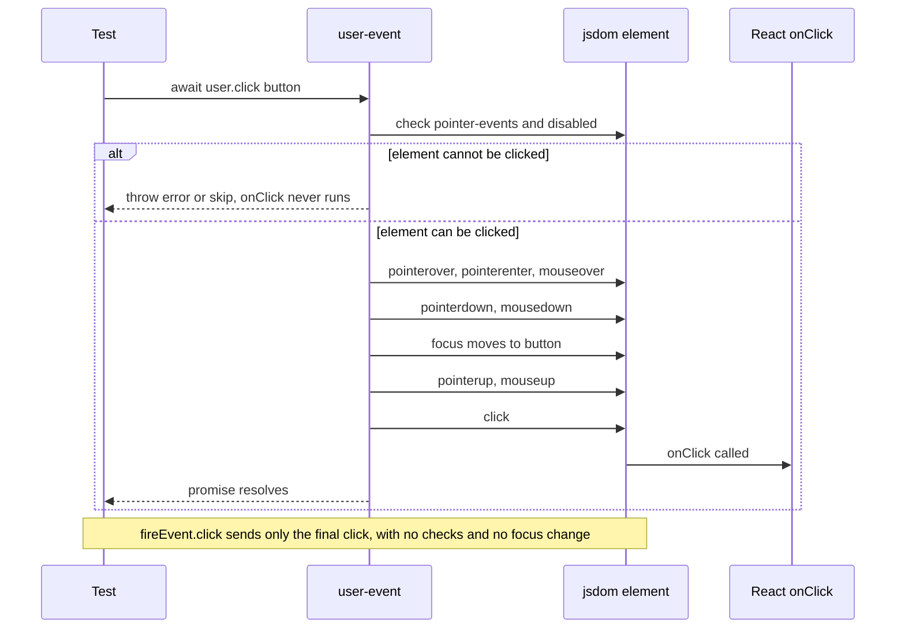

# 06 · user-event

*Level (a) never used · about 9 min reading + 20 min practice*

## Why this matters here

Every component in **Part 2** has an interaction group: clicking the Button, typing into the Input, flipping the Toggle, switching Tabs, closing the Modal with Escape. **Part 3** includes an "event handler not called" bug and a "state not updating" bug. Both only show up when you interact with the component the way a real user would. `@testing-library/user-event` is the tool that does that.

## Mental model

**user-event is a robot user sitting at a keyboard and mouse. fireEvent is a message sent straight to one element.**

When a person clicks a button, the browser fires a whole chain of events. First the pointer moves over the button, then `pointerdown`, `mousedown`, focus moves to the button, then `pointerup`, `mouseup`, and finally `click`. Typing one letter fires `keydown`, `keypress`, `beforeinput`, `input` and `keyup`, and the value grows by one character.

`fireEvent.click(button)` dispatches **one** `click` event and nothing else. `user.click(button)` performs the **whole chain**. It also checks first whether a real user *could* click the element: is it disabled, and does CSS block pointer events on it?

**Where the analogy breaks:** the robot still runs in jsdom, not a real browser. It does not know whether the button is covered by another element or scrolled off-screen, because jsdom has no layout. It only checks a small set of rules: `disabled`, `pointer-events: none`, and focusability. The real-browser check is Cypress's job in Part 4.

## Diagram

What happens when a test calls `await user.click(button)`, compared with `fireEvent.click(button)`:



## Core primitives

### 1. `userEvent.setup()`: one user per test

In user-event 14 you create a user instance and then **await** every action. The docs recommend calling `setup()` before `render`. A small helper keeps each test short:

```tsx
import { render, screen } from '@testing-library/react';
import userEvent from '@testing-library/user-event';
import type { ReactElement } from 'react';

function setup(ui: ReactElement) {
  return { user: userEvent.setup(), ...render(ui) };
}
```

Every action returns a `Promise`. Forgetting `await` is the most common user-event bug (see Common mistakes).

### 2. `user.click`

```tsx
import { Button } from './Button';

it('calls onClick when clicked', async () => {
  const onClick = jest.fn();
  const { user } = setup(<Button onClick={onClick}>Save</Button>);

  await user.click(screen.getByRole('button', { name: 'Save' }));

  expect(onClick).toHaveBeenCalledTimes(1);
});
```

`jest.fn()` is a fake function that records its calls. Chapter 07 covers it in full.

### 3. `user.type` and `user.clear`

`Input` is a **controlled** component: it displays the `value` prop it receives and reports edits through `onChange`, but it does not store what was typed. The parent has to hold that state. `user.type(element, text)` clicks the element first, then types each character as a separate key press. `user.clear` selects the whole value and deletes it.

```tsx
import { useState } from 'react';
import { Input } from './Input';

// A tiny parent that owns the state, because Input is controlled
// (it shows the value prop it is given and never stores its own)
function EmailField() {
  const [value, setValue] = useState('');
  return <Input label="Email" value={value} onChange={(e) => setValue(e.target.value)} />;
}

it('shows what the user types', async () => {
  const { user } = setup(<EmailField />);
  const field = screen.getByRole('textbox', { name: /email/i });

  await user.type(field, 'jay@example.com');
  expect(field).toHaveValue('jay@example.com');

  await user.clear(field);
  expect(field).toHaveValue('');
});
```

This guide assumes `Input`'s `onChange` passes the change event, like a native input. If your component passes the new string instead, write `onChange={setValue}`.

### 4. `user.keyboard`: individual keys

Plain characters are typed as themselves. Named keys go in curly braces: `{Enter}`, `{Escape}`, `{ArrowRight}`, `{Home}`, `{End}`. The keys go to whichever element currently has focus.

```tsx
import { Modal } from './Modal';

it('calls onClose when Escape is pressed', async () => {
  const onClose = jest.fn();
  const { user } = setup(
    <Modal isOpen onClose={onClose} title="Delete item">
      <button>Confirm</button>
    </Modal>,
  );

  await user.keyboard('{Escape}');

  expect(onClose).toHaveBeenCalledTimes(1);
});
```

### 5. `user.tab`: moving focus

`user.tab()` presses Tab and moves focus to the next focusable element in document order. `user.tab({ shift: true })` goes backwards. Use it to test focus order and the Modal's focus trap. A **focus trap** keeps Tab cycling inside the dialog instead of escaping to the page behind it.

```tsx
it('keeps focus inside the modal', async () => {
  const { user } = setup(
    <Modal isOpen onClose={() => {}} title="Delete item">
      <button>Cancel</button>
      <button>Confirm</button>
    </Modal>,
  );
  const dialog = screen.getByRole('dialog', { name: 'Delete item' });

  for (let i = 0; i < 5; i++) {
    await user.tab();
    expect(dialog).toContainElement(document.activeElement as HTMLElement);
  }
});
```

### 6. `disabled` and `pointer-events` are respected

A native `<button disabled>` never runs `onClick` in React, whichever tool you use. The difference shows up with elements that *look* unavailable but are still in the DOM. One example is a loading button styled with `pointer-events: none`. Another is a custom control that uses `aria-disabled`. `fireEvent.click` runs their handlers anyway. `user.click` refuses when `pointer-events: none` applies and throws an error that says so. For `aria-disabled`, which user-event does not check, you still need to assert that the handler was not called.

```tsx
it('does not call onClick while loading', async () => {
  const onClick = jest.fn();
  const { user } = setup(<Button onClick={onClick} loading>Save</Button>);
  const button = screen.getByRole('button', { name: /save/i });

  // If loading sets `disabled`, user-event skips the click.
  // If it only sets pointer-events: none, user.click throws; wrap it:
  await user.click(button).catch(() => {});

  expect(onClick).not.toHaveBeenCalled();
});
```

The `.catch(() => {})` keeps the test green for both designs. Once you have read the component, delete it and assert the one behaviour it really has.

## Worked example: `Toggle`

`Toggle {label, checked, onChange}` is a **controlled** component, like `Input` in primitive 3. It does not hold its own state. It shows whatever `checked` the parent passes and asks the parent to change it through `onChange`. This guide assumes `onChange` receives the new boolean. Following the WAI-ARIA Switch pattern (the WAI-ARIA Authoring Practices are the W3C's published recipes for how each kind of widget should behave for keyboard and screen-reader users), it should have `role="switch"`, expose its state through `aria-checked`, and toggle on click or Space.

**Step 1. Test the contract with a fixed prop.** Clicking an unchecked toggle should *ask* for `true`. Because the prop never changes, the toggle stays unchecked on screen. That is correct for a controlled component.

```tsx
import { useState } from 'react';
import { render, screen } from '@testing-library/react';
import userEvent from '@testing-library/user-event';
import { Toggle } from './Toggle';

describe('Toggle', () => {
  it('asks to become checked when clicked', async () => {
    const user = userEvent.setup();
    const onChange = jest.fn();
    render(<Toggle label="Dark mode" checked={false} onChange={onChange} />);

    await user.click(screen.getByRole('switch', { name: 'Dark mode' }));

    expect(onChange).toHaveBeenCalledWith(true);
    expect(onChange).toHaveBeenCalledTimes(1);
  });
```

**Step 2. Test real behaviour with a parent that owns state.** This is where a "state not updating" bug shows up: the handler fires, but the screen does not change.

```tsx
  function Harness() {
    const [on, setOn] = useState(false);
    return <Toggle label="Dark mode" checked={on} onChange={setOn} />;
  }

  it('flips on and off with the mouse', async () => {
    const user = userEvent.setup();
    render(<Harness />);
    const toggle = screen.getByRole('switch', { name: 'Dark mode' });

    await user.click(toggle);
    expect(toggle).toBeChecked();

    await user.click(toggle);
    expect(toggle).not.toBeChecked();
  });
```

**Step 3. Keyboard users.** Tab to the control, then press Space. If the toggle is built from a `<div>` with no `tabIndex`, `user.tab()` skips it. That is a real accessibility bug, and `fireEvent` would never reveal it.

```tsx
  it('can be operated with Tab and Space', async () => {
    const user = userEvent.setup();
    render(<Harness />);
    const toggle = screen.getByRole('switch', { name: 'Dark mode' });

    await user.tab();
    expect(toggle).toHaveFocus();

    await user.keyboard(' ');
    expect(toggle).toBeChecked();
  });
});
```

**Step 4. Compare with fireEvent.** Try `fireEvent.click(toggle)` in step 3 instead of Tab + Space. It passes even when the toggle can't receive focus. A test that can't fail when the bug is present doesn't protect you from that bug.

## Common mistakes

1. **Forgetting `await`.**
   *Symptom:* the assertion runs before the click finishes and fails at random. Or it passes, and an "act" warning (React's message that state changed while the test was not waiting, see chapter 08) appears after the test.
   *Fix:* `await` every `user.*` call and make the test function `async`. Turning on the ESLint rule `testing-library/await-async-events` (from `eslint-plugin-testing-library`; ESLint is the tool that flags code problems as you type) catches this.

2. **Calling `userEvent.click(...)` directly without `setup()`.**
   *Symptom:* it mostly works, but keyboard state such as a held Shift key is not shared between calls, and the options you need later (like `advanceTimers` in chapter 08) have nowhere to go.
   *Fix:* `const user = userEvent.setup()` once per test, then use `user`.

3. **Typing into a controlled input with no state.**
   *Symptom:* `render(<Input value="" onChange={fn} … />)`, then `user.type(field, 'abc')`. The field still shows `''`, and `fn` was called three times, each time with a single character.
   *Fix:* this is correct React behaviour. Assert on the calls, or render inside a small parent with `useState` as in primitive 3.

4. **Using `fireEvent` "because it's faster".**
   *Symptom:* tests pass for controls that a keyboard or mouse user can't operate, so the accessibility bug goes unnoticed.
   *Fix:* default to user-event. Keep `fireEvent` for events user-event does not model, such as `fireEvent.scroll` or a `transitionEnd`.

5. **Testing the Escape key with focus outside the modal.**
   *Symptom:* `user.keyboard('{Escape}')` does nothing because focus is on `document.body` and the listener sits on the dialog.
   *Fix:* check the Modal moves focus into itself on open (`expect(dialog).toContainElement(document.activeElement as HTMLElement)`). If it doesn't, you have found a bug.

## Check yourself

??? question "Q1. A Button has `pointer-events: none` while loading. What does `fireEvent.click` do? What does `user.click` do?"
    `fireEvent.click` dispatches the click and `onClick` runs, so the test says clicks work when users can't click. `user.click` sees `pointer-events: none` and throws an error explaining the element can't be clicked.

??? question "Q2. Predict the result: `render(<Toggle label='Wifi' checked={false} onChange={fn} />)`, then `await user.click(switch)`, then `expect(switch).toBeChecked()`."
    It fails. The toggle is controlled and the `checked` prop is still `false`. `fn` was called with `true`, but nothing re-rendered the component with the new value. Assert on `fn`, or use a stateful parent.

??? question "Q3. Why does `user.type` catch a missing `onChange` wire-up that setting `input.value` directly would miss?"
    `user.type` fires real key and `input` events one character at a time, and React's `onChange` listens to those. Setting `.value` directly fires no events, so React never runs the handler, and your test ends up checking a value React never saw.

??? question "Q4. Which Tabs behaviour would you test with `user.keyboard('{ArrowRight}')`, and what would you assert?"
    The WAI-ARIA Tabs pattern: with focus on a tab, ArrowRight moves focus to the next tab. Assert that the next tab `toHaveFocus()`. If the component activates tabs as focus moves, also assert it has `aria-selected="true"` and its panel is shown.

## Go deeper

**Official docs**

- [user-event](https://testing-library.com/docs/user-event/intro): realistic clicks and typing, and why it beats `fireEvent`
- [Switch](https://www.w3.org/WAI/ARIA/apg/patterns/switch/): `role="switch"`, `aria-checked`, Space toggles
- [Dialog (modal)](https://www.w3.org/WAI/ARIA/apg/patterns/dialog-modal/): focus trap, Escape closes, focus returns

**Articles**

- [Why you should test with user-event | Philipp Fritsche](https://ph-fritsche.github.io/blog/post/why-userevent) by Philipp Fritsche, the user-event maintainer. What fireEvent skips.
- [FireEvent vs UserEvent in Testing | Introduction to Testing | Steve Kinney](https://stevekinney.com/courses/testing/user-event) by Steve Kinney. A short side-by-side comparison.

**Videos**

- [React Testing Tutorial - 35 - User Interactions](https://www.youtube.com/watch?v=mSWYQUXXF5Q): Codevolution · 3:57
- [React Testing Tutorial - 36 - Pointer Interactions](https://www.youtube.com/watch?v=pyKS3H2i7gk): Codevolution · 9:51 (episode 37 covers keyboard interactions)
- [userEvent.setup vs not including it in unit tests](https://www.youtube.com/watch?v=RQwT3zOlOKM): Kent C. Dodds · 4:41

## Used in

- **Part 2:** the interaction group in every component test file. Clicks for Button, Card actions and Alert dismiss; typing for Input; Space for Toggle; arrow keys for Tabs and Dropdown; Escape and Tab for Modal.
- **Part 3:** the failing tests for the "event handler not called" and "state not updating" bugs. A real click or key press shows the handler never ran, or ran and changed nothing on screen.
- **Part 4:** the integration tests that drive several components in a row, such as filling an Input and then submitting with a Button.

*Resources verified 2026-09-29.*
