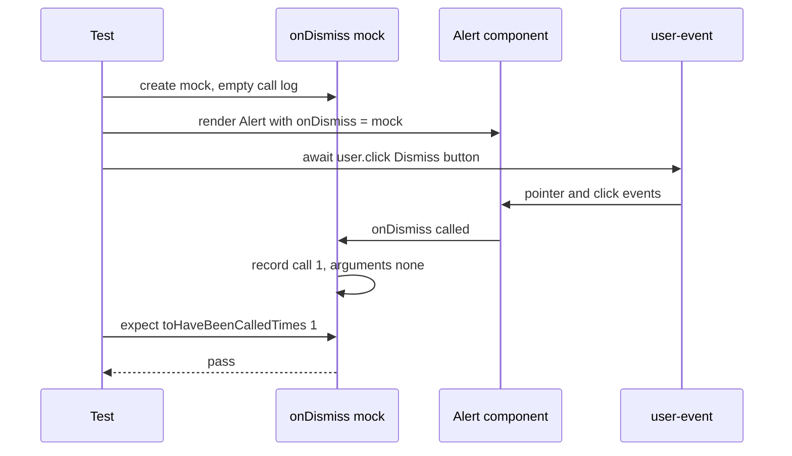
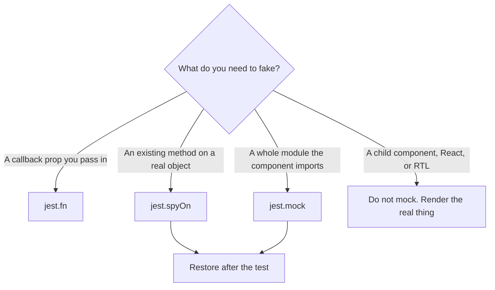

# 07 · Jest mocking

*Level (a) never used · about 10 min reading + 20 min practice*

## Why this matters here

Almost every component in this library takes a callback prop: `onClick`, `onChange`, `onClose`, `onDismiss`. In **Part 2** you need to prove that each one is called at the right moment, with the right arguments, and *not* called when it shouldn't be, for example on a disabled Button. One seeded bug in **Part 3** is "event handler not called", and its failing test is a mock assertion. Mocks also come back in **Part 4** when an integration test needs to stand in for something outside the library.

## Mental model

**A mock is a stand-in actor who writes down every line they were given.**

When you pass `onClick={jest.fn()}` to a Button, the button has no idea it is talking to a fake. It calls the function as usual. The fake does nothing useful, but it keeps a notebook: how many times it was called, and with which arguments. After the action, your test reads the notebook: "Were you called once? With `true`?"

There are three levels of stand-in:

- **`jest.fn()`** is a brand-new fake function you hand to the component yourself.
- **`jest.spyOn(object, 'method')`** wraps a method that already exists (like `console.error`) so you can read its notebook. By default the real method still runs.
- **`jest.mock('module-path')`** swaps a whole imported module for fakes, before your component even loads.

**Where the analogy breaks:** a real actor improvises. A mock only does what you scripted. If you script `mockResolvedValue({ ok: true })` and the real service returns something else, your test passes and production fails. Every mock is a claim about the outside world that no test checks. That is why you mock as little as possible (see "When not to mock").

## Diagram

How a callback-prop test uses a mock, from arrange to assert:



And which tool to reach for:



## Core primitives

### 1. `jest.fn()` with call assertions

```tsx
import { render, screen } from '@testing-library/react';
import userEvent from '@testing-library/user-event';
import { Button } from './Button';

it('calls onClick once per click', async () => {
  const user = userEvent.setup();
  const onClick = jest.fn();
  render(<Button onClick={onClick}>Save</Button>);

  await user.click(screen.getByRole('button', { name: 'Save' }));

  expect(onClick).toHaveBeenCalled();         // at least once
  expect(onClick).toHaveBeenCalledTimes(1);   // exactly once
});

it('does not call onClick when disabled', async () => {
  const user = userEvent.setup();
  const onClick = jest.fn();
  render(<Button onClick={onClick} disabled>Save</Button>);

  await user.click(screen.getByRole('button', { name: 'Save' }));

  expect(onClick).not.toHaveBeenCalled();
});
```

Prefer `toHaveBeenCalledTimes(1)` over `toHaveBeenCalled()`. A handler that fires twice per click is a real bug, and only the exact count catches it.

### 2. `toHaveBeenCalledWith` and reading `mock.calls`

`toHaveBeenCalledWith(...args)` passes if *any* call had those arguments. `toHaveBeenLastCalledWith` checks only the most recent one. For finer checks, `mockFn.mock.calls` is an array of argument arrays.

```tsx
import { Tabs } from './Tabs';

const tabs = [
  { id: 'profile', label: 'Profile', content: 'Profile panel' },
  { id: 'billing', label: 'Billing', content: 'Billing panel' },
];

it('reports the id of the clicked tab', async () => {
  const user = userEvent.setup();
  const onChange = jest.fn();
  render(<Tabs tabs={tabs} defaultTabId="profile" onChange={onChange} />);

  await user.click(screen.getByRole('tab', { name: 'Billing' }));

  expect(onChange).toHaveBeenCalledWith('billing');
  expect(onChange.mock.calls).toEqual([['billing']]);
});
```

(This assumes `Tabs` calls `onChange` with the tab's `id`. Read the component and adjust.)

When the argument is a big object, such as a React event, match only the part you care about: `expect(onChange).toHaveBeenCalledWith(expect.objectContaining({ type: 'change' }))`.

### 3. `jest.spyOn` for existing methods

The usual case in a component library is `console.error`. React logs a warning there for problems like a missing `key` on list items, or an input that switches from uncontrolled (the browser keeps the value) to controlled (a `value` prop keeps it). Spy on it to assert there are no warnings, or to silence one you expect.

```tsx
it('renders without React warnings', () => {
  const errorSpy = jest.spyOn(console, 'error').mockImplementation(() => {});

  render(<Tabs tabs={tabs} />);

  expect(errorSpy).not.toHaveBeenCalled();
  errorSpy.mockRestore();   // put the real console.error back
});
```

`.mockImplementation(() => {})` replaces the real behaviour, so nothing prints. Without it, the spy records calls and the real method still runs.

### 4. Scripting return values: `mockReturnValue`, `mockImplementation`, `mockResolvedValue`

```ts
const getLabel = jest.fn().mockReturnValue('Save');           // always returns 'Save'
const double = jest.fn((n: number) => n * 2);                  // shorthand for mockImplementation
const once = jest.fn().mockReturnValueOnce('first').mockReturnValue('rest');

const save = jest.fn().mockResolvedValue({ ok: true });        // returns Promise that resolves
const fail = jest.fn().mockRejectedValue(new Error('Network')); // returns Promise that rejects
```

`mockResolvedValue` is how you fake an async callback. An example is an `onClick` that saves something while the Button shows `loading`. Chapter 08 covers waiting for the result.

### 5. `jest.mock` for module boundaries

`jest.mock('./path')` replaces every export of that module with an auto-generated `jest.fn()`. Jest **hoists** the call, meaning it moves it to the top of the file, so it runs before any `import`. `jest.mocked()` gives you the mock's TypeScript type without a cast.

The example below is **illustrative** (`ProfileForm` and `api` are not part of the 8-component library). Suppose a Part 4 integration test renders a small form that calls `saveProfile` from an `api` module. The network is the boundary, so that is what you mock:

```tsx
import { saveProfile } from './api';
import { ProfileForm } from './ProfileForm';

jest.mock('./api');                       // every export becomes jest.fn()
const saveProfileMock = jest.mocked(saveProfile);

it('saves the typed name', async () => {
  const user = userEvent.setup();
  saveProfileMock.mockResolvedValue({ ok: true });
  render(<ProfileForm />);

  await user.type(screen.getByRole('textbox', { name: /name/i }), 'Jay');
  await user.click(screen.getByRole('button', { name: 'Save' }));

  expect(saveProfileMock).toHaveBeenCalledWith({ name: 'Jay' });
});
```

### 6. Resetting and restoring

Mocks keep their notebook between tests unless you clear it. That lets one test's calls leak into the next.

| Call | Clears call log | Removes scripted behaviour | Puts the real method back (spies) |
|---|---|---|---|
| `mockClear()` / `jest.clearAllMocks()` | yes | no | no |
| `mockReset()` / `jest.resetAllMocks()` | yes | yes | no |
| `mockRestore()` / `jest.restoreAllMocks()` | yes | yes | yes |

The simplest safe setup is in `jest.config.ts`: `clearMocks: true` and `restoreMocks: true`. Jest then does this before every test, so you can't forget.

## Worked example: `Alert` dismiss

`Alert {variant, dismissible?, onDismiss?, autoDismissMs?}` shows its message as children. The goal is to cover the dismiss behaviour, including the null-check edge case.

**Step 1. The happy path.** Give it a fake `onDismiss`, click the dismiss button, read the notebook.

```tsx
import { render, screen } from '@testing-library/react';
import userEvent from '@testing-library/user-event';
import { Alert } from './Alert';

describe('Alert dismiss', () => {
  it('calls onDismiss once when the dismiss button is clicked', async () => {
    const user = userEvent.setup();
    const onDismiss = jest.fn();
    render(<Alert variant="success" dismissible onDismiss={onDismiss}>Saved</Alert>);

    await user.click(screen.getByRole('button', { name: /dismiss/i }));

    expect(onDismiss).toHaveBeenCalledTimes(1);
  });
```

**Step 2. No dismiss button unless `dismissible`.** No mock is needed here. This is plain rendering.

```tsx
  it('has no dismiss button when not dismissible', () => {
    render(<Alert variant="info">Heads up</Alert>);

    expect(screen.queryByRole('button', { name: /dismiss/i })).not.toBeInTheDocument();
  });
```

**Step 3. The optional-callback edge case.** `onDismiss` is optional (`onDismiss?`). What happens if it is missing and the user clicks dismiss? If the component calls `onDismiss()` without checking, it throws `TypeError: onDismiss is not a function`. That is exactly the "missing null check" category of bug. No mock is involved: the test passes *no* function and asserts nothing blows up.

```tsx
  it('can be dismissed without an onDismiss handler', async () => {
    const user = userEvent.setup();
    render(<Alert variant="warning" dismissible>Careful</Alert>);

    await user.click(screen.getByRole('button', { name: /dismiss/i }));

    expect(screen.queryByText('Careful')).not.toBeInTheDocument();
  });
});
```

The last line assumes the Alert hides itself. If the parent is meant to remove it, assert only that the click did not throw. With `user.click` awaited, a thrown error fails the test on its own.

**Step 4. Check you are not over-mocking.** Nothing in this file mocks the Button used inside the Alert, React, or RTL. The only fake is the callback, which is the component's real boundary.

## When not to mock

- **Child components.** Don't `jest.mock('./Button')` inside the Modal tests. You would be testing a Modal nobody uses, and the integration tests in Part 4 exist to exercise the real combination.
- **React hooks or state.** Don't spy on `useState`. Assert on what the user sees instead (chapter 05).
- **The thing under test.** Mocking part of the component you are testing means the test checks your mock.
- **Pure helpers.** A function like `clamp(page, 1, total)` is fast and deterministic (same input, same output, every time), so let it run. Mocking it would hide the off-by-one pagination bug instead of catching it.

The module rule sums it up: **mock only at module boundaries**. A **boundary** is the edge where your code hands off to something it does not own and cannot run reliably in a test: the network, timers, or browser APIs jsdom lacks.

## Common mistakes

1. **Asserting on a mock you never passed in.**
   *Symptom:* `expect(onClick).toHaveBeenCalled()` fails although clicking clearly works in the browser.
   *Fix:* make sure the same `jest.fn()` instance reaches the prop. A typo like `onClik` is caught by TypeScript strict mode. A different variable is not.

2. **Call counts leaking between tests.**
   *Symptom:* `toHaveBeenCalledTimes(1)` fails with "received 2" only when the whole file runs.
   *Fix:* create the mock inside each test, or set `clearMocks: true` in the Jest config.

3. **`jest.mock` path doesn't match the import path.**
   *Symptom:* the real module still runs, for example a real network call or `saveProfile is not a mock function`.
   *Fix:* the string must resolve to the same file the component imports, relative to the *test* file.

4. **A spy on `console.error` that is never restored.**
   *Symptom:* later tests swallow real React warnings silently.
   *Fix:* call `mockRestore()`, or set `restoreMocks: true`.

5. **Mocking to make a test pass.**
   *Symptom:* coverage goes up but the bug remains, because the mocked piece was where the bug lived.
   *Fix:* remove the mock and ask what the smallest real boundary is.

## Check yourself

??? question "Q1. A test renders `<Button onClick={onClick} disabled>`, clicks it, and asserts `expect(onClick).toHaveBeenCalledTimes(0)`. Is there a clearer matcher?"
    `expect(onClick).not.toHaveBeenCalled()`. It says the same thing, and the failure message lists the calls that did happen.

??? question "Q2. You `jest.spyOn(console, 'error')` without `mockImplementation`. Does the error still print?"
    Yes. A bare spy records calls and passes them through to the real method. Add `.mockImplementation(() => {})` to silence it.

??? question "Q3. What is the difference between `jest.clearAllMocks()` and `jest.restoreAllMocks()`?"
    `clearAllMocks` empties every mock's call log but keeps scripted return values and keeps spies in place. `restoreAllMocks` also removes the scripting and puts the real methods back under every `spyOn`.

??? question "Q4. Should the Modal tests mock the Button component used for the close control? Why?"
    No. Render the real Button. Mocking it would hide bugs in how the two work together (for example, the close button never receiving `onClose`), and those are exactly what the integration tests in Part 4 need to catch.

??? question "Q5. Why is a missing-`onDismiss` test written without any mock at all?"
    The bug is the component calling a function that isn't there. Passing a mock would supply the function and hide the crash. The test has to leave the prop out.

## Go deeper

**Official docs**

- [Mock functions](https://jestjs.io/docs/mock-functions): `jest.fn()`, spies, checking a handler was or wasn't called

**Articles**

- [But really, what is a JavaScript mock?](https://kentcdodds.com/blog/but-really-what-is-a-javascript-mock) by Kent C. Dodds. Builds mocks by hand, then shows the Jest equivalents.
- [Jest .fn() and .spyOn() spy/stub/mock assertion reference · Code with Hugo](https://codewithhugo.com/jest-fn-spyon-stub-mock/) by Hugo Di Francesco. A practical reference for the mock assertions.
- [Mocking functions and modules with Jest | pawelgrzybek.com](https://pawelgrzybek.com/mocking-functions-and-modules-with-jest/) by Paweł Grzybek. A concise explanation of module mocking.

**Videos**

- [React Testing Tutorial - 42 - Mocking Functions](https://www.youtube.com/watch?v=TuxmnyhPdhA): Codevolution · 8:05
- [Mock vs Spy in Testing with Jest: Which is Better?](https://www.youtube.com/watch?v=9N8D7U9Am8o): Dev tips by MoHo · 25:12

## Used in

- **Part 2:** every callback prop in all 8 components gets a `jest.fn()`, with called-once, called-with and not-called assertions.
- **Part 3:** the "event handler not called" bug. The red commit is a test whose `toHaveBeenCalledTimes(1)` fails. The "missing null check" bug is tested by *leaving out* an optional callback.
- **Part 4:** integration tests mock only true boundaries, never the library's own components.

*Resources verified 2026-09-29.*
