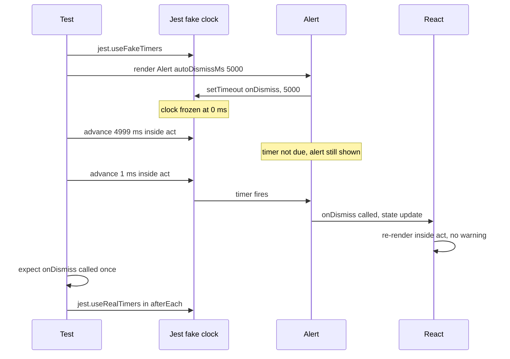
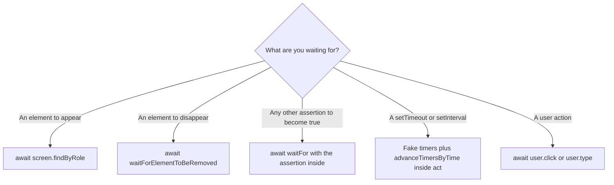

# 08 · Async tests and fake timers

*Level (a) never used · about 10 min reading + 25 min practice*

## Why this matters here

`Alert` has an `autoDismissMs` prop. Waiting five real seconds in a test would make your suite slow and **flaky** (passing on some runs and failing on others with no code change). **Part 2** needs a fast, exact test for that timer, and some components update the screen after a promise resolves, which a test also has to wait for. **Part 3**'s "state not updating" bug and **Part 4**'s integration tests both depend on waiting correctly. If you wait too little the test fails at random. If you wait for the wrong thing, it passes when it shouldn't.

## Mental model

**A test is a script that must pause until the world catches up. Fake timers let you turn the clock's hands yourself.**

Some things in a React app happen *later*. A promise resolves on a future turn of the **event loop** (JavaScript's cycle of taking the next queued job and running it). A `setTimeout` fires after a delay. React then re-renders. An **async test** is one marked `async` that uses `await` to pause at those points, so its assertions run against the updated screen.

**Fake timers** replace `setTimeout`, `setInterval` and `Date` with a pretend clock that stands still until you move it. `jest.advanceTimersByTime(5000)` means "pretend five seconds passed, and run every timer that would have fired". It finishes instantly.

**Where the analogy breaks:** fake timers control *timers*, not *promises*. A resolved promise still runs its `.then` callbacks on the **microtask queue** (a high-priority job queue that JavaScript empties right after the current code finishes), whatever the fake clock says. Tools that wait by polling also misbehave if nobody moves the fake clock. That includes user-event's small delays between actions, and older versions of RTL's `waitFor`. So when fake timers are on, you have to tell user-event how to move the clock (primitive 5).

## Diagram

How an auto-dismissing Alert test moves through time with fake timers:



When to use each waiting tool:



## Core primitives

### 1. `async` / `await` in a test

Mark the test function `async`, then `await` anything that returns a promise. If you forget `await`, the test ends before the work is done. Jest reports it as passed, and any failure appears later, attached to the wrong test.

```tsx
it('waits for the click to finish', async () => {
  const user = userEvent.setup();
  const onClick = jest.fn();
  render(<Button onClick={onClick}>Save</Button>);

  await user.click(screen.getByRole('button', { name: 'Save' }));

  expect(onClick).toHaveBeenCalledTimes(1);
});
```

### 2. `findBy…`: wait for something to appear

`findBy` is `getBy` that retries. It checks the DOM repeatedly (by default every 50 ms, for up to 1000 ms) and resolves with the element as soon as it appears.

```tsx
it('shows the confirmation after an async save', async () => {
  const user = userEvent.setup();
  const save = jest.fn().mockResolvedValue({ ok: true });
  render(<SaveButton onSave={save} />);   // illustrative, not one of the 8: shows an Alert after save resolves

  await user.click(screen.getByRole('button', { name: 'Save' }));

  expect(await screen.findByRole('alert')).toHaveTextContent('Saved');
});
```

### 3. `waitFor` and `waitForElementToBeRemoved`

`waitFor(callback)` re-runs the callback until it stops throwing, or the timeout runs out. Put **one assertion** inside it and no side effects, because it may run many times.

```tsx
import { waitFor, waitForElementToBeRemoved } from '@testing-library/react';

await waitFor(() => expect(onDismiss).toHaveBeenCalledTimes(1));

// For disappearance, the element must exist when you start waiting:
await waitForElementToBeRemoved(() => screen.queryByRole('alert'));
```

Rule of thumb: waiting for an element to *appear* uses `findBy`. Waiting for a *mock call or a disappearance* uses `waitFor` or `waitForElementToBeRemoved`.

### 4. `act()` and the "not wrapped in act" warning

`act` is a React test helper that runs your code, then flushes every state update and **effect** (code in a `useEffect` hook, which React runs after rendering) it caused before returning. That way your assertions see the final screen. RTL already wraps `render`, every user-event action, `findBy` and `waitFor` in `act`, so you rarely call it yourself.

The warning looks like this:

```text
Warning: An update to Alert inside a test was not wrapped in act(...).
```

It means that **React updated state at a moment your test was not watching.** Usually a timer fired or a promise resolved after your last `await`, so your assertions may have checked a screen that was out of date. The fix is almost never to add `act` blindly around everything. Instead:

- If the update comes from a promise, `await` something that waits for its result (`findBy`, `waitFor`).
- If it comes from a fake timer you advanced yourself, wrap the advance in `act`:

```tsx
import { act } from '@testing-library/react';

act(() => {
  jest.advanceTimersByTime(5000);
});
```

### 5. `jest.useFakeTimers` with user-event's `advanceTimers`

Turn fake timers on before rendering, and back off after each test. user-event waits with a tiny `setTimeout` between actions. With a frozen clock that wait never ends and the test times out. Passing `advanceTimers` tells user-event to move the fake clock itself.

```tsx
import { act } from '@testing-library/react';
import userEvent from '@testing-library/user-event';

beforeEach(() => {
  jest.useFakeTimers();
});

afterEach(() => {
  act(() => {
    jest.runOnlyPendingTimers();   // flush leftovers so they don't leak into the next test
  });
  jest.useRealTimers();
});

it('clicks with fake timers on', async () => {
  const user = userEvent.setup({ advanceTimers: jest.advanceTimersByTime });
  // ...render and interact as usual
});
```

Other timer controls: `jest.runAllTimers()` runs everything, including timers created by timers, and can loop forever with `setInterval`. `jest.runOnlyPendingTimers()` runs only the timers waiting right now. `jest.advanceTimersByTime(ms)` is the most exact of the three, so prefer it for "fires after N ms" behaviour.

## Worked example: auto-dismissing `Alert`

`Alert {variant, dismissible?, onDismiss?, autoDismissMs?}`. When `autoDismissMs` is set, the Alert should call `onDismiss` once that many milliseconds after it appears, and it should cancel its timer if it is removed first. This example assumes the Alert has `role="alert"` and hides itself on dismiss. Check the component and adjust the query if it uses `role="status"` for some variants.

**Step 1. Set up the clock.**

```tsx
import { act, render, screen } from '@testing-library/react';
import userEvent from '@testing-library/user-event';
import { Alert } from './Alert';

describe('Alert auto-dismiss', () => {
  beforeEach(() => {
    jest.useFakeTimers();
  });

  afterEach(() => {
    act(() => {
      jest.runOnlyPendingTimers();
    });
    jest.useRealTimers();
  });
```

**Step 2. Test the boundary, not just "eventually".** Testing both 4999 ms and 5000 ms pins the exact behaviour. It catches a timer set in seconds instead of milliseconds, or one set off by one.

```tsx
  it('calls onDismiss exactly at autoDismissMs', () => {
    const onDismiss = jest.fn();
    render(
      <Alert variant="success" autoDismissMs={5000} onDismiss={onDismiss}>
        Saved
      </Alert>,
    );

    act(() => {
      jest.advanceTimersByTime(4999);
    });
    expect(onDismiss).not.toHaveBeenCalled();
    expect(screen.getByRole('alert')).toHaveTextContent('Saved');

    act(() => {
      jest.advanceTimersByTime(1);
    });
    expect(onDismiss).toHaveBeenCalledTimes(1);
    expect(screen.queryByRole('alert')).not.toBeInTheDocument();
  });
```

The test is synchronous. It has no `async` and no real waiting, and it runs in a few milliseconds.

**Step 3. No timer without the prop.**

```tsx
  it('stays until dismissed when autoDismissMs is not set', () => {
    const onDismiss = jest.fn();
    render(<Alert variant="info" onDismiss={onDismiss}>Heads up</Alert>);

    act(() => {
      jest.advanceTimersByTime(60_000);
    });

    expect(onDismiss).not.toHaveBeenCalled();
    expect(screen.getByRole('alert')).toBeInTheDocument();
  });
```

**Step 4. Cleanup on unmount.** If the Alert's effect does not return `clearTimeout`, the timer still fires after the Alert has gone. `onDismiss` then runs for an alert nobody can see.

```tsx
  it('cancels the timer when removed early', () => {
    const onDismiss = jest.fn();
    const { unmount } = render(
      <Alert variant="warning" autoDismissMs={5000} onDismiss={onDismiss}>Careful</Alert>,
    );

    unmount();
    act(() => {
      jest.advanceTimersByTime(5000);
    });

    expect(onDismiss).not.toHaveBeenCalled();
  });
```

**Step 5. A manual dismiss with fake timers on.** This is where `advanceTimers` matters. Without it, this test hangs until Jest's 5-second timeout.

```tsx
  it('can still be dismissed by hand before the timer', async () => {
    const user = userEvent.setup({ advanceTimers: jest.advanceTimersByTime });
    const onDismiss = jest.fn();
    render(
      <Alert variant="error" dismissible autoDismissMs={5000} onDismiss={onDismiss}>
        Failed
      </Alert>,
    );

    await user.click(screen.getByRole('button', { name: /dismiss/i }));
    act(() => {
      jest.advanceTimersByTime(5000);
    });

    expect(onDismiss).toHaveBeenCalledTimes(1);   // not twice
  });
});
```

The last assertion catches a subtle bug. If a manual dismiss doesn't clear the auto-dismiss timer, `onDismiss` fires twice.

## Common mistakes

1. **Using real time.**
   *Symptom:* `await new Promise((r) => setTimeout(r, 5000))` makes the suite slow and still flaky on a busy CI machine (the continuous-integration server that runs your tests on every push).
   *Fix:* `jest.useFakeTimers()` and `advanceTimersByTime`.

2. **Fake timers on, user-event not told.**
   *Symptom:* `thrown: "Exceeded timeout of 5000 ms for a test"` on the first `await user.click`.
   *Fix:* `userEvent.setup({ advanceTimers: jest.advanceTimersByTime })`.

3. **Advancing timers outside `act`.**
   *Symptom:* the "not wrapped in act(...)" warning, and an assertion that sees the old screen.
   *Fix:* `act(() => { jest.advanceTimersByTime(ms); })`.

4. **Using `getBy` for something that appears later.**
   *Symptom:* "Unable to find role alert", even though it clearly shows up in the app.
   *Fix:* `await screen.findByRole('alert')`.

5. **Side effects or several assertions inside `waitFor`.**
   *Symptom:* a click inside `waitFor` fires many times, or the test waits the full timeout on the first failing assertion.
   *Fix:* do the action before `waitFor`, and put one assertion inside it.

## Check yourself

??? question "Q1. With fake timers on, an Alert has `autoDismissMs={3000}`. You advance 2000 ms, then 2000 ms again. How many times is `onDismiss` called, and when?"
    Once, during the second advance. The clock passes 3000 ms partway through it. A single `setTimeout` fires only once, however far past its time you advance.

??? question "Q2. You see 'An update to Tabs inside a test was not wrapped in act(...)'. What does it tell you, and what is your first move?"
    React updated state after your test stopped watching. Look for an un-awaited promise, a user-event call missing `await`, or a timer you advanced outside `act`. Then `await` the right thing, rather than wrapping random lines in `act`.

??? question "Q3. You want to check an Alert is gone after an async save resolves. `findBy`, `waitFor` or `waitForElementToBeRemoved`?"
    `waitForElementToBeRemoved(() => screen.queryByRole('alert'))`, or `await waitFor(() => expect(screen.queryByRole('alert')).not.toBeInTheDocument())`. `findBy` waits for elements to *appear*, so it can't be used here.

??? question "Q4. Why test at 4999 ms and at 5000 ms instead of just `runAllTimers()`?"
    `runAllTimers` proves the Alert dismisses *eventually*. The pair proves it dismisses at the *right* time. That catches unit mistakes (seconds vs milliseconds) and off-by-one delays.

??? question "Q5. Why does the unmount test matter, if no user can see the Alert after it is removed?"
    A timer that outlives its component still runs `onDismiss`, which can change parent state for an alert that is already gone. React may also warn about updates after unmount. The test proves the effect cleans up with `clearTimeout`.

## Go deeper

**Official docs**

- [Timer mocks](https://jestjs.io/docs/timer-mocks): fake timers for auto-dismissing alerts and debounced inputs

**Articles**

- [Fix the "not wrapped in act(...)" warning](https://kentcdodds.com/blog/fix-the-not-wrapped-in-act-warning) by Kent C. Dodds. Why the warning appears and how to fix it with findBy and waitFor.
- [Faster tests with Jest timers vs. waitFor on debounced inputs](https://testdouble.com/insights/jest-timers-vs-waitfor-debounced-inputs) by Test Double. Fake timers with RTL on a debounced input.
- [Prefer Jest real timers when testing with React Testing Library – Jaroslav Šnajdr](https://jardasn.blog/2023/01/11/prefer-jest-real-timers-when-testing-with-react-testing-library/) by Jaroslav Šnajdr. The pitfalls of mixing fake timers with RTL and user-event, a useful counterpoint.

**Videos**

- [React Testing Tutorial - 31 - findBy](https://www.youtube.com/watch?v=XTKF8GKD1tA): Codevolution · 7:06
- [React Testing Tutorial - 41 - Act Utility](https://www.youtube.com/watch?v=W7CbUiO3_28): Codevolution · 5:46
- [Testing time-dependent code in Jest with fake timers](https://www.youtube.com/watch?v=XL6YeZC-Tlg): Paweł Barszcz · 2:56

## Used in

- **Part 2:** the Alert test file's auto-dismiss group (the boundary, no-prop and unmount-cleanup tests above), plus any component whose screen updates after a promise.
- **Part 3:** reading "not wrapped in act" warnings and choosing the right wait, so that the red test fails for the bug and not for timing.
- **Part 4:** integration tests that wait with `findBy` across components, with fake timers on wherever an Alert is involved.

*Resources verified 2026-09-29.*
