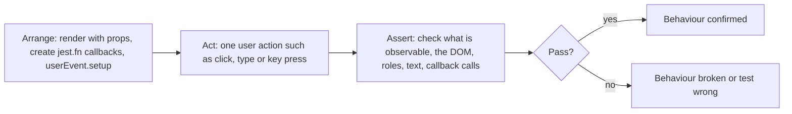
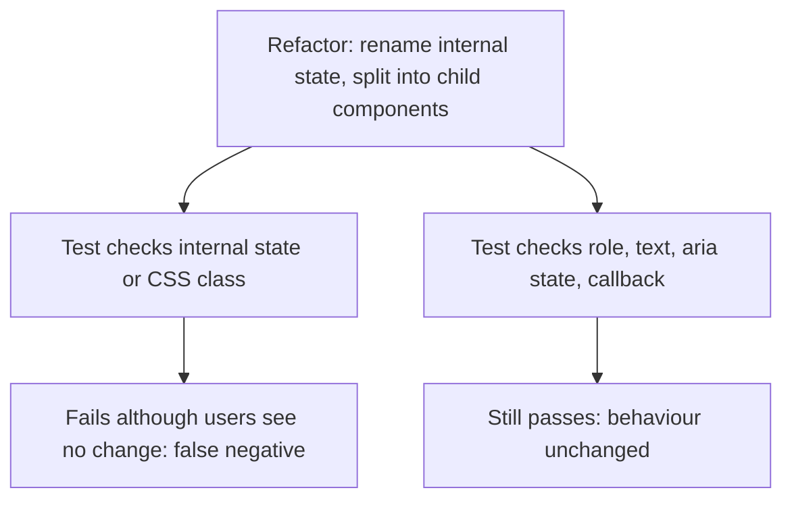

# 09 · Arrange-Act-Assert and Testing Behaviour

*Level (a) never used · about 12 minutes to read, plus 20 minutes for the exercises*

## Why this matters here

Every test you write in **Part 2** (unit tests for all 8 components) follows the same shape, and every test file needs three groups: rendering, interactions and edge cases. The red tests in **Part 3** and the integration tests in **Part 4** use the same shape. If the shape is right, a reviewer can read any test in ten seconds and a refactor of a component will not break tests that should still pass.

## Mental model

**A test is a short story told from the outside: "given this setup, when the user does this, then they see that."** You only describe what someone outside the component can observe. That "someone" is either the person using the page (what they see, click and hear from a screen reader) or the developer using the component (the props they pass in and the callbacks they get back).

Think of a restaurant inspector who orders a meal. They judge the food that arrives, not which pan the chef used. If the chef switches pans, the inspection result should not change. A test that checks the pan (a component's internal state, a private function, a CSS class name) fails when the chef changes pans, even though the meal is the same.

**Where the analogy breaks:** an inspector cannot rearrange the kitchen, but a test can. In the Arrange step you control everything: props, fake callbacks, fake timers. That setup is allowed. The rule applies to what you **check**, not to what you set up.

Two terms you will see in the reading:

- **Implementation detail**: anything about *how* a component works that its users cannot observe. Examples: the name of a `useState` variable, how many times it re-renders, which child component it uses internally, a CSS class.
- **False negative / false positive**: a test that fails when nothing is broken (it checked an implementation detail that changed), or a test that passes when something *is* broken (it never checked what the user sees).

## Diagram

The first diagram shows one test's flow. The second shows why behaviour tests survive a refactor while implementation-detail tests do not.





## Core primitives

### 1. Arrange, Act, Assert, visibly separated

Put a blank line (or a short comment) between the three parts. This project's rules require the separation to be visible. In the Arrange step, `jest.fn()` creates a **mock function**: a fake callback that records every call it receives, so the Assert step can check how it was called.

```tsx
import { render, screen } from '@testing-library/react';
import userEvent from '@testing-library/user-event';
import { Button } from './Button';

it('calls onClick when the user clicks it', async () => {
  // Arrange
  const user = userEvent.setup();
  const handleClick = jest.fn();
  render(<Button onClick={handleClick}>Save</Button>);

  // Act
  await user.click(screen.getByRole('button', { name: 'Save' }));

  // Assert
  expect(handleClick).toHaveBeenCalledTimes(1);
});
```

### 2. Test names that read as sentences

Read `describe` plus `it` aloud. It should sound like a line in a specification. When the test fails, the name alone tells you what is broken.

```tsx
describe('Button', () => {
  it('shows its children as the accessible name', () => { /* ... */ });
  it('does not call onClick when disabled', async () => { /* ... */ });
});
// Bad names: 'test 1', 'works', 'handleClick', 'state updates'
```

### 3. Group with `describe`: rendering, interactions, edge cases

Every component's test file in Part 2 uses these three groups. Keep nesting to one level under the component name, so each test stays easy to read.

```tsx
describe('Alert', () => {
  describe('rendering', () => {
    it('renders its message in an alert region', () => { /* ... */ });
  });
  describe('interactions', () => {
    it('calls onDismiss when the dismiss button is clicked', async () => { /* ... */ });
  });
  describe('edge cases', () => {
    it('shows no dismiss button when dismissible is false', () => { /* ... */ });
  });
});
```

### 4. Assert on what can be observed, not on internals

Observable things are what is in the DOM (found by role, label or text), ARIA state, focus, and the calls your callback props received.

```tsx
// Behaviour: what a user or parent component can see
expect(screen.getByRole('tab', { name: 'Billing' })).toHaveAttribute('aria-selected', 'true');
expect(onChange).toHaveBeenCalledWith('billing');

// Implementation details: avoid these
// expect(container.querySelector('.tab--active')).not.toBeNull();   // CSS class
// expect(wrapperInstance.state.activeIndex).toBe(1);                 // internal state
```

### 5. One behaviour per test

A test should fail for one reason. You may use several `expect` lines if they all describe the **same** behaviour, for example "the dialog opens with its title". Split the test if the lines describe different behaviours, such as "opens" and "closes on Escape".

```tsx
it('closes when the user presses Escape', async () => {
  const user = userEvent.setup();
  const onClose = jest.fn();
  render(<Modal isOpen onClose={onClose} title="Delete file">Are you sure?</Modal>);

  await user.keyboard('{Escape}');

  expect(onClose).toHaveBeenCalledTimes(1);
});
```

### 6. Snapshots: use rarely, and keep them small

A **snapshot test** (`expect(container).toMatchSnapshot()`) saves the rendered HTML to a file and fails whenever it changes. It catches *every* change, so it catches *nothing in particular*. People learn to press "update snapshot" without reading it. In this module, prefer explicit assertions. If you do use one, snapshot a small, stable piece and never use it as the only test for a behaviour.

```tsx
// Acceptable as a small extra, never as the main test
expect(screen.getByRole('alert')).toMatchSnapshot();
```

## Worked example

Let's write the Toggle's test file from scratch. Toggle's props are `{ label, checked, onChange }`. It is a **controlled** component: the parent owns `checked`, and Toggle only asks for a change by calling `onChange`. In these examples `onChange` receives the new boolean value.

**Step 1: list the behaviours in plain English first.** Before writing any code:

- Rendering: it shows a switch named by its label, and reflects `checked` as on or off.
- Interactions: clicking asks for the opposite value. Pressing Space does the same.
- Edge cases: when it is already on, clicking asks for `false`.

**Step 2: turn each line into one test.**

```tsx
import { render, screen } from '@testing-library/react';
import userEvent from '@testing-library/user-event';
import { Toggle } from './Toggle';

describe('Toggle', () => {
  describe('rendering', () => {
    it('renders a switch named by its label', () => {
      render(<Toggle label="Dark mode" checked={false} onChange={jest.fn()} />);

      expect(screen.getByRole('switch', { name: 'Dark mode' })).toBeInTheDocument();
    });

    it('reports checked=true as aria-checked="true"', () => {
      render(<Toggle label="Dark mode" checked onChange={jest.fn()} />);

      expect(screen.getByRole('switch')).toHaveAttribute('aria-checked', 'true');
    });
  });

  describe('interactions', () => {
    it('asks to turn on when clicked while off', async () => {
      const user = userEvent.setup();
      const onChange = jest.fn();
      render(<Toggle label="Dark mode" checked={false} onChange={onChange} />);

      await user.click(screen.getByRole('switch', { name: 'Dark mode' }));

      expect(onChange).toHaveBeenCalledWith(true);
    });

    it('asks to turn on when Space is pressed', async () => {
      const user = userEvent.setup();
      const onChange = jest.fn();
      render(<Toggle label="Dark mode" checked={false} onChange={onChange} />);

      await user.tab();
      await user.keyboard(' ');

      expect(onChange).toHaveBeenCalledWith(true);
    });
  });

  describe('edge cases', () => {
    it('asks to turn off when clicked while on', async () => {
      const user = userEvent.setup();
      const onChange = jest.fn();
      render(<Toggle label="Dark mode" checked onChange={onChange} />);

      await user.click(screen.getByRole('switch'));

      expect(onChange).toHaveBeenCalledWith(false);
    });
  });
});
```

**Step 3: check each test against the rules.**

- Is AAA visible? Yes, there are blank lines between the three parts. (For render-only tests there is no Act step, and that is fine.)
- Does each name read as a sentence? "Toggle interactions asks to turn on when clicked while off". Yes.
- Does anything check internals? No. We check the role, `aria-checked`, and what `onChange` received. You could rewrite Toggle with a hidden checkbox or a `<button>` and these tests would still pass, which is exactly what we want.

**Step 4: see the whole round trip in one integration-style test.** Because Toggle is controlled, the visible state only flips when the parent re-renders it. To test that, render a tiny parent that owns the state:

```tsx
import { useState } from 'react';

function ToggleHarness() {
  const [on, setOn] = useState(false);
  return <Toggle label="Dark mode" checked={on} onChange={setOn} />;
}

it('flips to on after the user clicks it', async () => {
  const user = userEvent.setup();
  render(<ToggleHarness />);

  await user.click(screen.getByRole('switch', { name: 'Dark mode' }));

  expect(screen.getByRole('switch')).toHaveAttribute('aria-checked', 'true');
});
```

This is the kind of test that catches a "state not updating" bug. Part 3 has a seeded bug in that category.

## Common mistakes

1. **Checking a CSS class to prove state.**
   *Symptom:* a designer renames `.toggle--on` to `.is-on` and five tests fail, but the app works.
   *Fix:* assert on `aria-checked`, `aria-selected`, `toBeDisabled()`, or visible text instead.

2. **One giant test that does everything.**
   *Symptom:* a test called `'works'` fails at line 30, and you have to read all of it to know which behaviour broke.
   *Fix:* one behaviour per test, with a sentence name. Shared setup can go in a small helper function (a plain `renderToggle()` function is easier to follow than a deep `beforeEach`).

3. **Arrange, Act and Assert mixed together.**
   *Symptom:* `expect` lines sit between clicks, and it is unclear which action caused which result.
   *Fix:* do all setup, then one action (or one short sequence that is a single user intent, like "type a name"), then all assertions.

4. **Snapshot as the only test.**
   *Symptom:* the snapshot file changes on every pull request and gets updated without anyone reading it; a real bug slips through.
   *Fix:* replace it with explicit assertions on roles, names and states. Keep a snapshot only as a small, extra check.

5. **Testing that React works instead of that your component works.**
   *Symptom:* tests like "useState is called" or "the component re-renders twice".
   *Fix:* ask "what would a user or the parent component notice?" and test that.

## Check yourself

<details markdown="1">
<summary><strong>Q1. A test finds the active tab with <code>container.querySelector('.active')</code>. You change the styling approach and the test fails, but the tabs still work in the browser. What kind of failure is this, and how do you rewrite the assertion?</strong></summary>

It is a false negative: the test failed although the behaviour is fine, because it checked an implementation detail (a CSS class). Rewrite it to `expect(screen.getByRole('tab', { name: 'Billing' })).toHaveAttribute('aria-selected', 'true')`.

</details>

<details markdown="1">
<summary><strong>Q2. Is <code>expect(onDismiss).toHaveBeenCalledTimes(1)</code> testing an implementation detail?</strong></summary>

No. `onDismiss` is a prop, part of Alert's public contract with the developer who uses it. The parent component can observe that call, so it is behaviour. Testing a *private* function inside Alert would be an implementation detail.

</details>

<details markdown="1">
<summary><strong>Q3. You have one test that opens the Modal, checks its title, presses Escape and checks that onClose was called. Should you split it? Into what?</strong></summary>

Yes. It checks two behaviours. Split it into "renders the title in a dialog when isOpen is true" and "calls onClose when the user presses Escape". Each then fails for exactly one reason.

</details>

<details markdown="1">
<summary><strong>Q4. Write a test name for this behaviour: the Dropdown shows the label of the currently selected option.</strong></summary>

For example: `describe('Dropdown')` > `describe('rendering')` > `it('shows the label of the selected option')`. Read aloud: "Dropdown rendering shows the label of the selected option."

</details>

<details markdown="1">
<summary><strong>Q5. Why is a large snapshot a weak test even though it catches every change?</strong></summary>

Because it does not say which change matters. Every harmless markup change also fails it, so people update it without reading it, and it stops protecting anything. An explicit assertion states the one behaviour that must hold.

</details>

## Go deeper

**Official docs**

- [Guiding principles](https://testing-library.com/docs/guiding-principles): test the way a user uses the UI. The idea behind every RTL rule.
- [Query priority](https://testing-library.com/docs/queries/about/#priority): which queries test behaviour and which drift toward internals.

**Articles**

- [Testing Implementation Details](https://kentcdodds.com/blog/testing-implementation-details), Kent C. Dodds. The main essay on false negatives and false positives.
- [Arrange-Act-Assert: A Pattern for Writing Good Tests | Automation Panda](https://automationpanda.com/2020/07/07/arrange-act-assert-a-pattern-for-writing-good-tests/), Andrew Knight. A clear, language-neutral explanation of AAA.
- [Bill Wake — Arrange, Act, Assert](https://xp123.com/articles/3a-arrange-act-assert/): where the AAA pattern comes from.
- *(optional)* [Avoid Nesting when you're Testing](https://kentcdodds.com/blog/avoid-nesting-when-youre-testing), Kent C. Dodds. Why flat tests stay readable.

**Videos**

- [Introduction to Unit Testing Using Jest with the Arrange Act Assert Pattern](https://www.youtube.com/watch?v=iIJwyrGwCtQ), Coding With Adam (12:52).
- [React Testing Tutorial - 16 - What to test?](https://www.youtube.com/watch?v=rPTj1fX_inE), Codevolution (4:11).

## Used in

- **Part 2:** every one of the 8 test files uses the rendering / interactions / edge cases groups, AAA layout and sentence names from this chapter.
- **Part 3:** each red test is one behaviour with a name that describes the bug's correct behaviour.
- **Part 4:** the 3 integration tests use a small harness, like `ToggleHarness` above, to test several components working together through behaviour only.

*Resources verified 2026-09-29.*
