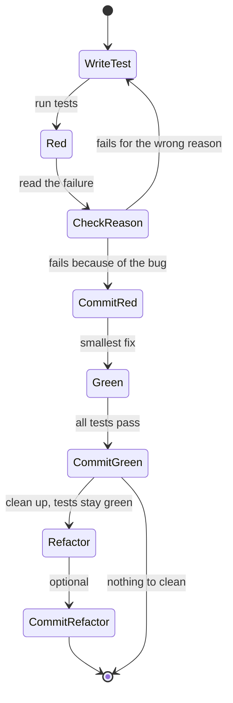
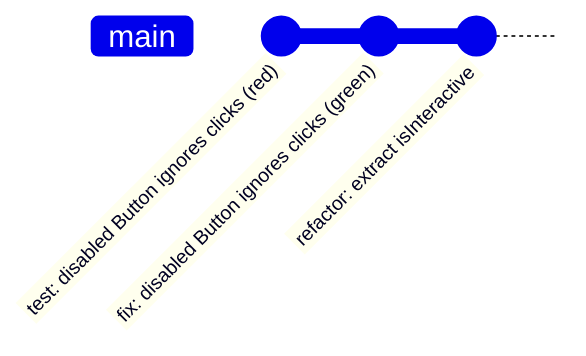

# 10 · Test-Driven Development: Red, Green, Refactor

*Level (a) never used · about 12 minutes to read, plus 30 minutes for the exercises*

## Why this matters here

**Part 3** asks you to fix the library's 5 seeded bugs test-first. For each bug you commit a failing test first (red), then the fix that makes it pass (green). The reviewer reads your git history, so the order of commits is part of the deliverable. **Part 5** collects those commits into the TDD commit log.

## Mental model

**Write down the correct behaviour as a test, watch it fail, then change the code until it passes.** The failing test is proof of two things: the bug exists, and your test can see it. The passing test is proof that the fix works, and it stays in the suite so the bug cannot quietly come back.

Terms:

- **TDD (test-driven development)**: a way of working in short cycles where the test is written before the code that makes it pass.
- **Red**: the new test runs and fails (Jest prints it in red).
- **Green**: you make the smallest change that makes it pass.
- **Refactor**: with all tests green, you clean up the code without changing behaviour. The tests tell you if you broke anything.
- **Regression test**: a test that pins down a bug that was once fixed, so that a "regression" (the bug returning) is caught.

Think of a lock and key. The red test is the lock, cut to the exact shape of the correct behaviour. The fix is the key. You make the lock first, so you know what shape the key must be.

**Where the analogy breaks:** a lock never changes, but a test can be wrong. If the test fails for the wrong reason (a typo, a wrong query, a missing import), red proves nothing. Always read the failure message and check it fails **because of the bug**.

## Diagram

The cycle, with the check people skip:



How that looks in your git history for one bug:



## Core primitives

### 1. Write the test from the bug report, not from the code

Describe the **correct** behaviour. The test name is the sentence that should be true.

```tsx
it('does not call onClick when disabled', async () => {
  const user = userEvent.setup();
  const onClick = jest.fn();
  render(<Button onClick={onClick} disabled>Save</Button>);

  await user.click(screen.getByRole('button', { name: 'Save' }));

  expect(onClick).not.toHaveBeenCalled();
});
```

### 2. Run only that test and read the failure

```bash
npx jest src/components/Button --watch
# or one test by name:
npx jest -t "does not call onClick when disabled"
```

A good red failure looks like `Expected number of calls: 0, Received number of calls: 1`. A bad one looks like `Unable to find an accessible element with the role "button"`: that means your query is wrong, not that you found the bug.

### 3. The red commit, in Conventional Commits format

**Conventional Commits** is a message format: `type(scope): description`. Common types are `test`, `fix`, `feat`, `refactor`, `chore`. This project adds `(red)` / `(green)` at the end so the reviewer sees the TDD order.

```bash
git add src/components/Button/Button.test.tsx
git commit -m "test(m01): disabled Button does not call onClick (red)"
```

Commit **only the test**. The suite is failing on purpose at this commit. Say so in the commit body if your team's CI (continuous integration: the server that runs the tests on every push) would otherwise be confused.

### 4. The smallest green fix, and the green commit

Change as little as possible to make the test pass. Resist tidying other code in the same commit, because it hides what the fix was.

```bash
git add src/components/Button/Button.tsx
git commit -m "fix(m01): disabled Button does not call onClick (green)"
```

### 5. Refactor with the tests as a safety net

Only now, with everything green, improve names or remove duplication. Run the tests after each small change. If you refactor, it gets its own commit: `refactor(m01): ...`.

### 6. Test the boundaries for number bugs

**Off-by-one** errors happen at the edges: the first item, the last item, an empty list, a count that divides exactly or leaves a remainder. Write a test for each edge, not just the middle.

```ts
it.each([
  { total: 20, pageSize: 10, pages: 2 },  // exact fit
  { total: 21, pageSize: 10, pages: 3 },  // remainder
  { total: 0,  pageSize: 10, pages: 0 },  // empty
])('has $pages pages for $total items of $pageSize', ({ total, pageSize, pages }) => {
  expect(getPageCount(total, pageSize)).toBe(pages);
});
```

## Worked example

Two bugs, fixed test-first. The code below illustrates the *kind* of bug in each category. The starter's real code will look different, so find the real cause yourself.

### Bug A: a disabled Button still calls `onClick`

Suppose Button renders `aria-disabled` instead of the native `disabled` attribute, so it stays focusable for screen-reader users, but its click handler forgets to check the flag:

```tsx
// Button.tsx (buggy)
import type { ReactNode } from 'react';

type ButtonProps = {
  children: ReactNode;
  onClick?: () => void;
  disabled?: boolean;
  variant?: 'primary' | 'secondary';
  loading?: boolean;
};

export function Button({ children, onClick, disabled = false, variant = 'primary', loading = false }: ButtonProps) {
  return (
    <button
      type="button"
      className={`btn btn--${variant}`}
      aria-disabled={disabled || loading}
      onClick={() => onClick?.()}
    >
      {loading ? 'Loading…' : children}
    </button>
  );
}
```

(If a Button uses the native `disabled` attribute, the browser, and `user-event`, will not fire the click at all. The bug only appears when the "disabled" state is faked, for example with `aria-disabled` or a `<div>`. That is also why you test with `user-event` rather than calling the handler directly.)

**Step 1, red.** Write the test from primitive 1 and run it. It fails with `Received number of calls: 1`. That is the bug, so the red is valid. Commit only the test file:
`test(m01): disabled Button does not call onClick (red)`.

**Step 2, green.** The smallest fix is a guard in the handler:

```tsx
onClick={() => {
  if (disabled || loading) return;
  onClick?.();
}}
```

Run the tests: green. Commit: `fix(m01): disabled Button does not call onClick (green)`.

**Step 3, one more red while you are here.** The same guard covers `loading`, but no test proves it yet. Add `it('does not call onClick while loading', ...)`. It passes straight away, so it is not a red test; commit it as `test(m01): cover loading Button click`. A test that is green on first run is fine for coverage, but it is not proof of a bug, so do not label it red.

**Step 4, refactor.** The condition `disabled || loading` now appears twice. Extract it:

```tsx
const isInert = disabled || loading;
// ...
aria-disabled={isInert}
onClick={() => { if (!isInert) onClick?.(); }}
```

Tests stay green. Commit: `refactor(m01): name Button inert state`.

### Bug B: off-by-one in pagination

Suppose a list component shows items page by page using a helper, and page numbers shown to the user start at 1:

```ts
// pagination.ts (buggy)
export function getPageItems<T>(items: T[], page: number, pageSize: number): T[] {
  const start = page * pageSize;          // treats page as 0-based
  return items.slice(start, start + pageSize);
}
```

The symptom a user would see: page 1 shows items 11 to 20, and the last page is empty.

**Step 1, red.** Test the edges: the first page and the last, partly filled page.

```ts
import { getPageItems } from './pagination';

const items = Array.from({ length: 25 }, (_, i) => i + 1); // 1..25

describe('getPageItems', () => {
  it('returns the first 10 items for page 1', () => {
    expect(getPageItems(items, 1, 10)).toEqual([1, 2, 3, 4, 5, 6, 7, 8, 9, 10]);
  });

  it('returns the 5 remaining items on the last page', () => {
    expect(getPageItems(items, 3, 10)).toEqual([21, 22, 23, 24, 25]);
  });
});
```

Both fail: page 1 returns `[11..20]`, page 3 returns `[]`. Commit: `test(m01): pagination returns correct items for 1-based pages (red)`.

**Step 2, green.**

```ts
const start = (page - 1) * pageSize;
```

Both pass. Commit: `fix(m01): pagination returns correct items for 1-based pages (green)`.

**Step 3, refactor (optional).** If the component also calculates the page count, check it uses `Math.ceil(total / pageSize)`, and add the `it.each` boundary test from primitive 6.

If the pagination lives inside a component rather than a helper, write the red test at the component level instead: render it, click "Next", and assert on the visible items. That is closer to the user and survives a later refactor into a helper.

## Common mistakes

1. **Writing the fix first, then the test.**
   *Symptom:* the test passes on first run, so you never saw it fail. It may not test the bug at all.
   *Fix:* if you already fixed it, `git stash` the fix (this sets your uncommitted changes aside; `git stash pop` brings them back), run the test, and confirm it fails. Then commit test, unstash, commit fix.

2. **Red for the wrong reason.**
   *Symptom:* the failure says "Unable to find role button" or "Cannot find module".
   *Fix:* fix the test until it fails **only** on the assertion that describes the bug.

3. **Test and fix in one commit.**
   *Symptom:* the reviewer cannot see the red step; Part 3's TDD evidence is missing.
   *Fix:* stage files separately (`git add <test file>` then commit, then `git add <source file>` then commit).

4. **Skipping refactor, or refactoring while red.**
   *Symptom:* either duplicated, rushed code stays forever, or you change structure while a test fails and cannot tell which change broke what.
   *Fix:* refactor only when everything is green, in small steps, running tests after each.

5. **Testing only the middle case.**
   *Symptom:* the off-by-one fix passes page 2 but page 1 or the last page is still wrong.
   *Fix:* always test first, last, empty and remainder cases.

## Check yourself

<details markdown="1">
<summary><strong>Q1. You write a red test for 'Input shows its error message' and it fails with <code>TestingLibraryElementError: Unable to find a label with the text of: Email</code>. Can you commit this as your red commit?</strong></summary>

No. The failure is about your query (the label text or the query itself), not about the missing error message. Fix the test until it finds the input and fails only on the assertion that the error message is shown.

</details>

<details markdown="1">
<summary><strong>Q2. Put these in the right order: fix(m01) … (green); refactor(m01) …; test(m01) … (red).</strong></summary>

`test(m01): … (red)`, then `fix(m01): … (green)`, then optionally `refactor(m01): …`.

</details>

<details markdown="1">
<summary><strong>Q3. For <code>getPageCount(total, pageSize)</code>, which three inputs would you test first, and why?</strong></summary>

An exact fit (20 items, size 10, expect 2), a remainder (21, 10, expect 3) and empty (0, 10, expect 0). Off-by-one bugs live at boundaries, and these are the three boundaries of a division that rounds up.

</details>

<details markdown="1">
<summary><strong>Q4. A new test passes on first run. Is that a problem?</strong></summary>

For a bug fix, yes: it means the test does not reproduce the bug (or the bug was already fixed). Check the test targets the real symptom. For extra coverage of already-correct behaviour it is fine, but do not label it as a red commit.

</details>

<details markdown="1">
<summary><strong>Q5. Why does the red test stay in the suite after the fix?</strong></summary>

It becomes a regression test. If anyone later reintroduces the bug, that test fails and names the exact behaviour that broke.

</details>

## Go deeper

**Official docs**

- [Test Driven Development](https://martinfowler.com/bliki/TestDrivenDevelopment.html), Martin Fowler. The cycle in one page, and the refactor step people skip.
- [Conventional Commits](https://www.conventionalcommits.org/en/v1.0.0/): the commit message format for the red and green commits.

**Articles**

- [Test-Driven Development Tutorial – How to Test Your JavaScript and ReactJS Applications](https://www.freecodecamp.org/news/test-driven-development-tutorial-how-to-test-javascript-and-reactjs-app/), freeCodeCamp News. A step-by-step walkthrough in JS and React with Jest.
- [Red, Green, Refactor | Codecademy](https://www.codecademy.com/article/tdd-red-green-refactor), Codecademy. A very short explanation of each phase.
- Book: Kent Beck, *Test-Driven Development: By Example*. Part I shows the cycle in tiny steps (optional).

**Videos**

- [Test-Driven Development // Fun TDD Introduction with JavaScript](https://www.youtube.com/watch?v=Jv2uxzhPFl4), Fireship (12:55).
- [React Testing Tutorial - 9 - Test Driven Development](https://www.youtube.com/watch?v=foiMMI-pEes), Codevolution (8:34).

## Used in

- **Part 3:** for each of the 5 seeded bugs you write one red test, commit it with `test(m01): … (red)`, fix it, commit with `fix(m01): … (green)`, and refactor if needed.
- **Part 5:** you list those commit pairs in the TDD commit log and describe each bug in the bug document.

*Resources verified 2026-09-29.*
