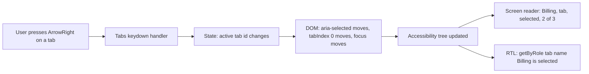
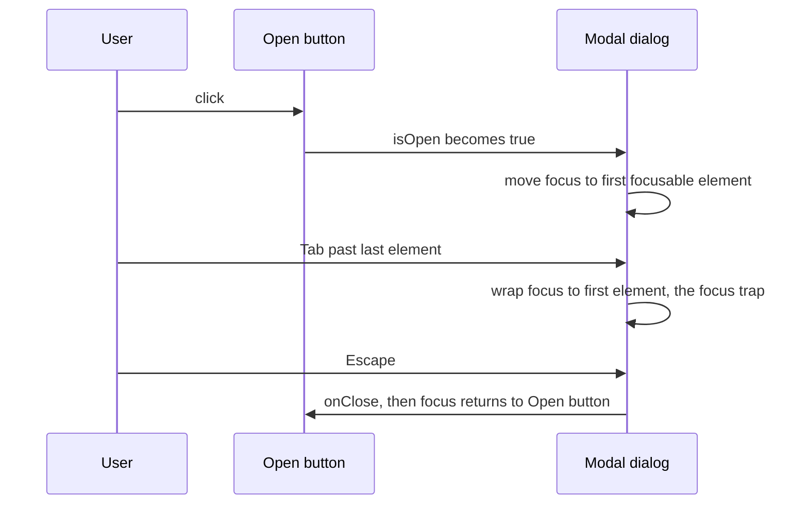

# 11 · Accessibility for Components

*Level (a) never used · about 14 minutes to read, plus 30 minutes for the exercises*

## Why this matters here

One of the 5 seeded bugs in **Part 3** is an accessibility bug, and the Cypress test in **Part 4** must include an accessibility check. There is a quieter reason too: in **Part 2** every `getByRole` query you write only works if the component is accessible. If `screen.getByRole('switch')` cannot find the Toggle, a screen reader cannot find it either. Accessibility and good RTL tests are the same work.

## Mental model

**Every element has a second, invisible description that assistive technology reads: its role, its name and its state.** The browser builds this into the **accessibility tree**, a simplified copy of the page that a **screen reader** (software that reads the page aloud, such as NVDA or VoiceOver) uses instead of the pixels.

- **Role**: what the thing *is*: `button`, `switch`, `tab`, `dialog`, `option`.
- **Accessible name**: what it is *called*: the button's text, the input's `<label>`, or `aria-label` / `aria-labelledby`.
- **State**: what condition it is *in*: `aria-checked`, `aria-selected`, `aria-expanded`, disabled.

Plus two behaviours no attribute gives you for free: **keyboard support** (everything works without a mouse) and **focus management** (keyboard focus goes to a sensible place when things open and close).

Think of a shipping label on a box. The box's contents are what sighted users see. The label says "Fragile, 3 kg, to: Colombo". Screen readers only read the label. RTL's role queries read the same label, which is why they test accessibility for free.

**Where the analogy breaks:** a label is static, but ARIA state must change with the UI. A Tabs component whose `aria-selected` never moves is a box whose label lies. And no label makes a box *keyboard operable*: that part is code you have to write and test.

**ARIA** (Accessible Rich Internet Applications) is the set of `role` and `aria-*` attributes. Rule one of ARIA: use a native HTML element when one exists (`<button>`, `<input type="checkbox">`, `<dialog>`) because it comes with role, keyboard and focus behaviour built in. Add ARIA only for widgets HTML does not have, such as tabs or a switch. The **WAI-ARIA Authoring Practices** describe, for each widget, which roles, states and keys it needs. Each description is called a "pattern".

## Diagram

How a Tabs click flows into what a screen reader announces, and what your test reads:



Focus management for the Modal, the most demanding pattern in this library:



## Core primitives

### 1. Roles and accessible names, tested with `getByRole`

If this query works, role and name are right. Prefer it over every other query.

```tsx
render(<Button onClick={jest.fn()}>Save</Button>);
expect(screen.getByRole('button', { name: 'Save' })).toBeInTheDocument();

render(<Input label="Email" value="" onChange={jest.fn()} required />);
// The <label> gives the input its accessible name
expect(screen.getByRole('textbox', { name: /email/i })).toBeRequired();
```

An icon-only button (like Alert's dismiss "×") needs `aria-label="Dismiss"`, or it has no name and `getByRole('button', { name: 'Dismiss' })` fails. That missing name is a classic accessibility bug.

### 2. ARIA states: `aria-checked`, `aria-selected`, `aria-expanded`

| Component | Pattern | Role(s) | State to test |
|---|---|---|---|
| Toggle | Switch | `switch` | `aria-checked="true"` / `"false"` |
| Tabs | Tabs | `tablist`, `tab`, `tabpanel` | `aria-selected` on the active tab |
| Dropdown | Listbox | `button` (trigger), `listbox`, `option` | `aria-expanded` on trigger, `aria-selected` on the chosen option |
| Modal | Dialog (modal) | `dialog` with `aria-modal="true"` | named by its title via `aria-labelledby` |

```tsx
const user = userEvent.setup();
render(
  <Dropdown
    label="Country"
    options={[{ value: 'lk', label: 'Sri Lanka' }, { value: 'in', label: 'India' }]}
    value="lk"
    onChange={jest.fn()}
  />
);
const trigger = screen.getByRole('button', { name: /country/i });
expect(trigger).toHaveAttribute('aria-expanded', 'false');

await user.click(trigger);

expect(trigger).toHaveAttribute('aria-expanded', 'true');
expect(screen.getByRole('option', { name: 'Sri Lanka' })).toHaveAttribute('aria-selected', 'true');
```

(RTL also offers `getByRole('option', { selected: true })` and `getByRole('switch', { checked: true })` filters, which read the same states.)

### 3. Keyboard support, tested with `user.keyboard` and `user.tab`

Each pattern lists its keys. For Tabs: Left/Right arrows move between tabs, Home/End jump to first/last. Only the active tab is in the Tab order; this is called a **roving tabindex** (active tab has `tabIndex={0}`, others `-1`).

```tsx
const tabs = [
  { id: 'profile', label: 'Profile', content: 'Profile settings' },
  { id: 'billing', label: 'Billing', content: 'Billing settings' },
];
const user = userEvent.setup();
render(<Tabs tabs={tabs} defaultTabId="profile" />);

await user.tab();                      // focus lands on the active tab
await user.keyboard('{ArrowRight}');

const billing = screen.getByRole('tab', { name: 'Billing' });
expect(billing).toHaveFocus();
expect(billing).toHaveAttribute('aria-selected', 'true');
expect(screen.getByRole('tabpanel')).toHaveTextContent('Billing settings');
```

### 4. Focus management and the focus trap

A **focus trap** keeps Tab and Shift+Tab cycling inside the open Modal, so keyboard users cannot land on the page behind it. The Dialog pattern also says Escape closes it and focus returns to the element that opened it.

```tsx
it('keeps focus inside the dialog when tabbing past the last element', async () => {
  const user = userEvent.setup();
  render(
    <Modal isOpen onClose={jest.fn()} title="Delete file">
      <button>Cancel</button>
      <button>Delete</button>
    </Modal>
  );
  const dialog = screen.getByRole('dialog', { name: 'Delete file' });

  await user.tab();
  await user.tab();
  await user.tab();
  await user.tab();

  expect(dialog).toContainElement(document.activeElement as HTMLElement);
});
```

(The exact number of Tab presses depends on how many focusable elements the Modal has, including its own close button. The assertion does not care, which makes the test robust.)

### 5. Automated checks with `jest-axe`

**axe** is an engine that scans the DOM for rule violations (missing names, invalid ARIA, duplicate ids, missing labels). `jest-axe` runs it inside Jest. It finds maybe a third of real problems, so it complements, never replaces, the role and keyboard tests above. In **jsdom** (the imitation browser DOM that Jest runs your tests in, inside Node) it cannot check colour contrast, because jsdom does no layout or painting.

```tsx
// jest.setup.ts (once, after installing jest-axe and @types/jest-axe;
// this file is listed in the Jest config under setupFilesAfterEnv)
import '@testing-library/jest-dom';
import { toHaveNoViolations } from 'jest-axe';
expect.extend(toHaveNoViolations);
```

```tsx
import { axe } from 'jest-axe';

it('has no detectable accessibility violations', async () => {
  const { container } = render(<Toggle label="Dark mode" checked={false} onChange={jest.fn()} />);

  const results = await axe(container);

  expect(results).toHaveNoViolations();
});
```

## Worked example

Let's make the Modal's full keyboard story a test, then check it with axe. Modal's props are `{ isOpen, onClose, title, children }`. Because focus must return to the *trigger*, the test needs a small parent that owns `isOpen`:

```tsx
import { useState } from 'react';
import { render, screen } from '@testing-library/react';
import userEvent from '@testing-library/user-event';
import { axe } from 'jest-axe';
import { Button } from '../Button/Button';
import { Modal } from './Modal';

function ModalHarness() {
  const [open, setOpen] = useState(false);
  return (
    <>
      <Button onClick={() => setOpen(true)}>Delete file</Button>
      <Modal isOpen={open} onClose={() => setOpen(false)} title="Confirm delete">
        <p>This cannot be undone.</p>
        <Button onClick={() => setOpen(false)}>Cancel</Button>
      </Modal>
    </>
  );
}

describe('Modal accessibility', () => {
  it('moves focus into the dialog when it opens', async () => {
    const user = userEvent.setup();
    render(<ModalHarness />);

    await user.click(screen.getByRole('button', { name: 'Delete file' }));

    const dialog = screen.getByRole('dialog', { name: 'Confirm delete' });
    expect(dialog).toContainElement(document.activeElement as HTMLElement);
  });

  it('closes on Escape and returns focus to the trigger', async () => {
    const user = userEvent.setup();
    render(<ModalHarness />);
    const trigger = screen.getByRole('button', { name: 'Delete file' });
    await user.click(trigger);

    await user.keyboard('{Escape}');

    expect(screen.queryByRole('dialog')).not.toBeInTheDocument();
    expect(trigger).toHaveFocus();
  });

  it('has no axe violations while open', async () => {
    const user = userEvent.setup();
    const { container } = render(<ModalHarness />);
    await user.click(screen.getByRole('button', { name: 'Delete file' }));

    expect(await axe(container)).toHaveNoViolations();
  });
});
```

Step by step:

1. **`getByRole('dialog', { name: 'Confirm delete' })`** passes only if the Modal has `role="dialog"` (or uses `<dialog>`) *and* is named by its title, usually with `aria-labelledby` pointing at the heading's `id`. If this line fails, you have found an accessibility bug before writing any assertion.
2. **Focus moves in.** Many modals forget this. A screen reader user would stay on the page behind with no idea a dialog opened.
3. **Escape and focus return.** Two expectations, one behaviour: "closing puts the user back where they were". Returning focus is usually done by saving `document.activeElement` when the modal opens and calling `.focus()` on it when it closes.
4. **axe last.** It catches anything structural the targeted tests missed, such as duplicate ids.

If the Modal is rendered through a **portal** (React's `createPortal` into `document.body`), it will be outside `container`. `screen` queries still find it, but pass `document.body` to `axe` instead of `container`.

## Common mistakes

1. **A clickable `<div>` instead of a `<button>`.**
   *Symptom:* `getByRole('button')` fails, Tab skips it, Enter and Space do nothing.
   *Fix:* use `<button type="button">`. You get role, focus and keyboard activation for free.

2. **State shown only visually.**
   *Symptom:* the active tab is highlighted, but `aria-selected` stays `false` (or is missing), so `getByRole('tab', { selected: true })` finds nothing.
   *Fix:* set the ARIA state from the same variable that drives the styling.

3. **Icon-only controls with no name.**
   *Symptom:* axe reports "Buttons must have discernible text"; screen readers say just "button".
   *Fix:* add `aria-label="Dismiss"` (or visually hidden text).

4. **Modal without focus management.**
   *Symptom:* after opening, Tab moves through the page behind the overlay; after closing, focus is lost to `<body>`.
   *Fix:* move focus in on open, trap Tab and Shift+Tab, restore focus on close. Test all three.

5. **Treating a green axe run as "accessible".**
   *Symptom:* axe passes, but the Tabs ignore arrow keys.
   *Fix:* axe checks structure, not behaviour. Keep the keyboard and focus tests from primitives 3 and 4.

## Check yourself

??? question "Q1. `screen.getByRole('switch', { name: 'Dark mode' })` fails, but `getByText('Dark mode')` works. What is probably wrong with Toggle, and why does it matter beyond the test?"
    The element has no `role="switch"` (or is not a native checkbox), or the label is not connected to it as its accessible name. A screen reader would announce it wrongly or not at all, so users cannot tell it is a toggle.

??? question "Q2. Which ARIA state would you assert for each: Toggle on, Tabs second tab active, Dropdown open?"
    Toggle: `aria-checked="true"`. Tabs: `aria-selected="true"` on the second tab. Dropdown: `aria-expanded="true"` on the trigger button.

??? question "Q3. Why does the Escape test need a harness component instead of rendering Modal with `isOpen` directly?"
    Focus must return to the element that opened the Modal, and closing must actually remove it. That needs a real trigger and real state that `onClose` changes. A bare Modal with a mock `onClose` never closes, and has no trigger to return to.

??? question "Q4. axe passes on your Tabs, but you suspect keyboard support is broken. What test do you write?"
    Tab to the active tab, press `{ArrowRight}` with `user.keyboard`, then assert the next tab has focus and `aria-selected="true"`, and the panel shows its content.

??? question "Q5. Why can jest-axe not catch a low-contrast grey text on white?"
    jsdom does not compute layout or rendered colours, so axe has nothing to measure. Contrast needs a real browser, for example cypress-axe in Chapter 12.

## Go deeper

**Official docs**

- [Dialog (modal)](https://www.w3.org/WAI/ARIA/apg/patterns/dialog-modal/): focus trap, Escape closes, focus returns.
- [Tabs](https://www.w3.org/WAI/ARIA/apg/patterns/tabs/): arrow keys, `aria-selected`, roving tabindex.
- [Listbox](https://www.w3.org/WAI/ARIA/apg/patterns/listbox/) and [Switch](https://www.w3.org/WAI/ARIA/apg/patterns/switch/): the Dropdown and Toggle patterns.

**Articles**

- [Keyboard focus  |  web.dev](https://web.dev/learn/accessibility/focus), web.dev (Google). Focus order, tabindex and keyboard navigation.
- [Accessibility testing in React with jest-axe - DEV Community](https://dev.to/bdougieyo/accessibility-testing-in-react-with-jest-axe-l7k), bdougie. Minimal `toHaveNoViolations` setup with RTL.
- *(optional)* [ARIA and HTML  |  web.dev](https://web.dev/learn/accessibility/aria-html), web.dev. When to use native HTML and when to reach for ARIA.
- *(optional)* [A CSS Approach to Trap Focus Inside of an Element | CSS-Tricks](https://css-tricks.com/a-css-approach-to-trap-focus-inside-of-an-element/), CSS-Tricks. The Tab and Shift+Tab cycling a modal must do.

**Videos**

- [Accessible Modal Dialogs -- A11ycasts #19](https://www.youtube.com/watch?v=JS68faEUduk), Chrome for Developers (12:46).
- [Steve Barnett - Getting the most out of jest-axe](https://www.youtube.com/watch?v=GpNAfvhadIo), A11y Bytes (17:42).
- *(optional)* [Intro to ARIA -- A11ycasts #13](https://www.youtube.com/watch?v=g9Qff0b-lHk), Chrome for Developers (9:16).

## Used in

- **Part 2:** role-based queries and ARIA-state assertions in the Toggle, Tabs, Dropdown and Modal test files, plus a `jest-axe` check per component.
- **Part 3:** you find the accessibility bug with a failing role, name, state or keyboard test (red), then fix the component (green).
- **Part 4:** the same thinking, in a real browser, with `cypress-axe` in the E2E flow (Chapter 12).

*Resources verified 2026-09-29.*
