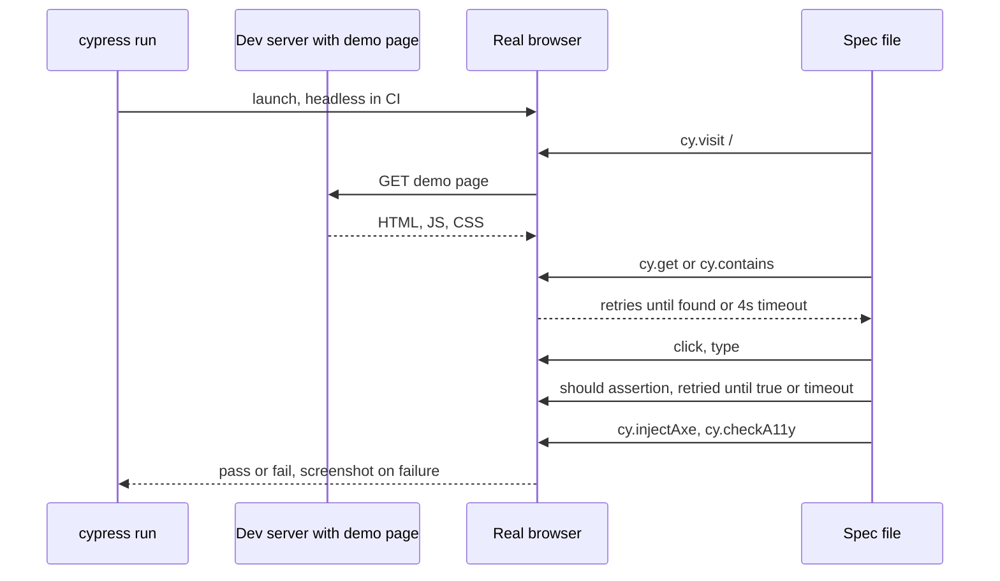

# 12 · End-to-End Testing with Cypress

*Level (a) never used · about 12 minutes to read, plus 40 minutes for setup and the exercise*

## Why this matters here

**Part 1** adds the Cypress config next to Jest's. **Part 4** needs at least one Cypress end-to-end test that walks a real user flow across several components and includes an accessibility check. It is the only test in this module that runs in a real browser, so it catches what jsdom cannot see.

## Mental model

**An E2E test is a robot user in a real browser: it opens the page, looks for things the way a person would, clicks and types, and checks what appears on screen.** **E2E (end-to-end)** means the whole stack runs for real: the bundled app, the browser's layout and CSS, real focus and real events. Nothing is simulated.

Compare with your Jest tests. **jsdom** is a JavaScript imitation of a browser's DOM that runs inside Node. It is fast, but it has no layout engine: it does not know whether an element is hidden behind another, off screen, zero pixels wide, or low in contrast. Cypress runs in Chrome, Electron, Firefox or Edge, so it does know.

Think of a flight simulator versus a test flight. Jest with jsdom is the simulator: cheap, fast, you run it hundreds of times. Cypress is the test flight: slower and costlier, so you do a few, on the routes that matter most.

**Where the analogy breaks:** a test flight is risky, but a Cypress run is safe and repeatable. The real cost is speed and **flakiness** (a test that sometimes passes and sometimes fails with no code change), which is why you keep E2E tests few and write them carefully.

## Diagram

What happens when a Cypress test runs:



The key idea in that diagram is **retry-ability**: most Cypress commands and `should` assertions keep retrying until they succeed or time out (4 seconds by default). That is why you never need `cy.wait(2000)`.

## Core primitives

### 1. Setup: `cypress.config.ts` and a page to visit

A component library has no app, so Cypress needs a **demo page** that renders the components (for example a small page served by Vite, a fast development server and bundler, or a Storybook, a tool that shows components one at a time). The config points Cypress at it.

```ts
// cypress.config.ts
import { defineConfig } from 'cypress';

export default defineConfig({
  e2e: {
    baseUrl: 'http://localhost:5173',          // your demo page's dev server
    specPattern: 'cypress/e2e/**/*.cy.ts',
    supportFile: 'cypress/support/e2e.ts',
    video: false,
  },
});
```

Cypress uses Mocha-style `describe` / `it` and Chai-style assertions, not Jest. (Mocha is another test runner and Chai is an assertion library; Cypress bundles both, which is why you write `.should('have.attr', ...)` instead of Jest matchers.) Give the `cypress/` folder its own `tsconfig.json` with `"types": ["cypress", "cypress-axe"]` so its globals do not clash with Jest's `expect` types.

Keep Cypress specs out of Jest: add `testPathIgnorePatterns: ['/node_modules/', '/cypress/']` to the Jest config.

### 2. `cy.visit`, `cy.get`, `cy.contains`, `.should`

```ts
cy.visit('/');                                        // relative to baseUrl
cy.contains('button', 'Open settings').click();       // element type + visible text
cy.get('[role="dialog"]').should('be.visible');       // any CSS selector
cy.get('[role="dialog"]').should('contain.text', 'Settings');
```

Commands are **queued and chained**, not run immediately. `cy.get(...)` does not return the element; it yields it to the next command in the chain. Do not write `const el = cy.get(...)` and expect a DOM node.

### 3. Selector strategy

Choose selectors that survive design changes, in the same spirit as RTL's query priority:

1. Visible text and roles: `cy.contains('button', 'Save')`, `cy.get('[role="switch"]')`, `cy.get('[aria-label="Dismiss"]')`.
2. A dedicated test attribute when nothing accessible is unique: `data-cy="settings-save"`. Cypress's best-practices guide recommends this over classes.
3. Never CSS classes, tag chains or `nth-child`: `.btn.btn--primary > span` breaks on any restyle.

(The `@testing-library/cypress` package adds `cy.findByRole(...)`, the same queries you use in RTL. It is optional; plain `cy.get` / `cy.contains` are enough for one flow.)

### 4. No arbitrary waits

```ts
// Bad: slow when the app is fast, flaky when it is slow
cy.wait(3000);
cy.get('[role="alert"]').should('not.exist');

// Good: assert the end state and let Cypress retry
cy.get('[role="alert"]', { timeout: 6000 }).should('not.exist');
```

The good version waits only as long as needed. For Alert's `autoDismissMs`, raise the timeout on that one assertion instead of sleeping.

### 5. `cypress-axe` accessibility check

**cypress-axe** runs the same axe engine as `jest-axe`, but in a real browser, so it can also check colour contrast and visibility.

```ts
// cypress/support/e2e.ts
import 'cypress-axe';
```

```ts
cy.visit('/');
cy.injectAxe();                 // after every cy.visit, before checking
cy.checkA11y();                 // whole page
cy.checkA11y('[role="dialog"]'); // or just one region, e.g. the open Modal
```

Install both packages: `npm i -D cypress-axe axe-core`.

### 6. Running headless in CI

**Headless** means the browser runs without a visible window, which is what CI (continuous integration) machines, the servers that run your tests on every push, need. `cypress run` is headless by default; `cypress open` is the interactive runner you use while writing tests.

```json
{
  "scripts": {
    "demo": "vite",
    "cy:open": "cypress open",
    "cy:run": "cypress run",
    "e2e": "start-server-and-test demo http://localhost:5173 cy:run"
  }
}
```

`start-server-and-test` (a small npm package) starts the demo server, waits until the URL responds, runs Cypress, then stops the server. In CI, run `npm ci`, then `npm run e2e`. On failure Cypress saves screenshots to `cypress/screenshots/`, which you can upload as a CI artifact.

## Worked example

One flow across several components: **a user opens the settings Modal, switches the Toggle on, picks a tab, saves, sees a success Alert, and the page has no accessibility violations.** This assumes the demo page renders a "Open settings" Button that opens a Modal titled "Settings" containing a Toggle, Tabs and a Save Button, and that saving shows a success Alert. Adapt the text to your demo page.

```ts
// cypress/e2e/settings-flow.cy.ts
describe('Settings flow', () => {
  beforeEach(() => {
    cy.visit('/');
    cy.injectAxe();
  });

  it('lets a user change a setting and see confirmation', () => {
    // Open the modal
    cy.contains('button', 'Open settings').click();
    cy.get('[role="dialog"]').should('be.visible').and('contain.text', 'Settings');

    // Toggle on: check the ARIA state, not a CSS class
    cy.get('[role="switch"]')
      .should('have.attr', 'aria-checked', 'false')
      .click()
      .should('have.attr', 'aria-checked', 'true');

    // Switch tabs with the keyboard: real focus, real key events
    cy.contains('[role="tab"]', 'Profile').focus().type('{rightArrow}');
    cy.contains('[role="tab"]', 'Notifications')
      .should('have.attr', 'aria-selected', 'true');

    // Accessibility check while the modal is open
    cy.checkA11y('[role="dialog"]');

    // Save and close
    cy.get('[role="dialog"]').contains('button', 'Save').click();
    cy.get('[role="dialog"]').should('not.exist');

    // Focus returns to the trigger
    cy.focused().should('contain.text', 'Open settings');

    // Success alert appears; no cy.wait
    cy.get('[role="alert"]').should('be.visible').and('contain.text', 'Settings saved');

    // Whole page check at the end
    cy.checkA11y();
  });
});
```

Step by step:

1. **`beforeEach` visits and injects axe.** Each test starts from a fresh page, so tests do not depend on each other's leftovers.
2. **Every assertion is retried.** `should('be.visible')` waits for the Modal's open animation to finish. In jsdom, "visible" is a guess; here it is real layout.
3. **The Toggle chain** shows the before and after state in one readable line, checking `aria-checked` the same way your unit tests do.
4. **Keyboard on tabs.** `.type('{rightArrow}')` sends a real key event to the focused tab. This catches a Tabs component that works with the mouse only.
5. **Two axe checks.** One on the open dialog (things only there while it is open), one on the final page.
6. **Focus return and the Alert.** Checked in the real browser, where a focus bug or an overlay covering the Alert would show up.

This single test is your Part 4 E2E. Keep it to one flow; the detail belongs in unit and integration tests.

## Common mistakes

1. **`cy.wait(<number>)` to "fix" flakiness.**
   *Symptom:* tests pass locally, fail in slower CI, and the suite gets slower every week.
   *Fix:* assert the state you are waiting for (`should('be.visible')`, `should('not.exist')`), with a larger `timeout` on that one command if needed.

2. **Brittle selectors.**
   *Symptom:* a CSS refactor breaks the E2E test while the app works.
   *Fix:* use text, roles and ARIA attributes, or `data-cy` when nothing else is unique.

3. **Forgetting `cy.injectAxe()` after `cy.visit`.**
   *Symptom:* `cy.checkA11y` errors with axe not being defined on the window.
   *Fix:* call `cy.injectAxe()` after every `cy.visit`, usually in `beforeEach`.

4. **Jest picking up Cypress specs, or type clashes.**
   *Symptom:* Jest tries to run `*.cy.ts` and fails on `cy is not defined`, or TypeScript complains about two different `expect` types.
   *Fix:* add `/cypress/` to Jest's `testPathIgnorePatterns`, and give `cypress/` its own `tsconfig.json`.

5. **Testing every detail in E2E.**
   *Symptom:* dozens of slow Cypress tests that duplicate unit tests.
   *Fix:* one or a few flows across components. Details stay in Jest.

## Check yourself

??? question "Q1. Name two bugs Cypress can catch that a Jest + jsdom test of the same component would miss."
    Examples: a button covered by an overlay so a real click cannot reach it; an element present in the DOM but hidden by CSS or off screen; low colour contrast (via cypress-axe); a focus problem caused by real browser behaviour.

??? question "Q2. Your Alert auto-dismisses after 5 seconds. How do you assert it disappears, without cy.wait?"
    `cy.get('[role="alert"]', { timeout: 7000 }).should('not.exist')`. Cypress retries until the alert is gone or 7 seconds pass.

??? question "Q3. Rank these selectors from best to worst: `.modal__footer > button:nth-child(2)`, `cy.contains('button', 'Save')`, `[data-cy=save]`."
    `cy.contains('button', 'Save')` (what the user sees), then `[data-cy=save]` (stable, but invisible to users), then the class and `nth-child` chain (breaks on any restyle).

??? question "Q4. What does `const btn = cy.get('button')` give you, and why is that a problem?"
    A Cypress chainable, not a DOM element. Cypress commands are queued and run later, so you must chain (`cy.get('button').click()`) or use `.then(($btn) => ...)` to reach the element.

??? question "Q5. Which command runs Cypress in CI, and why do you need start-server-and-test or similar?"
    `cypress run`, which is headless by default. Cypress needs the demo page served at `baseUrl` before it starts, so something must start the server, wait until it responds, run the tests, and shut it down.

## Go deeper

**Official docs**

- [Why Cypress](https://docs.cypress.io/app/get-started/why-cypress): what E2E covers that jsdom cannot.
- [Best practices](https://docs.cypress.io/app/core-concepts/best-practices): selector strategy, no arbitrary waits, independent tests.
- [cypress-axe](https://github.com/component-driven/cypress-axe): the accessibility check inside the E2E flow.

**Articles**

- [How to Use Cypress for End-to-End Testing Your React Apps](https://www.freecodecamp.org/news/cypress-for-end-to-end-testing-react-apps/), freeCodeCamp News. A beginner walkthrough against a React app.
- [How to test for accessibility with Cypress - Deque](https://www.deque.com/blog/how-to-test-for-accessibility-with-cypress/), Deque (makers of axe). cypress-axe setup and reading violations.
- *(optional)* [5 Things to Avoid When Writing Cypress Tests | Webiny](https://www.webiny.com/blog/things-to-avoid-when-writing-cypress-tests), Webiny. Fixed waits and brittle selectors explained.
- *(optional)* [Automated Accessibility Tests with cypress-axe](https://sparkbox.com/foundry/cypress_and_axe_tutorial_automated_accessibility_testing_tools), Sparkbox. Written companion to the Sparkbox video.

**Videos**

- [Testing your first application - Lesson 02 - Installing Cypress and writing your first test](https://www.youtube.com/watch?v=x0QuiEJUf6s), Cypress.io (18:21).
- [Combining Cypress and Axe for Automated Accessibility Tests](https://www.youtube.com/watch?v=7TDg3Cq0JnA), Sparkbox (2:53).
- *(optional)* [Cypress in 100 Seconds](https://www.youtube.com/watch?v=BQqzfHQkREo), Fireship (2:31).

## Used in

- **Part 1:** add `cypress.config.ts`, the support file with `cypress-axe`, a separate `cypress/tsconfig.json`, and the `cy:run` / `e2e` scripts; exclude `cypress/` from Jest.
- **Part 4:** write the one E2E flow across Modal, Toggle, Tabs, Button and Alert, with `cy.checkA11y()`, and run it headless with `cypress run`.

*Resources verified 2026-09-29.*
