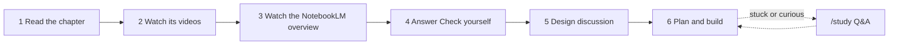

# Syllabus — ENG-L1-M01 Code Quality & Testing

A study guide for testing a React + TypeScript component library: from "why test at all" to a
suite with 80% coverage, bugs fixed test-first, and one real-browser end-to-end flow. It was
generated from my own level check, so it covers only what I don't already know.

## How I use this syllabus

1. **Read** the chapters in order. Each takes 6–14 minutes, plus a small exercise.
2. **Watch** the videos listed under *Go deeper*. They're verified links, mostly under 20 minutes.
3. **Watch the NotebookLM video overview** made from this syllabus. It's the whole module in
   one sitting.
4. **Check yourself.** Answer the questions before opening the collapsed answers.
5. Then **design the test suite together with Claude**: options, patterns and trade-offs,
   with me deciding. After that comes the plan and the build.

## Level map

| Concept | My level | Treatment |
|---|---|---|
| Testing pyramid / trophy | (a) never used | Full chapter |
| Jest | (a) | Full chapter |
| Code coverage | (a) | Full chapter |
| React + TypeScript props | (b) theory only | Short chapter: production concerns only |
| React Testing Library | (a) | Full chapter |
| user-event | (a) | Full chapter |
| Jest mocking | (a) | Full chapter |
| Async tests and fake timers | (b) | Full chapter (async/await known; test-side is new) |
| AAA and behaviour testing | (a) | Full chapter |
| TDD | (a) | Full chapter |
| Accessibility (ARIA, focus, keyboard) | (a) | Full chapter |
| Cypress E2E | (a) | Full chapter |

## Chapters

| # | Chapter | Time | Used in |
|---|---|---|---|
| 01 | [Testing pyramid and testing trophy](01-testing-pyramid.md) | ~20 min | Parts 2 and 4: which level each test belongs at |
| 02 | [Jest basics](02-jest-basics.md) | ~25 min | Part 1: config; every test after |
| 03 | [Code coverage](03-code-coverage.md) | ~26 min | Part 1 thresholds; Part 5 report |
| 04 | [Typing React props under strict mode](04-typescript-props.md) | ~6 min | Reading the components before testing them |
| 05 | [React Testing Library](05-react-testing-library.md) | ~30 min | Part 2: rendering and querying |
| 06 | [user-event](06-user-event.md) | ~30 min | Part 2: every interaction test |
| 07 | [Jest mocking](07-mocking.md) | ~30 min | Part 2: handler assertions; Part 3 bugs |
| 08 | [Async tests and fake timers](08-async-and-fake-timers.md) | ~35 min | Part 2: Alert, Modal, anything timed |
| 09 | [Arrange-Act-Assert and testing behaviour](09-aaa-and-behaviour.md) | ~30 min | Part 2: test quality |
| 10 | [TDD: red, green, refactor](10-tdd.md) | ~40 min | Part 3: the five bug fixes |
| 11 | [Accessibility for components](11-accessibility.md) | ~45 min | Parts 2–3: Modal, Tabs, Dropdown, Toggle; the a11y bug |
| 12 | [End-to-end testing with Cypress](12-cypress-e2e.md) | ~50 min | Part 4: the E2E flow |

About 6 hours with exercises. Suggested split: chapters 01–06 in the first sitting,
07–12 in the second.

## Assumptions to check against the real components

The starter components weren't available when this was written, so some examples assume
details that may differ. Check them when the real code arrives:

- `Input.onChange` receives the change event; `Toggle.onChange(checked)`, `Dropdown.onChange(value)`
  and `Tabs.onChange(id)` receive the new value.
- `Alert` renders its message as `children`, uses `role="alert"`, and hides itself on dismiss.
- `Toggle` uses `role="switch"` (it may be a checkbox).
- `Modal` is named by its title through `aria-labelledby`.

*Resources verified 2026-09-29.*
